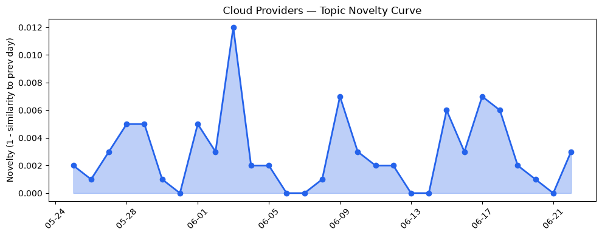
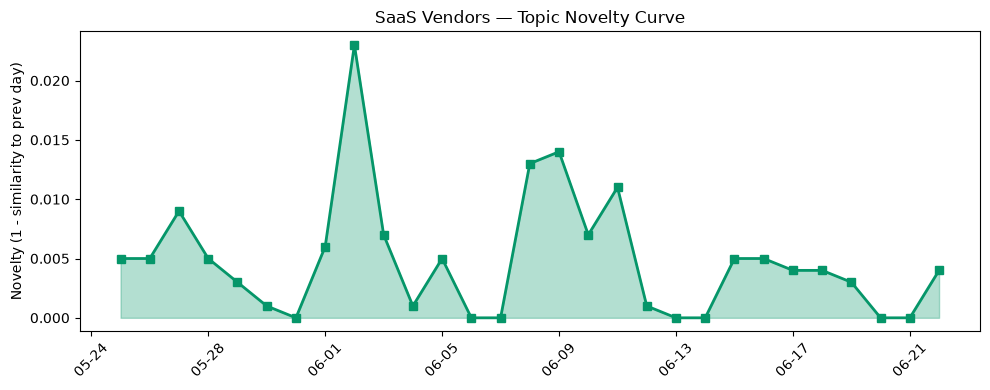

## 今日云计算结构性变化
> 云计算和SaaS领域主要变化信号来自于云厂商的技术和基础设施更新，以及AI和数据分析的融合进展。
今天最值得注意的云计算/SaaS结构性变化是云厂商的技术和基础设施更新，以及AI和数据分析的融合进展。这些变化表明云计算和SaaS领域正在持续升温，尤其是在技术层面和应用层面。同时，资本信号也呈现持续增强趋势，表明投资者对该领域的兴趣度不断提高。
- 📈 **持续趋势**：技术层话题已连续8天增强
- 🆕 **新兴方向**：agent和超算为30天内首次出现
- 🔺 **突然升温**：Microsoft Azure近3天突然集中出现
- 🔑 **新关键词**：agent, 超算
- 📉 **消退关键词**：Adobe, Amazon Bedrock, Azure, ByteHouse, ClickHouse, Graviton5, OpenAI, Tokenization, 基础设施, 应用层

## 技术层信号
🔴 重大突破

云原生、容器、K8s、Serverless等技术层面正在经历重大突破。AWS推出了Lambda MicroVMs，Google Cloud推出Managed Python UDFs，Microsoft Azure推出新一代的Azure Cobalt 200 VMs。这些更新表明云厂商正在不断加强其技术能力，以满足客户的需求。同时，Cloudflare推出的新的agent技能库也表明了云厂商对AI和数据分析的重视。
根据[Run isolated sandboxes with full lifecycle control: AWS Lambda introduces MicroVMs](https://aws.amazon.com/blogs/aws/run-isolated-sandboxes-with-full-lifecycle-control-aws-lambda-introduces-microvms/)，[Boost BigQuery with Python: Managed Python UDFs now generally available](https://cloud.google.com/blog/products/data-analytics/python-udf-in-bigquery-now-generally-available/)，[New Azure Cobalt 200 VMs deliver 50% performance improvement, fully optimized for modern agentic AI workloads](https://azure.microsoft.com/en-us/blog/new-azure-cobalt-200-vms-deliver-50-performance-improvement-fully-optimized-for-modern-agentic-ai-workloads/)，我们可以看到云厂商正在不断加强其技术能力。

## 产业资本信号
🔴 强信号

产业资本信号呈现强信号，表明投资者对云计算和SaaS领域的兴趣度不断提高。Groq确认了6.5亿美元的融资，Strella获得1400万美元的Series A融资。同时，Nvidia的市值超过2000亿美元，Amazon和Chobani采用了Strella的AI interviews。这些信号表明云计算和SaaS领域正在吸引大量投资。
根据[AI chipmaker Groq confirms $650M raise, re-staffs after Nvidia’s $20B not-acqui-hire deal](https://techcrunch.com/2026/06/22/ai-chipmaker-groq-confirms-650m-raise-re-staffs-after-nvidias-20b-not-acqui-hire-deal/)，[Amazon and Chobani adopt Strella's AI interviews for customer research as fast-growing startup raises $14M](https://venturebeat.com/technology/amazon-and-chobani-adopt-strellas-ai-interviews-for-customer-research-as)等文章，我们可以看到产业资本信号的强度。

## 潜在拐点判断
根据今日信号和历史趋势，我们判断可能存在潜在拐点。技术层面和应用层面的持续升温，资本信号的强度，表明云计算和SaaS领域可能正在经历一个重要的转变。这个转变可能会带来新的机会和挑战，企业需要密切关注这些变化，以便及时调整自己的战略。

## 明日观察点
1. 关注云厂商的技术更新，特别是AI和数据分析方面的进展。
2. 关注资本信号的变化，特别是投资者对云计算和SaaS领域的兴趣度。
3. 关注应用层面的变化，特别是新兴技术和新兴市场的出现。

## 长期趋势坐标
根据今日信号和历史趋势，我们可以将今日信号放到月/季尺度。技术层面和应用层面的持续升温，资本信号的强度，表明云计算和SaaS领域可能正在经历一个长期的转变。这个转变可能会带来新的机会和挑战，企业需要密切关注这些变化，以便及时调整自己的战略。

## 数据洞察
### 云厂商话题演化
云厂商的话题向量在最近30天内呈现延续趋势，novelty_score为0.021，mean_similarity为0.979。这些信号表明云厂商的话题正在不断演化，新的技术和应用层面的更新正在不断出现。
### SaaS 厂商话题演化
SaaS厂商的话题向量在最近30天内呈现延续趋势，novelty_score为0.045，mean_similarity为0.955。这些信号表明SaaS厂商的话题正在不断演化，新的技术和应用层面的更新正在不断出现。
### 趋势图

## 参考来源
- [Run isolated sandboxes with full lifecycle control: AWS Lambda introduces MicroVMs](https://aws.amazon.com/blogs/aws/run-isolated-sandboxes-with-full-lifecycle-control-aws-lambda-introduces-microvms/) — AWS Blog
- [Boost BigQuery with Python: Managed Python UDFs now generally available](https://cloud.google.com/blog/products/data-analytics/python-udf-in-bigquery-now-generally-available/) — Google Cloud Blog
- [New Azure Cobalt 200 VMs deliver 50% performance improvement, fully optimized for modern agentic AI workloads](https://azure.microsoft.com/en-us/blog/new-azure-cobalt-200-vms-deliver-50-performance-improvement-fully-optimized-for-modern-agentic-ai-workloads/) — Microsoft Azure Blog
- [AI chipmaker Groq confirms $650M raise, re-staffs after Nvidia’s $20B not-acqui-hire deal](https://techcrunch.com/2026/06/22/ai-chipmaker-groq-confirms-650m-raise-re-staffs-after-nvidias-20b-not-acqui-hire-deal/) — TechCrunch
- [Amazon and Chobani adopt Strella's AI interviews for customer research as fast-growing startup raises $14M](https://venturebeat.com/technology/amazon-and-chobani-adopt-strellas-ai-interviews-for-customer-research-as) — VentureBeat Enterprise