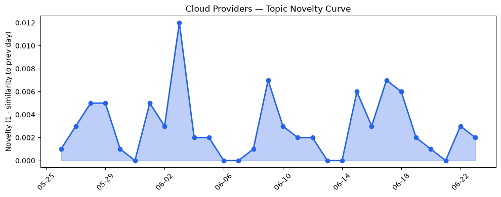
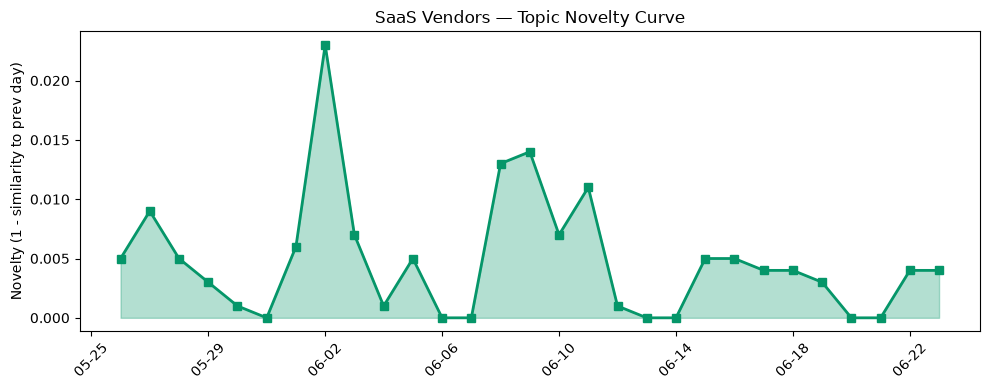

## 今日云计算结构性变化
> 云计算领域出现多项技术和基础设施更新，包括Azure的新VM发布、AWS的Lambda MicroVMs推出和Cloudflare在AI和安全领域的进展，表明云厂商在技术和基础设施方面持续创新。
今天最值得注意的云计算/SaaS结构性变化是云厂商在技术和基础设施方面的创新，包括Azure的新VM发布、AWS的Lambda MicroVMs推出和Cloudflare在AI和安全领域的进展。这些变化表明云厂商在技术和基础设施方面持续创新，推动云计算和SaaS产业的发展。
- 📈 **持续趋势**：基础设施和应用层的话题向量在最近8天内呈现持续增强趋势。
- 🆕 **新兴方向**：Lambda MicroVMs为30天内首次出现的新关键词。
- 🔺 **突然升温**：Cloudflare在AI和安全领域的进展突然集中出现。
- 🔑 **新关键词**：Lambda MicroVMs。
- 📉 **消退关键词**：Adobe、Amazon Bedrock、Anthropic、ByteHouse、ClickHouse、Graviton5、OpenAI、Tencent Cloud、Tokenization。

## 技术层信号
🔴 重大突破

云原生和容器技术方面，Azure发布新VM，优化了agentic AI工作负载，AWS推出Lambda MicroVMs，支持长时间运行任务，Google Cloud推出Observability Analytics，支持SQL查询日志和跟踪。这些变化表明云厂商在技术层面上持续创新，推动云计算和SaaS产业的发展。
基础设施方面，火山引擎发布新数据产品，包括大数据研发治理套件和ByteHouse云数仓版，Cloudflare的安全洞察系统实现了10倍的扫描能力，优化了Kafka消费。这些变化表明云厂商在基础设施方面持续创新，推动云计算和SaaS产业的发展。
AI和机器学习方面，Salesforce推出了新的AI应用和工具，HubSpot发布多篇关于AI应用和优化的文章，火山引擎发布新数据产品，包括大数据研发治理套件和ByteHouse云数仓版。这些变化表明云厂商在AI和机器学习方面持续创新，推动云计算和SaaS产业的发展。

## 产业资本信号
🔴 强信号

基础设施变化方面，AWS Local Zone 在河内推出，Azure发布新VM，优化了计算性能，AWS推出Lambda MicroVMs，支持长时间运行任务。这些变化表明云厂商在基础设施方面持续创新，推动云计算和SaaS产业的发展。
应用层变化方面，Salesforce推出了新的AI应用和工具，HubSpot发布多篇关于AI应用和优化的文章，火山引擎发布新数据产品，包括大数据研发治理套件和ByteHouse云数仓版。这些变化表明云厂商在应用层方面持续创新，推动云计算和SaaS产业的发展。
资本流向方面，Menlo Ventures获得30亿美元的新基金，Superhuman收购了AI检测初创公司GPTZero，Meta计划推出自己的预测市场，Cloudflare在AI领域的投资，吸引了来自Ensemble AI的人才。这些变化表明云计算和SaaS产业的资本流向持续增加，推动产业的发展。

## 潜在拐点判断
基于今日信号 + 历史趋势，判断是否存在潜在拐点。今日的信号表明云厂商在技术和基础设施方面持续创新，推动云计算和SaaS产业的发展。历史趋势也表明云计算和SaaS产业的发展持续推进。因此，今日的信号和历史趋势均表明云计算和SaaS产业的发展将持续推进，没有潜在拐点信号。

## 明日观察点
1. 观察云厂商在技术和基础设施方面的创新，特别是Azure的新VM发布、AWS的Lambda MicroVMs推出和Cloudflare在AI和安全领域的进展。
2. 观察Salesforce和HubSpot在AI应用和优化方面的发展。
3. 观察Menlo Ventures和Superhuman在云计算和SaaS产业的投资和收购。

## 长期趋势坐标
今日的信号和历史趋势均表明云计算和SaaS产业的发展将持续推进。云厂商在技术和基础设施方面的创新，特别是Azure的新VM发布、AWS的Lambda MicroVMs推出和Cloudflare在AI和安全领域的进展，将推动云计算和SaaS产业的发展。Salesforce和HubSpot在AI应用和优化方面的发展也将推动云计算和SaaS产业的发展。

## 数据洞察
### 云厂商话题演化
云厂商的话题向量在最近30天内呈现延续趋势，novelty_score为0.021，mean_similarity为0.979。
### SaaS 厂商话题演化
SaaS厂商的话题向量在最近30天内呈现延续趋势，novelty_score为0.043，mean_similarity为0.957。
### 趋势图

## 参考来源
- [New Azure Cobalt 200 VMs deliver 50% performance improvement, fully optimized for modern agentic AI workloads](https://azure.microsoft.com/en-us/blog/new-azure-cobalt-200-vms-deliver-50-performance-improvement-fully-optimized-for-modern-agentic-ai-workloads/)
- [AWS debuts Lambda MicroVMs with up to 8 hours runtime](https://www.theregister.com/devops/2026/06/23/aws-debuts-lambda-microvms-with-up-to-8-hours-runtime/5260035)
- [Log Analytics is now Observability Analytics: Query logs and traces with SQL](https://cloud.google.com/blog/products/management-tools/query-logs-and-traces-with-sql-in-observability-analytics/)
- [Verifiable, private AI: Google Cloud expands Confidential Computing frontiers](https://cloud.google.com/blog/products/identity-security/verifiable-trust-in-the-ai-era-whats-new-in-confidential-computing/)
- [Cloudflare DMARC Management is now generally available](https://blog.cloudflare.com/dmarc-management-ga/)
- [Scaling Security Insights: how we achieved a 10x increase in global scanning capacity](https://blog.cloudflare.com/scaling-security-scans/)
- [What $5 Billion in Penalties Can Teach Us About AI Guardrails](https://www.salesforce.com/blog/financial-services-ai-guardrails/)
- [Automate Manual Compliance Processes with Agentforce in Privacy Center](https://www.salesforce.com/blog/agentforce-in-privacy-center/)
- [How to rank in AI search results: Expert best practices](https://blog.hubspot.com/marketing/ai-search-ranking)
- [火山引擎正式推出四款数据产品 将持续完善敏捷数智引擎矩阵](https://www.cnblogs.com/volcengine/p/15640481.html)
- [After betting the firm on Anthropic, Menlo Ventures raises victorious $3B fund](https://techcrunch.com/2026/06/23/after-betting-the-firm-on-anthropic-menlo-ventures-raises-victorious-3b-fund/)
- [Superhuman acquires AI detection startup GPTZero](https://techcrunch.com/2026/06/23/superhuman-acquires-ai-detection-startup-gptzero/)
- [Growing the Cloudflare AI team with talent from Ensemble AI](https://blog.cloudflare.com/ensemble-ai-talent-joins-cloudflare/)
- [Klue says hackers stole credential from 2022 that led to customer data breaches](https://techcrunch.com/2026/06/23/klue-says-hackers-stole-credential-from-2022-that-led-to-customer-data-breaches/)
- [Tokenization takes the lead in the fight for data security](https://venturebeat.com/technology/tokenization-takes-the-lead-in-the-fight-for-data-security)