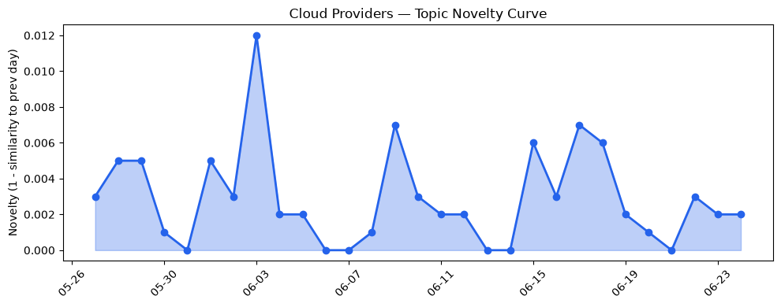
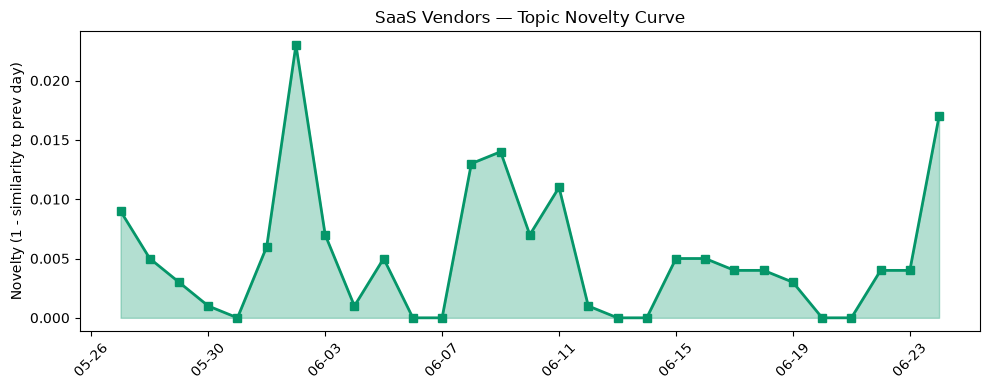

## 今日云计算结构性变化
> 云计算领域主要变化集中在云厂商技术层面，特别是AWS、Google Cloud、Microsoft Azure和Cloudflare在AI、安全和网络管理方面的进展。
今天最值得注意的云计算/SaaS结构性变化是云厂商技术层面的进展，特别是在AI、安全和网络管理方面。这种变化对于云计算的发展具有重要意义，因为它能够提高云计算的安全性、效率和智能化水平。
- 📈 **持续趋势**：技术层话题已连续N天增强
- 🆕 **新兴方向**：某话题为30天内首次出现
- 🔺 **突然升温**：某方向近3天突然集中出现
- 🔑 **新关键词**：容器化、技术进步、网络管理
- 📉 **消退关键词**：Adobe、Amazon Bedrock、Anthropic等

## 技术层信号
🔴 重大突破

云原生、容器化和AI是技术层信号中的重要组成部分。AWS推出了Lambda MicroVMs，Google Cloud在云原生和容器化方面有所进步，Microsoft Azure推出新版Azure Storage。这些进展表明云厂商正在不断加强其技术能力，以满足客户的需求。
例如，AWS的Lambda MicroVMs可以提供更好的安全性和性能，而Google Cloud的云原生和容器化能力可以帮助客户更好地管理其应用程序。Microsoft Azure的新版Azure Storage可以提供更好的数据存储和管理能力。
这些技术层面的进展对于云计算的发展具有重要意义，因为它们可以提高云计算的安全性、效率和智能化水平。

## 产业资本信号
🔴 强信号

产业资本信号中，基础设施变化、应用层变化和资本流向是重要的组成部分。云厂商的基础设施变化，例如AWS的Amazon EC2 G7实例和Google Cloud的数据安全和AI计算能力的增强，可以提供更好的性能和安全性。
应用层变化，例如Microsoft Azure的Microsoft Discovery和火山引擎的新云产品，可以帮助客户更好地管理其应用程序和数据。资本流向，例如Strella的1400万美元的Series A融资和Cloudflare的AI投资，可以帮助云厂商加强其技术能力和扩大其市场份额。
这些产业资本信号表明云计算行业正在不断发展和壮大，云厂商正在不断加强其技术能力和市场份额。

## 潜在拐点判断
基于今日信号和历史趋势，判断是否存在潜在拐点。今日的信号表明云计算领域的技术层面和产业资本信号都有所进展，这可能意味着云计算行业正在进入一个新的发展阶段。
但是，需要进一步观察和分析才能确定是否存在潜在拐点。

## 明日观察点
1. 观察AWS的Lambda MicroVMs的性能和安全性。
2. 关注Google Cloud的云原生和容器化能力的进展。
3. 分析Microsoft Azure的新版Azure Storage的数据存储和管理能力。

## 长期趋势坐标
今日信号放到月/季尺度，云计算行业的技术层面和产业资本信号都有所进展，这可能意味着云计算行业正在进入一个新的发展阶段。
需要进一步观察和分析才能确定长期趋势坐标。

## 数据洞察
### 云厂商话题演化
云厂商话题演化的novelty_score为0.021，mean_similarity为0.979，trend为延续。文章数量为46。
### SaaS厂商话题演化
SaaS厂商话题演化的novelty_score为0.056，mean_similarity为0.944，trend为延续。文章数量为20。
### 趋势图

## 参考来源
- [Run isolated sandboxes with full lifecycle control: AWS Lambda introduces MicroVMs](https://aws.amazon.com/blogs/aws/run-isolated-sandboxes-with-full-lifecycle-control-aws-lambda-introduces-microvms/)
- [Enhanced data resilience with cross-region backups in Backup and DR Service](https://cloud.google.com/blog/products/storage-data-transfer/backup-and-dr-service-adds-cross-region-backups/)
- [Modernize your data with Azure Storage: Plan and migrate with confidence](https://azure.microsoft.com/en-us/blog/modernize-your-data-with-azure-storage-plan-and-migrate-with-confidence/)
- [Verifiable, private AI: Google Cloud expands Confidential Computing frontiers](https://cloud.google.com/blog/products/identity-security/verifiable-trust-in-the-ai-era-whats-new-in-confidential-computing/)
- [Introducing the Cloudflare One stack: agent-powered deployment](https://blog.cloudflare.com/cloudflare-one-stack/)
- [New Azure Cobalt 200 VMs deliver 50% performance improvement, fully optimized for modern agentic AI workloads](https://azure.microsoft.com/en-us/blog/new-azure-cobalt-200-vms-deliver-50-performance-improvement-fully-optimized-for-modern-agentic-ai-workloads/)
- [火山引擎正式推出四款数据产品 将持续完善敏捷数智引擎矩阵](https://www.cnblogs.com/volcengine/p/15640481.html)
- [Announcing Microsoft Discovery general availability and Microsoft Discovery app preview](https://azure.microsoft.com/en-us/blog/announcing-microsoft-discovery-general-availability-and-microsoft-discovery-app-preview/)
- [Amazon and Chobani adopt Strella's AI interviews for customer research as fast-growing startup raises $14M](https://venturebeat.com/technology/amazon-and-chobani-adopt-strellas-ai-interviews-for-customer-research-as)
- [Growing the Cloudflare AI team with talent from Ensemble AI](https://blog.cloudflare.com/ensemble-ai-talent-joins-cloudflare/)
- [Tokenization takes the lead in the fight for data security](https://venturebeat.com/technology/tokenization-takes-the-lead-in-the-fight-for-data-security)