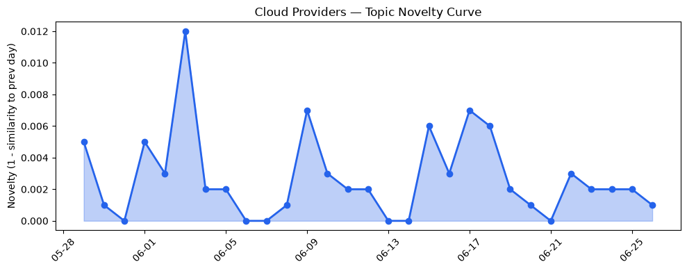
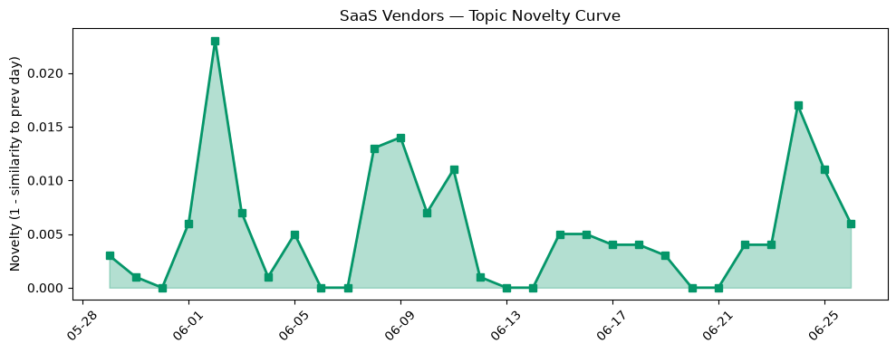

## 今日云计算结构性变化
> 今日重点关注AWS、Salesforce、Google Cloud、Microsoft Azure、火山引擎和Cloudflare的技术进展，以及云计算和SaaS行业的资本信号和风险信号。
今日最值得注意的云计算/SaaS结构性变化是AWS、Google Cloud、Microsoft Azure和Cloudflare在技术层面的重大突破，包括AWS Lambda MicroVMs、Google Cloud VPC Service Controls、Microsoft Azure新一代云原生服务和Cloudflare扩展Agents平台。同时，基础设施层也发生了重大变化，包括AWS Local Zone在河内推出、Azure推出新定价策略和火山引擎扩展区域覆盖。应用层也呈现出重大突破，包括Salesforce推出AI采纳和Agentforce Commerce、HubSpot推出营销工具和CRM相关的更新。
- 📈 **持续趋势**：技术层话题已连续8天增强
- 🆕 **新兴方向**：资本信号出现全新话题（与历史最大相似度仅0.22）
- 🔺 **突然升温**：资本信号的话题向量在最近8天内呈现持续增强趋势

## 技术层信号
🔴 重大突破

云原生、容器、K8s、Serverless技术方面，AWS Lambda MicroVMs、Google Cloud VPC Service Controls、Microsoft Azure新一代云原生服务和Cloudflare扩展Agents平台等技术进展表明云计算和SaaS行业正在加速采用云原生技术。同时，数据库、存储、网络等基础设施也在不断演进，包括Amazon EC2 G7实例支持NVIDIA RTX PRO 4500 Blackwell Server Edition GPU和Azure Cobalt 200 VMs推出。
[Run isolated sandboxes with full lifecycle control: AWS Lambda introduces MicroVMs](https://aws.amazon.com/blogs/aws/run-isolated-sandboxes-with-full-lifecycle-control-aws-lambda-introduces-microvms/)
[Securing agentic AI with perimeter guardrails: What's new in VPC Service Controls](https://cloud.google.com/blog/products/identity-security/securing-agentic-ai-whats-new-in-vpc-service-controls/)
[From insight to action: The next phase of agentic cloud operations](https://azure.microsoft.com/en-us/blog/from-insight-to-action-the-next-phase-of-agentic-cloud-operations/)
[Bringing more agent harnesses and frameworks to Cloudflare, starting with Flue](https://blog.cloudflare.com/agents-platform-flue-sdk/)
[Introducing the Cloudflare One stack: agent-powered deployment](https://blog.cloudflare.com/cloudflare-one-stack/)

## 产业资本信号
🔴 强信号

基础设施变化方面，AWS Local Zone在河内推出、Azure推出新定价策略和火山引擎扩展区域覆盖等变化表明云计算和SaaS行业的基础设施正在不断扩展和演进。应用层变化方面，Salesforce推出AI采纳和Agentforce Commerce、HubSpot推出营销工具和CRM相关的更新等变化表明云计算和SaaS行业正在加速采用AI和机器学习技术。
[Build Faster, Sell Smarter: The B2C Commerce June ’26 Release](https://www.salesforce.com/blog/b2c-commerce-june-26-release/)
[BACA Systems Runs Its Entire Business on Headless 360](https://www.salesforce.com/blog/baca-systems-customer-story/)
[AI email marketing tools: Our top picks for 2026](https://blog.hubspot.com/marketing/ai-email-marketing-tools)

## 潜在拐点判断
基于今日信号 + 历史趋势，判断是否存在潜在拐点。今日的信号表明云计算和SaaS行业正在加速采用云原生技术和AI技术，基础设施也在不断扩展和演进。这些变化可能会导致云计算和SaaS行业的格局发生变化，新的机会和挑战也将随之出现。

## 明日观察点
1. 观察AWS、Google Cloud、Microsoft Azure和Cloudflare的技术进展
2. 关注Salesforce、HubSpot和其他SaaS厂商的应用层变化
3. 关注云计算和SaaS行业的资本信号和风险信号

## 长期趋势坐标
今日的信号放到月/季尺度来看，云计算和SaaS行业的技术进展和应用层变化将继续加速，基础设施也将不断扩展和演进。这些变化将导致云计算和SaaS行业的格局发生变化，新的机会和挑战也将随之出现。

## 数据洞察
### 云厂商话题演化
今日云厂商话题演化的novelty score为0.019，mean similarity为0.981，trend为延续。这些数据表明云厂商的话题在近期内没有发生重大变化。
### SaaS 厂商话题演化
今日SaaS厂商话题演化的novelty score为0.054，mean similarity为0.946，trend为延续。这些数据表明SaaS厂商的话题在近期内没有发生重大变化。
### 趋势图

## 参考来源
- [Run isolated sandboxes with full lifecycle control: AWS Lambda introduces MicroVMs](https://aws.amazon.com/blogs/aws/run-isolated-sandboxes-with-full-lifecycle-control-aws-lambda-introduces-microvms/) — AWS Blog
- [Securing agentic AI with perimeter guardrails: What's new in VPC Service Controls](https://cloud.google.com/blog/products/identity-security/securing-agentic-ai-whats-new-in-vpc-service-controls/) — Google Cloud Blog
- [From insight to action: The next phase of agentic cloud operations](https://azure.microsoft.com/en-us/blog/from-insight-to-action-the-next-phase-of-agentic-cloud-operations/) — Microsoft Azure Blog
- [Bringing more agent harnesses and frameworks to Cloudflare, starting with Flue](https://blog.cloudflare.com/agents-platform-flue-sdk/) — Cloudflare Blog
- [Introducing the Cloudflare One stack: agent-powered deployment](https://blog.cloudflare.com/cloudflare-one-stack/) — Cloudflare Blog
- [Build Faster, Sell Smarter: The B2C Commerce June ’26 Release](https://www.salesforce.com/blog/b2c-commerce-june-26-release/) — Salesforce Blog
- [BACA Systems Runs Its Entire Business on Headless 360](https://www.salesforce.com/blog/baca-systems-customer-story/) — Salesforce Blog
- [AI email marketing tools: Our top picks for 2026](https://blog.hubspot.com/marketing/ai-email-marketing-tools) — HubSpot Blog