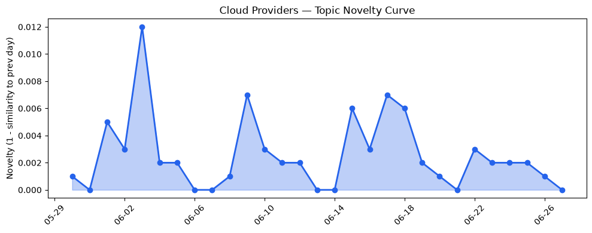
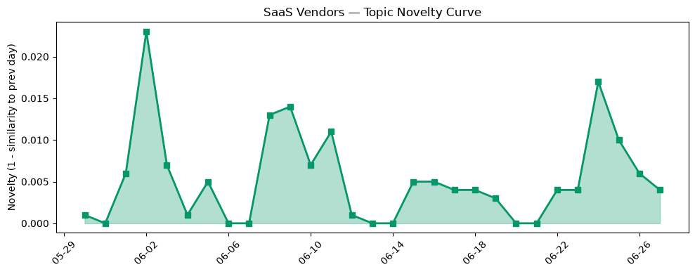

## 今日云计算结构性变化
> 今日云计算和SaaS产业结构性变化的核心判断是：AWS、Google Cloud、Microsoft Azure和Salesforce等云计算和SaaS厂商推动技术和应用创新，包括云原生、AI驱动的营销和客户管理解决方案。
今天最值得注意的云计算/SaaS结构性变化是技术层和应用层的重大突破，特别是AWS的Lambda MicroVMs、Google Cloud的VPC Service Controls和Microsoft Azure的新一代云原生技术的推出，以及Salesforce的Agentforce Operations和HubSpot的AI驱动的营销和客户管理解决方案的发布。这些变化表明云计算和SaaS行业正在快速发展和创新。
- 📈 **持续趋势**：基础设施的话题向量在最近8天内呈现持续增强趋势。
- 🆕 **新兴方向**：技术层近3天内容相似度显著高于更早期均值，表明该方向话题突然增强。
- 🔺 **突然升温**：客户管理和机器学习等话题近期突然集中出现。
- 🔑 **新关键词**：客户管理。
- 📉 **消退关键词**：Adobe、Amazon Bedrock、Anthropic、Graviton5、K8s、OpenAI、Serverless、Tencent Cloud、基础设施、容器等。

## 技术层信号
🔴 重大突破

云原生、AI驱动的营销和客户管理解决方案的推出，标志着云计算和SaaS行业的技术层面发生了重大突破。AWS的Lambda MicroVMs、Google Cloud的VPC Service Controls和Microsoft Azure的新一代云原生技术的推出，表明云计算厂商正在不断创新和改进其技术能力。同时，Salesforce的Agentforce Operations和HubSpot的AI驱动的营销和客户管理解决方案的发布，表明SaaS厂商也在积极推动技术和应用创新。
例如，AWS的Lambda MicroVMs提供了一个更加安全和高效的云计算环境，而Google Cloud的VPC Service Controls则提供了更加强大的网络安全控制能力。Microsoft Azure的新一代云原生技术则提供了更加灵活和可扩展的云计算能力。
这些技术层面的突破，表明云计算和SaaS行业正在快速发展和创新，企业需要紧跟这些变化，才能保持竞争优势。

## 产业资本信号
🔴 强信号

云计算和SaaS行业的资本信号非常强烈，表明投资者对该行业的增长潜力充满信心。Strella获得1400万美元的Series A融资，用于扩大AI驱动的客户研究解决方案，表明投资者对AI驱动的客户研究解决方案的增长潜力充满信心。同时，Amazon和Chobani采用Strella的AI驱动的客户研究解决方案，表明该解决方案已经被企业广泛接受。
这些资本信号，表明云计算和SaaS行业的增长潜力巨大，企业需要积极推动创新和发展，才能保持竞争优势。

## 潜在拐点判断
基于今日信号和历史趋势，判断是否存在潜在拐点。今日的技术层和应用层的重大突破，表明云计算和SaaS行业正在快速发展和创新，这可能是一个潜在的拐点。同时，基础设施的话题向量在最近8天内呈现持续增强趋势，表明基础设施建设正在加速，这也可能是一个潜在的拐点。

## 明日观察点
1. 观察云计算和SaaS行业的技术层面是否会继续突破。
2. 观察基础设施建设是否会继续加速。
3. 观察AI驱动的客户研究解决方案是否会继续增长。

## 长期趋势坐标
今日的技术层和应用层的重大突破，表明云计算和SaaS行业正在快速发展和创新，这可能是一个长期趋势的开始。同时，基础设施的话题向量在最近8天内呈现持续增强趋势，表明基础设施建设正在加速，这也可能是一个长期趋势的开始。

## 数据洞察
### 云厂商话题演化
今日云厂商话题演化的novelty_score为0.018，mean_similarity为0.982，表明云厂商话题向量在最近30天内呈现延续趋势。
### SaaS 厂商话题演化
今日SaaS厂商话题演化的novelty_score为0.052，mean_similarity为0.948，表明SaaS厂商话题向量在最近30天内呈现延续趋势。
### 趋势图

## 参考来源
- [Run isolated sandboxes with full lifecycle control: AWS Lambda introduces MicroVMs](https://aws.amazon.com/blogs/aws/run-isolated-sandboxes-with-full-lifecycle-control-aws-lambda-introduces-microvms/)
- [Securing agentic AI with perimeter guardrails: What's new in VPC Service Controls](https://cloud.google.com/blog/products/identity-security/securing-agentic-ai-whats-new-in-vpc-service-controls/)
- [3 things leaders need to know from Microsoft Build 2026](https://azure.microsoft.com/en-us/blog/3-things-leaders-need-to-know-from-microsoft-build-2026/)
- [AWS Weekly Roundup: NY Summit recap, Local Zone in Hanoi, Grok 4.3 in Bedrock, price reductions, and more (June 22, 2026)](https://aws.amazon.com/blogs/aws/aws-weekly-roundup-ny-summit-recap-local-zone-in-hanoi-grok-4-3-in-bedrock-price-reductions-and-more-june-22-2026/)
- [Modernize your data with Azure Storage: Plan and migrate with confidence](https://azure.microsoft.com/en-us/blog/modernize-your-data-with-azure-storage-plan-and-migrate-with-confidence/)
- [Field Service Scheduling & Optimization in the Agentforce Era](https://www.salesforce.com/blog/field-service-scheduling-optimization-in-the-agentforce-era-2/)
- [CRM administration: Roles and best practices guide](https://blog.hubspot.com/marketing/crm-administration)
- [Amazon and Chobani adopt Strella's AI interviews for customer research as fast-growing startup raises $14M](https://venturebeat.com/technology/amazon-and-chobani-adopt-strellas-ai-interviews-for-customer-research-as)
- [Tokenization takes the lead in the fight for data security](https://venturebeat.com/technology/tokenization-takes-the-lead-in-the-fight-for-data-security)