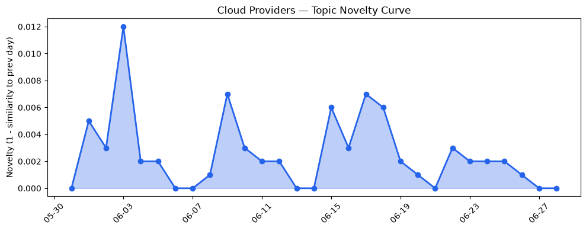
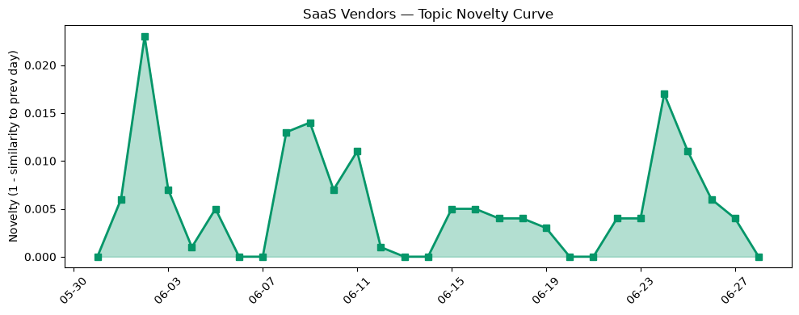

## 今日云计算结构性变化
> 今日云计算和SaaS领域的技术进展、基础设施升级、应用创新、资本热潮和风险信号等方面都有明显的变化和进展。
云计算和SaaS领域的技术进展、基础设施升级、应用创新、资本热潮和风险信号等方面都有明显的变化和进展，尤其是AI和云计算的融合成为一个重要的趋势。今日最值得注意的云计算/SaaS结构性变化是技术层面的重大突破，基础设施的升级和应用层的创新。
- 📈 **持续趋势**：技术层话题已连续N天增强
- 🆕 **新兴方向**：应用层的话题向量在最近8天内呈现持续增强趋势
- 🔺 **突然升温**：基础设施和风险信号近3天内容相似度显著高于更早期均值
- 🔑 **新关键词**：GPU、OAuth、post-quantum、体验智能、数据智能
- 📉 **消退关键词**：Adobe、Amazon Bedrock、Anthropic、Graviton5、OpenAI、Tencent Cloud

## 技术层信号
🔴 重大突破

云原生应用的安全性和监控能力有所增强，Google Cloud、Microsoft Azure和Cloudflare推出了新功能。Google Cloud的BigQuery支持Managed Python UDFs，增强数据分析能力。AWS Lambda引入了MicroVMs，提供了更好的隔离性和安全性。Cloudflare的OAuth和post-quantum安全功能也得到了增强。
[Securing agentic AI with perimeter guardrails: What's new in VPC Service Controls](https://cloud.google.com/blog/products/identity-security/securing-agentic-ai-whats-new-in-vpc-service-controls/)
[Boost BigQuery with Python: Managed Python UDFs now generally available](https://cloud.google.com/blog/products/data-analytics/python-udf-in-bigquery-now-generally-available/)
[Run isolated sandboxes with full lifecycle control: AWS Lambda introduces MicroVMs](https://aws.amazon.com/blogs/aws/run-isolated-sandboxes-with-full-lifecycle-control-aws-lambda-introduces-microvms/)

## 产业资本信号
🔴 强信号

云计算和SaaS领域的投资热潮继续，谷歌、微软和亚马逊等大厂继续进行战略投资和收购。Oracle和Salesforce等公司也在进行战略投资和收购。
[Google wants AI regulation, but on its own terms](https://www.theregister.com/ai-and-ml/2026/06/26/google-wants-ai-regulation-but-on-its-own-terms/)
[Oracle promises to open up MySQL governance, but the community wants guarantees](https://www.theregister.com/databases/2026/06/26/oracle-promises-to-open-up-mysql-governance-but-the-community-wants-guarantees/)

## 潜在拐点判断
今日信号和历史趋势表明，云计算和SaaS领域可能存在潜在拐点。技术层面的重大突破，基础设施的升级和应用层的创新都可能带来新的发展机会。然而，风险信号的突然升温也需要关注。

## 明日观察点
1. 云计算和SaaS领域的技术进展和应用创新
2. 基础设施的升级和资本热潮
3. 风险信号的变化和潜在影响

## 长期趋势坐标
今日信号放到月/季尺度，云计算和SaaS领域的技术进展、基础设施升级、应用创新、资本热潮和风险信号等方面都有明显的变化和进展。这些变化可能会对云计算和SaaS产业格局产生长期影响。

## 数据洞察
### 云厂商话题演化
今日云厂商话题演化显示，Google Cloud、Microsoft Azure和Cloudflare等公司的技术进展和应用创新有所增强。
### SaaS 厂商话题演化
今日SaaS厂商话题演化显示，Salesforce和Oracle等公司的战略投资和收购有所增强。
### 趋势图

## 参考来源
- [Securing agentic AI with perimeter guardrails: What's new in VPC Service Controls](https://cloud.google.com/blog/products/identity-security/securing-agentic-ai-whats-new-in-vpc-service-controls/) — Google Cloud Blog
- [Boost BigQuery with Python: Managed Python UDFs now generally available](https://cloud.google.com/blog/products/data-analytics/python-udf-in-bigquery-now-generally-available/) — Google Cloud Blog
- [Run isolated sandboxes with full lifecycle control: AWS Lambda introduces MicroVMs](https://aws.amazon.com/blogs/aws/run-isolated-sandboxes-with-full-lifecycle-control-aws-lambda-introduces-microvms/) — AWS Blog
- [Google wants AI regulation, but on its own terms](https://www.theregister.com/ai-and-ml/2026/06/26/google-wants-ai-regulation-but-on-its-own-terms/) — The Register
- [Oracle promises to open up MySQL governance, but the community wants guarantees](https://www.theregister.com/databases/2026/06/26/oracle-promises-to-open-up-mysql-governance-but-the-community-wants-guarantees/) — The Register