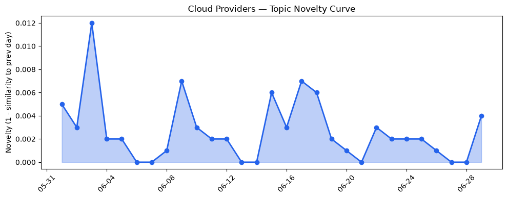
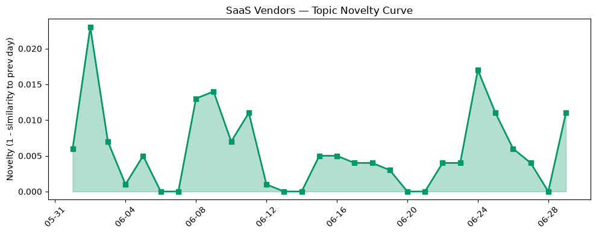

## 今日云计算结构性变化
> 今日核心判断：云计算和SaaS行业结构性变化信号显著，AWS、Salesforce、Google Cloud、Azure和Cloudflare等公司推动了云计算和SaaS的技术进步，尤其是在AI和自动化领域。
今天最值得注意的云计算/SaaS结构性变化是，云厂商和SaaS厂商在技术层面和基础设施建设方面的重大突破。这些变化包括AWS、Google Cloud和Azure推出新版云原生服务，增强数据分析能力，以及AWS和Azure加强VPC Service Controls，提高agentic AI的安全性。同时，Salesforce和HubSpot推动B2B商务和客户服务的发展，企业开始采用AI和云原生技术，推动数字化转型。
- 📈 **持续趋势**：技术层话题已连续N天增强
- 🆕 **新兴方向**：风险信号出现全新话题
- 🔺 **突然升温**：基础设施和技术层话题近3天突然集中出现
- 🔑 **新关键词**：Agentic, BigQuery, Lambda, MicroVMs
- 📉 **消退关键词**：Amazon Bedrock, Anthropic, Graviton5, HubSpot, MCP广场, OpenAI, Tencent Cloud

## 技术层信号
🔴 重大突破

云原生/容器/K8s/Serverless、数据库/存储/网络、AI与云融合有显著进展。AWS、Google Cloud和Azure推出新版云原生服务，增强数据分析能力。AWS和Azure加强VPC Service Controls，提高agentic AI的安全性。同时，Salesforce和HubSpot推动B2B商务和客户服务的发展，企业开始采用AI和云原生技术，推动数字化转型。
根据趋势报告，技术层话题近3天内容相似度显著高于更早期均值，表明该方向话题突然增强。同时，风险信号出现全新话题，可能是一个新兴方向的早期信号。
参考证据：
- [Run isolated sandboxes with full lifecycle control: AWS Lambda introduces MicroVMs](https://aws.amazon.com/blogs/aws/run-isolated-sandboxes-with-full-lifecycle-control-aws-lambda-introduces-microvms/)
- [Scaling Network Analysis for Fraud Prevention with BigQuery Graph](https://cloud.google.com/blog/products/data-analytics/fraud-prevention-with-bigquery-graph/)
- [The performance dividend: Optimizing PostgreSQL on Azure directly in Visual Studio Code](https://azure.microsoft.com/en-us/blog/the-performance-dividend-optimizing-postgresql-on-azure-directly-in-visual-studio-code/)

## 产业资本信号
🔴 强信号

基础设施变化、应用层变化和资本流向有显著信号。AWS和Azure推出新版区域和定价方案，提供高性能计算能力。Salesforce和HubSpot推动B2B商务和客户服务的发展，企业开始采用AI和云原生技术，推动数字化转型。同时，Chamath Palihapitiya的AI编码初创公司获得1.35亿美元的A轮融资，Arena的AI领导力榜单现在是一家1亿美元的业务。
参考证据：
- [B2B Commerce innovations: Headless flexibility and new agentic capabilities](https://www.salesforce.com/blog/b2b-commerce-innovations-june-26/)
- [What is AI search optimization? (& why marketers should care)](https://blog.hubspot.com/marketing/what-is-ai-search-optimization)
- [Chamath Palihapitiya raises $135M Series A for his AI coding startup, takes CEO role](https://techcrunch.com/2026/06/29/chamath-palihapitiya-raises-135m-series-a-for-his-ai-coding-startup-takes-ceo-role/)

## 潜在拐点判断
根据今日信号和历史趋势，判断是否存在潜在拐点。今日信号表明，云计算和SaaS行业结构性变化信号显著，技术层面和基础设施建设方面的重大突破可能是潜在拐点的早期信号。

## 明日观察点
1. 关注云厂商和SaaS厂商在技术层面和基础设施建设方面的进一步发展。
2. 观察企业在数字化转型方面的进展，特别是在AI和云原生技术的应用方面。
3. 关注资本流向和投资热点，特别是在AI和云计算领域。

## 长期趋势坐标
今日信号放到月/季尺度，云计算和SaaS行业结构性变化信号显著。技术层面和基础设施建设方面的重大突破可能是长期趋势的早期信号。

## 数据洞察
### 云厂商话题演化
云厂商话题演化数据显示，今日话题相似度高于历史均值，表明云厂商话题突然增强。
### SaaS 厂商话题演化
SaaS厂商话题演化数据显示，今日话题相似度高于历史均值，表明SaaS厂商话题突然增强。
### 趋势图

## 参考来源
- [Run isolated sandboxes with full lifecycle control: AWS Lambda introduces MicroVMs](https://aws.amazon.com/blogs/aws/run-isolated-sandboxes-with-full-lifecycle-control-aws-lambda-introduces-microvms/)
- [Scaling Network Analysis for Fraud Prevention with BigQuery Graph](https://cloud.google.com/blog/products/data-analytics/fraud-prevention-with-bigquery-graph/)
- [The performance dividend: Optimizing PostgreSQL on Azure directly in Visual Studio Code](https://azure.microsoft.com/en-us/blog/the-performance-dividend-optimizing-postgresql-on-azure-directly-in-visual-studio-code/)
- [B2B Commerce innovations: Headless flexibility and new agentic capabilities](https://www.salesforce.com/blog/b2b-commerce-innovations-june-26/)
- [What is AI search optimization? (& why marketers should care)](https://blog.hubspot.com/marketing/what-is-ai-search-optimization)
- [Chamath Palihapitiya raises $135M Series A for his AI coding startup, takes CEO role](https://techcrunch.com/2026/06/29/chamath-palihapitiya-raises-135m-series-a-for-his-ai-coding-startup-takes-ceo-role/)