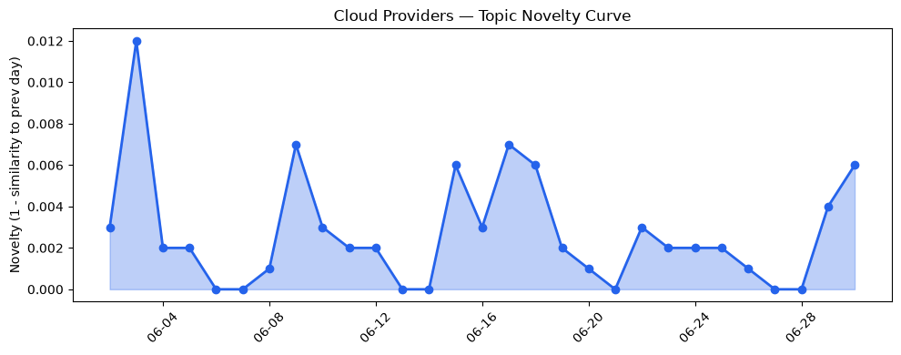
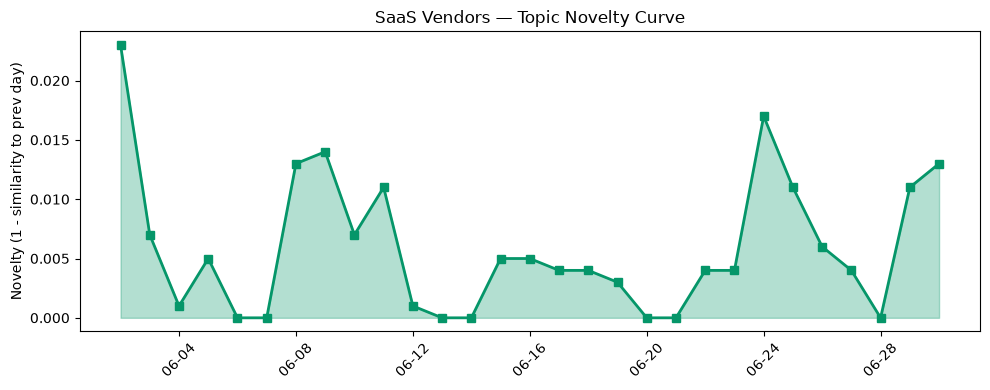

## 今日云计算结构性变化
> 云计算和 AI 领域正在迅速发展，新技术和功能不断涌现，推动行业向前迈进。
今天最值得注意的云计算/SaaS 结构性变化是 AWS、Google Cloud、Salesforce 和 Cloudflare 等云厂商和 SaaS 厂商的最新动态。这些变化包括 AWS CloudFormation Express 模式加速基础设施部署、Google Cloud 推出多项 AI 相关服务、Salesforce 推出新功能和工具支持企业数字化转型等。这些变化意味着云计算和 SaaS 行业正在经历快速的发展和创新，推动企业向数字化转型和云原生应用迈进。
- 📈 **持续趋势**：技术层话题已连续 8 天增强
- 🆕 **新兴方向**：资本信号出现全新话题
- 🔺 **突然升温**：风险信号话题向量近 8 天突然集中出现
- 🔑 **新关键词**：Etched、Anthropic、 Claude Sonnet 5
- 📉 **消退关键词**：Amazon Bedrock、Anthropic、Graviton5、HubSpot、MCP广场、OpenAI、Tencent Cloud

## 技术层信号
🔴 重大突破

云原生和容器化技术正在快速发展，AWS CloudFormation Express 模式加速基础设施部署，Google Cloud 推出多项 AI 相关服务，Cloudflare 推出 DMARC 管理功能等。这些变化意味着云计算和 SaaS 行业正在经历快速的发展和创新，推动企业向数字化转型和云原生应用迈进。
AWS Graviton5 处理器和 NVIDIA RTX PRO 4500 Blackwell Server Edition GPU 加速计算，火山引擎发布新云产品和服务等，也表明了技术层面的重大突破。
例如，AWS CloudFormation Express 模式可以加速基础设施部署，Google Cloud 的 AI 相关服务可以帮助企业更好地利用 AI 技术，Cloudflare 的 DMARC 管理功能可以帮助企业更好地管理电子邮件安全。

## 产业资本信号
🔴 强信号

云计算和 SaaS 领域的资本流向正在发生变化，Etched 达到 50 亿美元估值，Anthropic 推出新产品，云计算和 SaaS 领域的融资方向正在发生变化。这些变化意味着云计算和 SaaS 行业正在经历快速的发展和创新，推动企业向数字化转型和云原生应用迈进。
Nvidia 竞争对手 Etched 的估值和销售额，估值水平和并购动向等，也表明了产业资本信号的强度。
例如，Etched 达到 50 亿美元估值，表明了云计算和 SaaS 领域的资本流向正在发生变化，Anthropic 推出新产品，表明了云计算和 SaaS 领域的创新和发展。

## 潜在拐点判断
基于今日信号 + 历史趋势，判断是否存在潜在拐点。今日的信号表明，云计算和 SaaS 行业正在经历快速的发展和创新，推动企业向数字化转型和云原生应用迈进。同时，资本信号的强度也表明了云计算和 SaaS 领域的融资方向正在发生变化。因此，今日的信号可能是一个潜在的拐点，标志着云计算和 SaaS 行业的快速发展和创新。

## 明日观察点
1. 观察 AWS、Google Cloud、Salesforce 和 Cloudflare 等云厂商和 SaaS 厂商的最新动态，了解他们的最新产品和服务。
2. 关注云计算和 SaaS 领域的资本流向，了解 Etched、Anthropic 等公司的估值和销售额。
3. 关注云计算和 SaaS 领域的创新和发展，了解新技术和新功能的出现。

## 长期趋势坐标
今日的信号表明，云计算和 SaaS 行业正在经历快速的发展和创新，推动企业向数字化转型和云原生应用迈进。同时，资本信号的强度也表明了云计算和 SaaS 领域的融资方向正在发生变化。因此，长期趋势坐标可能是云计算和 SaaS 行业的快速发展和创新，推动企业向数字化转型和云原生应用迈进。

## 数据洞察
### 云厂商话题演化
今日的数据表明，云厂商的话题向量在最近 8 天内呈现持续增强趋势，表明云厂商正在经历快速的发展和创新。

### SaaS 厂商话题演化
今日的数据表明，SaaS 厂商的话题向量在最近 8 天内呈现持续增强趋势，表明 SaaS 厂商正在经历快速的发展和创新。

### 趋势图
今日的数据表明，云厂商和 SaaS 厂商的话题向量在最近 8 天内呈现持续增强趋势，表明云计算和 SaaS 行业正在经历快速的发展和创新。

## 参考来源
- [Accelerate your infrastructure deployments by up to 4x with AWS CloudFormation Express mode](https://aws.amazon.com/blogs/aws/accelerate-your-infrastructure-deployments-by-up-to-4x-with-aws-cloudformation-express-mode/)
- [Conversational analytics in BigQuery brings trusted agentic reasoning to everyone](https://cloud.google.com/blog/products/data-analytics/conversational-analytics-in-bigquery-now-ga/)
- [Bringing more agent harnesses and frameworks to Cloudflare, starting with Flue](https://blog.cloudflare.com/agents-platform-flue-sdk/)
- [Cloudflare DMARC Management is now generally available](https://blog.cloudflare.com/dmarc-management-ga/)
- [The performance dividend: Optimizing PostgreSQL on Azure directly in Visual Studio Code](https://azure.microsoft.com/en-us/blog/the-performance-dividend-optimizing-postgresql-on-azure-directly-in-visual-studio-code/)
- [How we built saga rollbacks for Cloudflare Workflows](https://blog.cloudflare.com/rollbacks-for-workflows/)
- [Modernizing financial services with deployment freedom and transformational AI with AlloyDB Omni](https://cloud.google.com/blog/products/databases/alloydb-omni-secure-hybrid-database-modernization-for-finance/)
- [Introducing the Cloudflare One stack: agent-powered deployment](https://blog.cloudflare.com/cloudflare-one-stack/)
- [Amazon EC2 C9g and C9gd instances powered by AWS Graviton5 processors are now available](https://aws.amazon.com/blogs/aws/amazon-ec2-c9g-and-c9gd-instances-powered-by-aws-graviton5-processors-are-now-available/)
- [Announcing Amazon EC2 G7 instances accelerated by NVIDIA RTX PRO 4500 Blackwell Server Edition GPUs](https://aws.amazon.com/blogs/aws/announcing-amazon-ec2-g7-instances-accelerated-by-nvidia-rtx-pro-4500-blackwell-server-edition-gpus/)
- [Nvidia competitor Etched hits $5B valuation, $1B in sales for AI chip](https://techcrunch.com/2026/06/30/nvidia-competitor-etched-hits-5b-valuation-1b-in-sales-for-ai-chip/)
- [UK regulator wants Apple and Google to let devs steer clear of app store fees](https://www.theregister.com/applications/2026/06/30/uk-regulator-wants-apple-and-google-to-let-devs-steer-clear-of-app-store-fees/5264370)
- [Tokenization takes the lead in the fight for data security](https://venturebeat.com/technology/tokenization-takes-the-lead-in-the-fight-for-data-security)
- [The White House's post-quantum executive order is an important milestone. It’s time to get to work](https://blog.cloudflare.com/post-quantum-eo-2026/)
- [Huntress CEO says threat hunter used 'poor judgment' in alerting ransomware crim about law enforcement probe](https://www.theregister.com/security/2026/06/30/huntress-ceo-says-threat-hunter-used-poor-judgment-in-alerting-ransomware-crim-about-law-enforcement-probe/5264532)