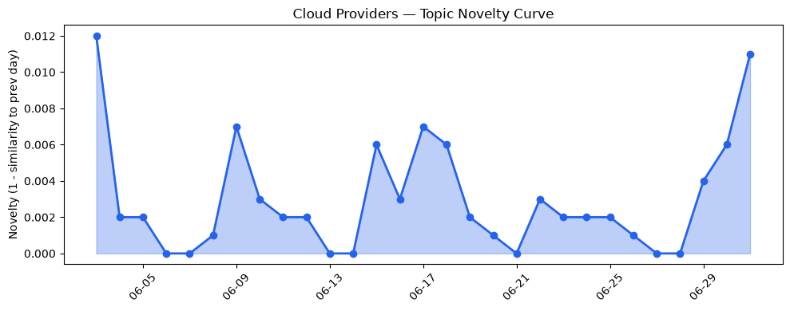
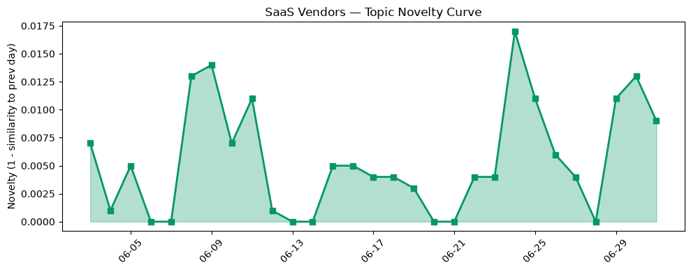

## 今日云计算结构性变化
> 今日云计算和SaaS领域主要变化体现在技术层面，尤其是AI和云计算的融合，以及云厂商的基础设施和应用层面的更新。
今日最值得注意的云计算/SaaS结构性变化是技术层面的重大突破，特别是AWS、Google Cloud和Microsoft Azure在云原生、AI和基础设施方面的更新。这些变化表明云计算和SaaS领域正在迅速演变，企业需要跟上这些变化以保持竞争力。
- 📈 **持续趋势**：技术层话题已连续8天增强
- 🆕 **新兴方向**：资本信号和风险信号出现全新话题

## 技术层信号
🔴 重大突破

云原生和AI技术的融合是今日技术层信号的主要内容。AWS推出Kubernetes版本回滚功能，Google Cloud推出AlloyDB AI Functions，Microsoft Azure推出Claude Fable 5，这些更新表明云厂商正在加速云原生和AI技术的发展。同时，基础设施的更新也在持续进行，AWS CloudFormation Express模式加速了基础设施部署，Azure Files和PostgreSQL trên Azure的性能优化也为企业提供了更好的选择。
[Upgrade Amazon EKS clusters with confidence using Kubernetes version rollbacks](https://aws.amazon.com/blogs/aws/upgrade-amazon-eks-clusters-with-confidence-using-kubernetes-version-rollbacks/)
[AlloyDB AI Functions - now with revolutionary performance boosts and cost savings](https://cloud.google.com/blog/products/databases/boost-performance-and-lower-costs-with-alloydb-ai-functions/)
[Claude in Microsoft Foundry is now generally available](https://azure.microsoft.com/en-us/blog/claude-in-microsoft-foundry-is-now-generally-available/)

## 产业资本信号
🔴 强信号

今日产业资本信号主要体现在资本流向和估值方面。Neocloud Together AI获得800M美元融资，估值达到8.3B美元，Venice AI获得65M美元Series A融资，估值达到1亿美元，这些融资事件表明资本市场对云计算和SaaS领域的信心。
[Neocloud Together AI raises $800M, leaps to $8.3B valuation](https://techcrunch.com/2026/07/01/neocloud-together-ai-raises-800m-leaps-to-8-3b-valuation/)
[Venice AI becomes a unicorn with $65M Series A as its privacy-first AI platform takes off](https://techcrunch.com/2026/07/01/venice-ai-becomes-a-unicorn-with-65m-series-a-as-its-privacy-first-ai-platform-takes-off/)

## 潜在拐点判断
今日信号和历史趋势表明，云计算和SaaS领域可能正在经历一个潜在的拐点。技术层面的重大突破和资本信号的强度都表明企业需要加速转型以保持竞争力。

## 明日观察点
1. 观察AWS、Google Cloud和Microsoft Azure在云原生和AI技术方面的进一步更新。
2. 关注资本市场对云计算和SaaS领域的信心和估值。
3. 注意风险信号和监管政策的变化。

## 长期趋势坐标
今日信号和历史趋势表明，云计算和SaaS领域的长期趋势是技术层面的持续创新和资本信号的强度。企业需要持续关注这些趋势并加速转型以保持竞争力。

## 数据洞察
### 云厂商话题演化
云厂商话题向量在最近8天内呈现持续增强趋势，表明云厂商正在持续升温。
### SaaS厂商话题演化
SaaS厂商话题向量在最近8天内呈现持续增强趋势，表明SaaS厂商正在持续升温。
### 趋势图

## 参考来源
- [Upgrade Amazon EKS clusters with confidence using Kubernetes version rollbacks](https://aws.amazon.com/blogs/aws/upgrade-amazon-eks-clusters-with-confidence-using-kubernetes-version-rollbacks/) — AWS Blog
- [AlloyDB AI Functions - now with revolutionary performance boosts and cost savings](https://cloud.google.com/blog/products/databases/boost-performance-and-lower-costs-with-alloydb-ai-functions/) — Google Cloud Blog
- [Claude in Microsoft Foundry is now generally available](https://azure.microsoft.com/en-us/blog/claude-in-microsoft-foundry-is-now-generally-available/) — Microsoft Azure Blog
- [Neocloud Together AI raises $800M, leaps to $8.3B valuation](https://techcrunch.com/2026/07/01/neocloud-together-ai-raises-800m-leaps-to-8-3b-valuation/) — TechCrunch
- [Venice AI becomes a unicorn with $65M Series A as its privacy-first AI platform takes off](https://techcrunch.com/2026/07/01/venice-ai-becomes-a-unicorn-with-65m-series-a-as-its-privacy-first-ai-platform-takes-off/) — TechCrunch