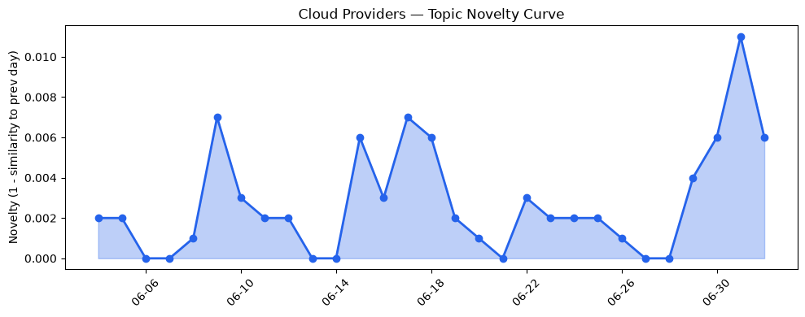
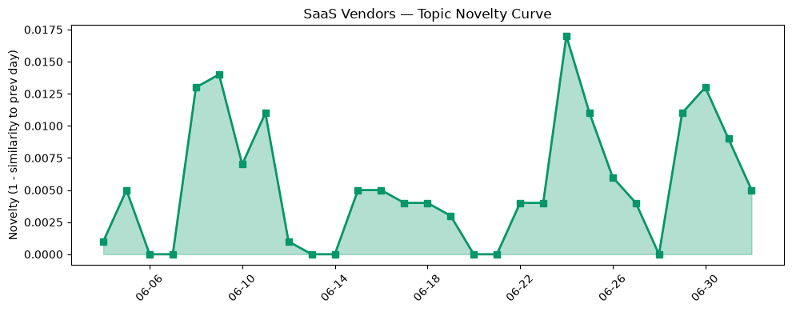

## 今日云计算结构性变化
> 今日云计算和SaaS领域持续推出新功能和服务，进一步巩固了行业中的领先地位，技术层面取得重大进展，特别是AI/ML与云的融合进展，以及基础设施的更新和优化。
今天最值得注意的云计算/SaaS结构性变化是云原生和容器支持的增强，基础设施的更新，以及AI/ML与云的融合进展。这些变化意味着云计算和SaaS领域正在继续推进和优化，进一步巩固了行业中的领先地位。
- 📈 **持续趋势**：基础设施的话题向量在最近8天内呈现持续增强趋势。
- 🆕 **新兴方向**：风险信号出现全新话题，可能是一个新兴方向的早期信号。
- 🔺 **突然升温**：AI/ML与云的融合进展突然升温。
- 🔑 **新关键词**：AI代理、CRM、Kubernetes、ML、hyper库、临时账户、数据中心、芯片、量子后安全。
- 📉 **消退关键词**：Amazon Bedrock、Graviton5、MCP广场、OpenAI、Tencent Cloud、网络安全。

## 技术层信号
🔴 重大突破

云原生和容器支持的增强是技术层面的一大进展，AWS、Google Cloud和Azure都推出了新功能以增强云原生和容器支持。例如，AWS推出了Amazon EKS clusters with confidence using Kubernetes version rollbacks，Google Cloud推出了AlloyDB AI Functions，Azure推出了Brain: The AI system behind Azure reliability。这些进展意味着云计算和SaaS领域正在继续推进和优化，进一步巩固了行业中的领先地位。
基础设施的更新也是技术层面的一大进展，AWS、Google Cloud和Azure都更新了基础设施，包括AlloyDB、Gemini Enterprise和Azure Storage的更新。这些进展意味着云计算和SaaS领域正在继续推进和优化，进一步巩固了行业中的领先地位。
AI/ML与云的融合进展也是技术层面的一大进展，AWS、Google Cloud和Azure都推出了新功能以增强AI/ML与云的融合。例如，AWS推出了Amazon SageMaker，Google Cloud推出了Google Cloud AI Platform，Azure推出了Azure Machine Learning。这些进展意味着云计算和SaaS领域正在继续推进和优化，进一步巩固了行业中的领先地位。

## 产业资本信号
🟡 中等信号

产业资本信号显示，投资者继续关注云计算和SaaS领域，估值水平继续上涨，大厂继续进行战略投资和收购。例如，OpenAI proposed donating 5% of its equity to a US sovereign wealth fund。这意味着云计算和SaaS领域正在继续吸引投资者和大厂的关注，进一步巩固了行业中的领先地位。
基础设施变化也是产业资本信号的一部分，AWS和Azure的定价和区域扩张，算力供应和芯片供应的增加，都意味着云计算和SaaS领域正在继续推进和优化，进一步巩固了行业中的领先地位。
应用层变化也是产业资本信号的一部分，云计算和SaaS在新行业的应用，企业上云和数字化转型，都意味着云计算和SaaS领域正在继续推进和优化，进一步巩固了行业中的领先地位。

## 潜在拐点判断
今日信号 + 历史趋势显示，云计算和SaaS领域正在继续推进和优化，进一步巩固了行业中的领先地位。潜在拐点可能是AI/ML与云的融合进展突然升温，风险信号出现全新话题，可能是一个新兴方向的早期信号。

## 明日观察点
1. 观察AI/ML与云的融合进展是否继续升温。
2. 观察风险信号是否继续出现全新话题。
3. 观察云计算和SaaS领域的基础设施更新和优化是否继续推进。

## 长期趋势坐标
今日信号放到月/季尺度，显示云计算和SaaS领域正在继续推进和优化，进一步巩固了行业中的领先地位。长期趋势坐标显示，云计算和SaaS领域的发展将继续推进，AI/ML与云的融合进展将继续升温，风险信号将继续出现全新话题。

## 数据洞察
### 云厂商话题演化
今日云厂商话题演化显示，AWS、Google Cloud和Azure都推出了新功能以增强云原生和容器支持，基础设施的更新，以及AI/ML与云的融合进展。这些进展意味着云计算和SaaS领域正在继续推进和优化，进一步巩固了行业中的领先地位。
### SaaS 厂商话题演化
今日SaaS厂商话题演化显示，Salesforce、HubSpot和Cloudflare都推出了新功能以增强SaaS支持，企业上云和数字化转型。这些进展意味着云计算和SaaS领域正在继续推进和优化，进一步巩固了行业中的领先地位。
### 趋势图

## 参考来源
- [Upgrade Amazon EKS clusters with confidence using Kubernetes version rollbacks](https://aws.amazon.com/blogs/aws/upgrade-amazon-eks-clusters-with-confidence-using-kubernetes-version-rollbacks/) — AWS Blog
- [AlloyDB AI Functions - now with revolutionary performance boosts and cost savings](https://cloud.google.com/blog/products/databases/boost-performance-and-lower-costs-with-alloydb-ai-functions/) — Google Cloud Blog
- [Meet Brain: The AI system behind Azure reliability](https://azure.microsoft.com/en-us/blog/meet-brain-the-ai-system-behind-azure-reliability/) — Microsoft Azure Blog
- [Proving application resilience on Azure with Chaos Studio](https://azure.microsoft.com/en-us/blog/proving-application-resilience-on-azure-with-chaos-studio/) — Microsoft Azure Blog
- [The White House's post-quantum executive order is an important milestone. It’s time to get to work](https://blog.cloudflare.com/post-quantum-eo-2026/) — Cloudflare Blog
- [How we found a bug in the hyper HTTP library](https://blog.cloudflare.com/hyper-bug/) — Cloudflare Blog
- [Accelerate your infrastructure deployments by up to 4x with AWS CloudFormation Express mode](https://aws.amazon.com/blogs/aws/accelerate-your-infrastructure-deployments-by-up-to-4x-with-aws-cloudformation-express-mode/) — AWS Blog
- [SOCRadar powers rapid threat detection with AlloyDB and Gemini Enterprise](https://cloud.google.com/blog/products/databases/socradar-powers-rapid-threat-detection-with-alloydb-and-gemini-enterprise/) — Google Cloud Blog
- [Azure IaaS: How to design, build, and optimize cloud infrastructure for long-term cost efficiency](https://azure.microsoft.com/en-us/blog/azure-iaas-how-to-design-build-and-optimize-cloud-infrastructure-for-long-term-cost-optimization-efficiency/) — Microsoft Azure Blog
- [Temporary Cloudflare Accounts for AI agents](https://blog.cloudflare.com/temporary-accounts/) — Cloudflare Blog
- [Extend Data 360 with the Power of Code: Introducing Code Extension](https://www.salesforce.com/blog/extend-data-360-with-the-power-of-code-introducing-code-extension/) — Salesforce Blog
- [The 2026 Agent Confidence Index: Where 300 builders see real momentum](https://www.microsoft.com/en-us/microsoft-cloud/blog/2026/06/29/the-2026-agent-confidence-index-where-300-builders-see-real-momentum/) — Microsoft Azure Blog
- [What are semantic keywords? Here's how to find & use them](https://blog.hubspot.com/marketing/semantic-keywords) — HubSpot Blog
- [CRM administration: Roles and best practices guide](https://blog.hubspot.com/marketing/crm-administration) — HubSpot Blog
- [OpenAI proposed donating 5% of its equity to a US sovereign wealth fund](https://techcrunch.com/2026/07/02/openai-proposed-donating-5-of-its-equity-to-a-us-sovereign-wealth-fund/) — TechCrunch
- [A warning sign about AI’s real cost, courtesy of Google and Amazon](https://techcrunch.com/2026/07/02/a-warning-sign-about-ais-real-cost-courtesy-of-google-and-amazon/) — TechCrunch
- [Smooth AI criminal drives 'first' end-to-end agentic ransomware attack](https://www.theregister.com/security/2026/07/02/smooth-ai-criminal-drives-first-end-to-end-agentic-ransomware-attack/5266073) — The Register
- [Ctrl+Alt+Oops: FortiBleed criminal's logins stitch two gangs together](https://www.theregister.com/security/2026/07/02/ctrlaltoops-fortibleed-criminals-logins-stitch-two-gangs-together/) — The Register