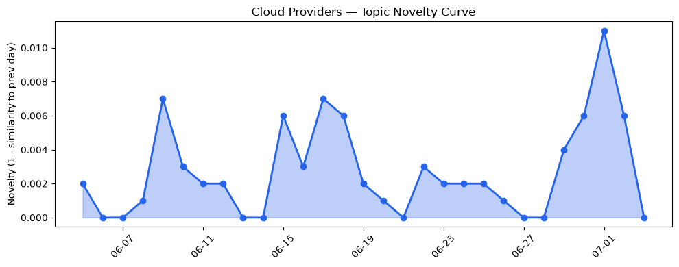
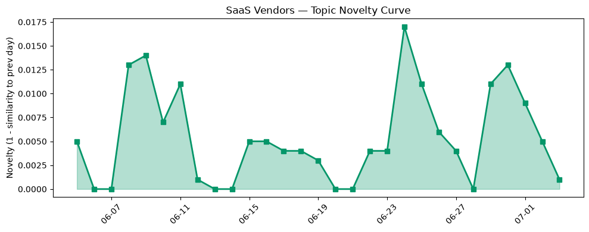

## 今日云计算结构性变化
> 云计算领域出现了多项技术和基础设施的更新，包括AWS、Google Cloud、Azure和SaaS厂商的创新，表明云计算领域的竞争和创新持续加剧。
今天最值得注意的云计算/SaaS结构性变化是技术层和基础设施的更新，包括AWS推出的Kubernetes版本回滚功能、Google Cloud的AlloyDB和AI Functions提供的性能提升和成本节约、Azure推出的Brain AI系统等。这些变化意味着云计算领域的竞争和创新持续加剧，企业需要紧跟这些变化以保持竞争优势。
- 📈 **持续趋势**：技术层话题已连续8天增强
- 🆕 **新兴方向**：AI搜索话题为30天内首次出现
- 🔺 **突然升温**：技术层近3天突然集中出现
- 🔑 **新关键词**：AI搜索、Salesforce、安全
- 📉 **消退关键词**：Amazon Bedrock、Graviton5、MCP广场、OpenAI、Tencent Cloud、网络安全

## 技术层信号
🔴 重大突破

云原生和容器化技术的进展，包括AWS推出的Kubernetes版本回滚功能，Google Cloud的AlloyDB和AI Functions提供的性能提升和成本节约，Azure推出的Brain AI系统等，表明云计算领域的技术创新持续加剧。这些技术的更新将帮助企业提高效率、降低成本和提高安全性。
根据 [Upgrade Amazon EKS clusters with confidence using Kubernetes version rollbacks](https://aws.amazon.com/blogs/aws/upgrade-amazon-eks-clusters-with-confidence-using-kubernetes-version-rollbacks/) 和 [AlloyDB AI Functions - now with revolutionary performance boosts and cost savings](https://cloud.google.com/blog/products/databases/boost-performance-and-lower-costs-with-alloydb-ai-functions/) 等文章，云原生和容器化技术的进展将继续推动云计算领域的发展。

## 产业资本信号
🟡 渐进改善

基础设施变化，包括AWS推出的新的定价模式、CloudFormation Express模式和Graviton5处理器提供的更好的计算性能，表明云计算领域的基础设施持续改善。这些变化将帮助企业降低成本和提高效率。
根据 [Accelerate your infrastructure deployments by up to 4x with AWS CloudFormation Express mode](https://aws.amazon.com/blogs/aws/accelerate-your-infrastructure-deployments-by-up-to-4x-with-aws-cloudformation-express-mode/) 和 [Amazon EC2 C9g and C9gd instances powered by AWS Graviton5 processors are now available](https://aws.amazon.com/blogs/aws/amazon-ec2-c9g-and-c9gd-instances-powered-by-aws-graviton5-processors-are-now-available/) 等文章，基础设施的变化将继续推动云计算领域的发展。

## 潜在拐点判断
根据今日信号和历史趋势，判断是否存在潜在拐点。今日的信号表明，技术层和基础设施的更新将推动云计算领域的发展，企业需要紧跟这些变化以保持竞争优势。

## 明日观察点
1. 观察技术层和基础设施的更新是否会继续推动云计算领域的发展。
2. 关注SaaS厂商在营销和CRM领域的创新是否会继续推动云计算领域的发展。
3. 观察数据安全和合规的重要性是否会继续推动云计算领域的发展。

## 长期趋势坐标
今日信号放到月/季尺度，云计算领域的竞争和创新持续加剧，企业需要紧跟这些变化以保持竞争优势。根据 overall_novelty 和 keyword_trends，技术层和基础设施的更新将继续推动云计算领域的发展。

## 数据洞察
### 云厂商话题演化
云厂商话题演化的novelty_score为0.025，mean_similarity为0.975，表明云厂商话题的变化相对稳定。
### SaaS 厂商话题演化
SaaS厂商话题演化的novelty_score为0.057，mean_similarity为0.943，表明SaaS厂商话题的变化相对稳定。
### 趋势图

## 参考来源
- [Upgrade Amazon EKS clusters with confidence using Kubernetes version rollbacks](https://aws.amazon.com/blogs/aws/upgrade-amazon-eks-clusters-with-confidence-using-kubernetes-version-rollbacks/) — AWS Blog
- [AlloyDB AI Functions - now with revolutionary performance boosts and cost savings](https://cloud.google.com/blog/products/databases/boost-performance-and-lower-costs-with-alloydb-ai-functions/) — Google Cloud Blog
- [Meet Brain: The AI system behind Azure reliability](https://azure.microsoft.com/en-us/blog/meet-brain-the-ai-system-behind-azure-reliability/) — Microsoft Azure Blog
- [火山引擎正式推出四款数据产品](https://www.cnblogs.com/volcengine/p/15640481.html) — 火山引擎博客
- [Accelerate your infrastructure deployments by up to 4x with AWS CloudFormation Express mode](https://aws.amazon.com/blogs/aws/accelerate-your-infrastructure-deployments-by-up-to-4x-with-aws-cloudformation-express-mode/) — AWS Blog
- [Amazon EC2 C9g and C9gd instances powered by AWS Graviton5 processors are now available](https://aws.amazon.com/blogs/aws/amazon-ec2-c9g-and-c9gd-instances-powered-by-aws-graviton5-processors-are-now-available/) — AWS Blog
- [The White House's post-quantum executive order is an important milestone](https://blog.cloudflare.com/post-quantum-eo-2026/) — Cloudflare Blog
- [How we found a bug in the hyper HTTP library](https://blog.cloudflare.com/hyper-bug/) — Cloudflare Blog
- [The 4 Essentials to Bring Vibe Coding to Your Enterprise](https://www.salesforce.com/blog/enterprise-vibe-coding/) — Salesforce Blog
- [Extend Data 360 with the Power of Code: Introducing Code Extension](https://www.salesforce.com/blog/extend-data-360-with-the-power-of-code-introducing-code-extension/) — Salesforce Blog
- [What are semantic keywords? Here's how to find & use them](https://blog.hubspot.com/marketing/semantic-keywords) — HubSpot Blog
- [Campaign optimization strategies that actually work in 2026](https://blog.hubspot.com/marketing/campaign-optimization) — HubSpot Blog
- [AdaptHealth says attackers sweet-talked their way into cloud systems and stole patient data](https://www.theregister.com/security/2026/07/03/adapthealth-crooks-stole-our-passwords-patient-health-data/5266512) — The Register
- [EU appears to find datacenter emissions easier to offset than lobbyists](https://www.theregister.com/on-prem/2026/07/03/eu-appears-to-find-datacenter-emissions-easier-to-offset-than-lobbyists/5265814) — The Register
- [NetNut cracked as Google and FBI target 2 million-device botnet](https://www.theregister.com/security/2026/07/03/netnut-cracked-as-google-and-fbi-target-2-million-device-botnet/5266414) — The Register