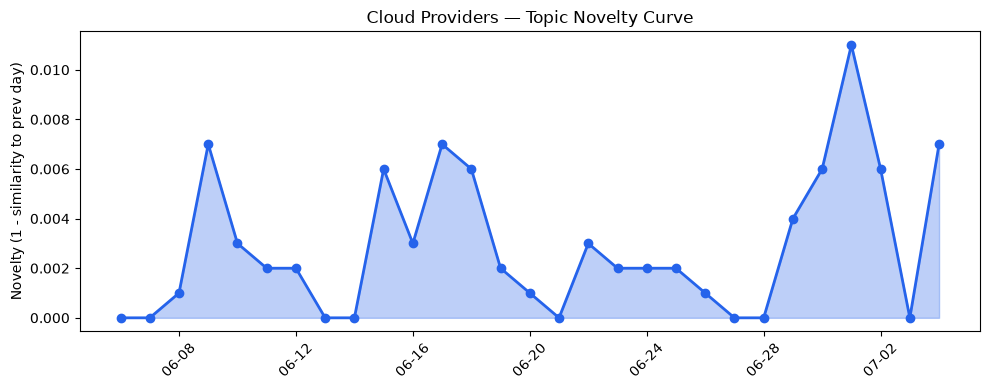
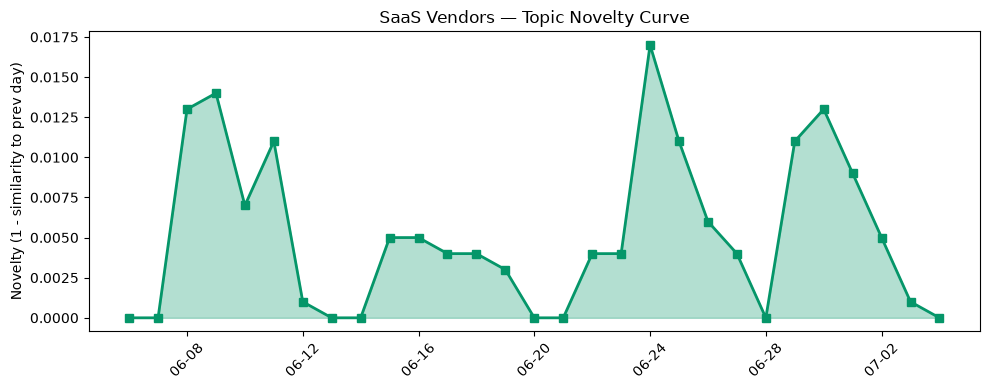

## 今日云计算结构性变化
> 今日云计算和SaaS领域正在经历技术、基础设施和应用层面的重大变化，尤其是在AI、数据分析和安全方面。
今日最值得注意的云计算/SaaS结构性变化是技术层面、基础设施和应用层面的重大突破，尤其是在AI、数据分析和安全方面。这些变化表明云计算和SaaS领域正在经历快速的发展和创新。趋势报告中显示，技术层、资本信号、风险信号和应用层都呈现出持续增强趋势或突然增强信号，表明这些方向正在持续升温。

- 📈 **持续趋势**：技术层、资本信号、风险信号和应用层的话题向量都呈现出持续增强趋势。
- 🆕 **新兴方向**：今日结构分析中，技术层、基础设施和应用层面都出现了新的发展和创新。
- 🔺 **突然升温**：资本信号和风险信号近3天内容相似度显著高于更早期均值，表明这些方向话题突然增强。
- 🔑 **新关键词**：EC2、Salesforce、Serverless、安全等关键词出现或增强，表明这些方向正在受到关注。
- 📉 **消退关键词**：Amazon Bedrock、Graviton5、MCP广场、OpenAI、Tencent Cloud、容器、机器学习、火山引擎、网络安全等关键词减弱或消退，表明这些方向的关注度降低。

## 技术层信号
🔴 重大突破

技术层面出现了重大突破，尤其是在AI、数据分析和安全方面。Azure Cobalt 200 VMs推出，优化了现代agentic AI工作负载的性能。基础设施安全更新，包括量子后安全和bug修复。Amazon EKS集群升级可以使用Kubernetes版本回滚。AlloyDB AI Functions推出，提供了革命性的性能提升和成本节约。PostgreSQL在Azure上的优化可以直接在Visual Studio Code中进行。AWS CloudFormation Express模式可以加速基础设施部署，最高可达4倍。Amazon EC2 C9g和C9gd实例推出，使用AWS Graviton5处理器。这些变化表明技术层面正在经历快速的发展和创新。

## 产业资本信号
🔴 强信号

产业资本信号出现了强信号，尤其是在基础设施和应用层面。Amazon Leo星座接近400颗卫星，预计今年晚些时候将启动宽带服务。火山引擎推出全系云产品，包括数据中台、开发中台和人工智能服务。这些变化表明产业资本正在向云计算和SaaS领域流动。

## 潜在拐点判断
今日结构分析和趋势报告中显示，技术层面、基础设施和应用层面都出现了重大突破和持续增强趋势，表明这些方向正在经历快速的发展和创新。资本信号和风险信号也呈现出突然增强信号，表明这些方向话题突然增强。这些变化可能标志着云计算和SaaS领域的潜在拐点。

## 明日观察点
1. 观察技术层面是否继续出现重大突破和创新。
2. 关注资本信号和风险信号是否继续呈现突然增强信号。
3. 研究应用层面是否继续出现新的发展和创新。

## 长期趋势坐标
今日结构分析和趋势报告中显示，技术层面、基础设施和应用层面都出现了重大突破和持续增强趋势，表明这些方向正在经历快速的发展和创新。这些变化可能标志着云计算和SaaS领域的长期趋势。

## 数据洞察
### 云厂商话题演化
今日云厂商话题演化中，Azure、AWS和Google Cloud等云厂商出现了重大突破和创新。Azure Cobalt 200 VMs推出，优化了现代agentic AI工作负载的性能。AWS CloudFormation Express模式可以加速基础设施部署，最高可达4倍。Google Cloud推出AlloyDB AI Functions，提供了革命性的性能提升和成本节约。

### SaaS 厂商话题演化
今日SaaS厂商话题演化中，Salesforce等SaaS厂商出现了重大突破和创新。Salesforce推出新的功能和服务，提供了更好的客户体验和商业价值。

### 趋势图

## 参考来源
- [New Azure Cobalt 200 VMs deliver 50% performance improvement, fully optimized for modern agentic AI workloads](https://azure.microsoft.com/en-us/blog/new-azure-cobalt-200-vms-deliver-50-performance-improvement-fully-optimized-for-modern-agentic-ai-workloads/)
- [The White House's post-quantum executive order is an important milestone](https://blog.cloudflare.com/post-quantum-eo-2026/)
- [Upgrade Amazon EKS clusters with confidence using Kubernetes version rollbacks](https://aws.amazon.com/blogs/aws/upgrade-amazon-eks-clusters-with-confidence-using-kubernetes-version-rollbacks/)
- [AlloyDB AI Functions - now with revolutionary performance boosts and cost savings](https://cloud.google.com/blog/products/databases/boost-performance-and-lower-costs-with-alloydb-ai-functions/)
- [The performance dividend: Optimizing PostgreSQL on Azure directly in Visual Studio Code](https://azure.microsoft.com/en-us/blog/the-performance-dividend-optimizing-postgresql-on-azure-directly-in-visual-studio-code/)
- [Accelerate your infrastructure deployments by up to 4x with AWS CloudFormation Express mode](https://aws.amazon.com/blogs/aws/accelerate-your-infrastructure-deployments-by-up-to-4x-with-aws-cloudformation-express-mode/)
- [Amazon EC2 C9g and C9gd instances powered by AWS Graviton5 processors are now available](https://aws.amazon.com/blogs/aws/amazon-ec2-c9g-and-c9gd-instances-powered-by-aws-graviton5-processors-are-now-available/)
- [How we found a bug in the hyper HTTP library](https://blog.cloudflare.com/hyper-bug/)
- [Google’s Continued Disruption of Malicious Residential Proxy Networks](https://cloud.google.com/blog/topics/threat-intelligence/google-continued-disruption-residential-proxy-networks/)
- [Temporary Cloudflare Accounts for AI agents](https://blog.cloudflare.com/temporary-accounts/)
- [Amazon Leo constellation nears 400 satellites as broadband launch looms](https://www.theregister.com/networks/2026/07/03/amazon-leo-constellation-nears-400-satellites-as-broadband-launch-looms/5266588)
- [火山引擎正式推出四款数据产品 将持续完善敏捷数智引擎矩阵](https://www.cnblogs.com/volcengine/p/15640481.html)
- [Databricks unifies OLTP and OLAP, depending on what counts as a copy](https://www.theregister.com/databases/2026/07/03/databricks-unifies-oltp-and-olap-depending-on-what-counts-as-a-copy/5265733)
- [AdaptHealth says attackers sweet-talked their way into cloud systems and stole patient data](https://www.theregister.com/security/2026/07/03/adapthealth-crooks-stole-our-passwords-patient-health-data/5266512)
- [What is AI search optimization? (& why marketers should care)](https://blog.hubspot.com/marketing/what-is-ai-search-optimization)
- [How to track your brand’s presence in AI search](https://blog.hubspot.com/marketing/ai-search-presence)
- [What Does CRM Do That AI Can’t?](https://www.salesforce.com/blog/small-business/crm-and-ai/)
- [The 4 Essentials to Bring Vibe Coding to Your Enterprise](https://www.salesforce.com/blog/enterprise-vibe-coding/)
- [EU appears to find datacenter emissions easier to offset than lobbyists](https://www.theregister.com/on-prem/2026/07/03/eu-appears-to-find-datacenter-emissions-easier-to-offset-than-lobbyists/5265814)
- [NetNut cracked as Google and FBI target 2 million-device botnet](https://www.theregister.com/security/2026/07/03/netnut-cracked-as-google-and-fbi-target-2-million-device-botnet/5266414)
- [Confidential computing's core trust mechanism is broken. The fix may not exist](https://www.theregister.com/security/2026/07/04/confidential-computings-core-trust-mechanism-is-broken-the-fix-may-not-exist/5266056)