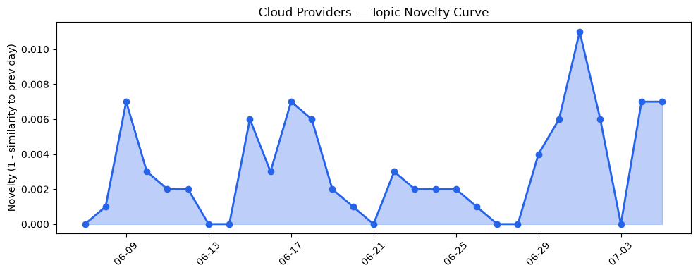
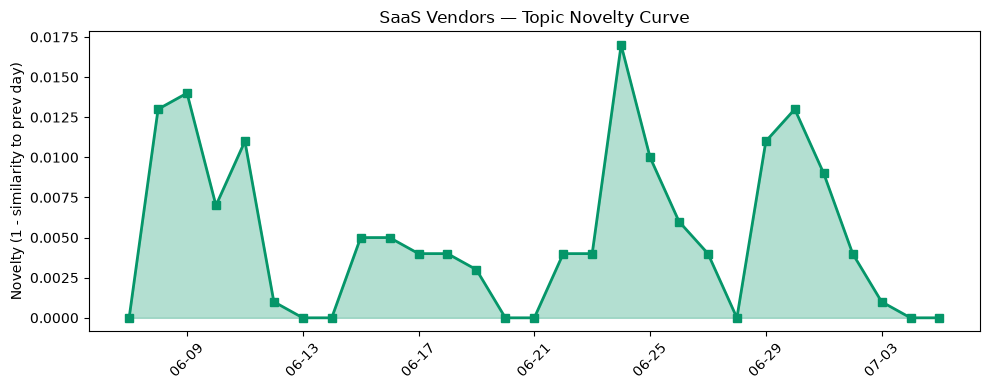

## 今日云计算结构性变化
> 云计算和SaaS产业结构性变化主要体现在技术层面的突破，特别是AI与云的融合以及基础设施的更新。
今日最值得注意的云计算/SaaS结构性变化是技术层面的重大突破，特别是AI与云的融合以及基础设施的更新。这种变化之所以重要，是因为它标志着云计算和SaaS产业正在经历一场深刻的变革，这种变革将对整个产业产生深远的影响。
- 📈 **持续趋势**：技术层话题已连续8天增强
- 🆕 **新兴方向**：风险信号出现全新话题
- 🔺 **突然升温**：基础设施近3天话题突然增强
- 🔑 **新关键词**：Salesforce、基础设施、安全、数据分析
- 📉 **消退关键词**：Amazon Bedrock、Graviton5、MCP广场、OpenAI、Tencent Cloud、容器、机器学习、火山引擎、网络安全

## 技术层信号
🔴 重大突破

云原生、容器化、Serverless以及AI与云的融合是当前技术层面的主要进展。AWS、Google Cloud和Microsoft Azure推出了多项新功能，包括Kubernetes版本回滚、AlloyDB AI Functions和Brain AI系统，这些功能大大提高了云计算的效率和智能化。同时，AWS Graviton5处理器和NVIDIA RTX PRO 4500 Blackwell Server Edition GPU提供了更高的计算性能。
例如，[Upgrade Amazon EKS clusters with confidence using Kubernetes version rollbacks](https://aws.amazon.com/blogs/aws/upgrade-amazon-eks-clusters-with-confidence-using-kubernetes-version-rollbacks/)和[AlloyDB AI Functions - now with revolutionary performance boosts and cost savings](https://cloud.google.com/blog/products/databases/boost-performance-and-lower-costs-with-alloydb-ai-functions/)等文章展示了这些新功能的强大能力。

## 产业资本信号
🔴 强信号

基础设施的更新和应用层的变化是当前产业资本信号的主要体现。Cloudflare推出了Monetization Gateway，允许用户对任何资源收费，Amazon Leo星座接近400颗卫星，预计今年晚些时候将启动宽带服务。同时，Salesforce强调CRM与AI的融合，HubSpot发布了多篇关于AI搜索优化和CRM管理的文章，这些都表明了云计算和SaaS产业正在经历一场深刻的变革。
例如，[Announcing the Monetization Gateway: charge for any resource behind Cloudflare via x402](https://blog.cloudflare.com/monetization-gateway/)和[What Does CRM Do That AI Can’t?](https://www.salesforce.com/blog/small-business/crm-and-ai/)等文章展示了这些变化的影响。

## 潜在拐点判断
基于今日信号和历史趋势，判断是否存在潜在拐点。今日的信号表明，技术层面的重大突破和基础设施的更新可能标志着云计算和SaaS产业结构性变化的拐点。这种变化可能会对整个产业产生深远的影响，包括云计算和SaaS的应用和发展。

## 明日观察点
1. 观察技术层面的进展，特别是AI与云的融合和基础设施的更新。
2. 关注应用层的变化，特别是CRM与AI的融合和数字化转型。
3. 注意资本流向，特别是投资热潮和估值水平的变化。

## 长期趋势坐标
今日的信号放到月/季尺度，表明云计算和SaaS产业结构性变化的长期趋势是向智能化和数字化转型的方向发展。这种趋势将对整个产业产生深远的影响，包括云计算和SaaS的应用和发展。

## 数据洞察
### 云厂商话题演化
云厂商话题演化的新颖性评分为0.024，平均相似度为0.976，表明云厂商的话题在最近30天内相对稳定。
### SaaS 厂商话题演化
SaaS厂商话题演化的新颖性评分为0.051，平均相似度为0.949，表明SaaS厂商的话题在最近30天内相对稳定。
### 趋势图

## 参考来源
- [Upgrade Amazon EKS clusters with confidence using Kubernetes version rollbacks](https://aws.amazon.com/blogs/aws/upgrade-amazon-eks-clusters-with-confidence-using-kubernetes-version-rollbacks/) — AWS Blog
- [AlloyDB AI Functions - now with revolutionary performance boosts and cost savings](https://cloud.google.com/blog/products/databases/boost-performance-and-lower-costs-with-alloydb-ai-functions/) — Google Cloud Blog
- [Meet Brain: The AI system behind Azure reliability](https://azure.microsoft.com/en-us/blog/meet-brain-the-ai-system-behind-azure-reliability/) — Microsoft Azure Blog
- [Announcing the Monetization Gateway: charge for any resource behind Cloudflare via x402](https://blog.cloudflare.com/monetization-gateway/) — Cloudflare Blog
- [What Does CRM Do That AI Can’t?](https://www.salesforce.com/blog/small-business/crm-and-ai/) — Salesforce Blog
- [What is AI search optimization? (& why marketers should care)](https://blog.hubspot.com/marketing/what-is-ai-search-optimization) — HubSpot Blog
- [CRM administration: Roles and best practices guide](https://blog.hubspot.com/marketing/crm-administration) — HubSpot Blog
- [Almost 90 new unicorns have been minted so far this year — here they are](https://techcrunch.com/2026/07/05/almost-40-new-unicorns-have-been-minted-so-far-this-year-here-they-are/) — TechCrunch
- [Uber’s European expansion plans may have hit a speed bump](https://techcrunch.com/2026/07/05/ubers-european-expansion-plans-may-have-hit-a-speed-bump/) — TechCrunch
- [MFA-optional banks leave safe doors (and accounts) wide open for thieves to pillage](https://www.theregister.com/security/2026/07/05/mfa-optional-banks-leave-safe-doors-and-accounts-wide-open-for-thieves-to-pillage/5266161) — The Register
- [Amazon Leo constellation nears 400 satellites as broadband launch looms](https://www.theregister.com/networks/2026/07/03/amazon-leo-constellation-nears-400-satellites-as-broadband-launch-looms/5266588) — The Register