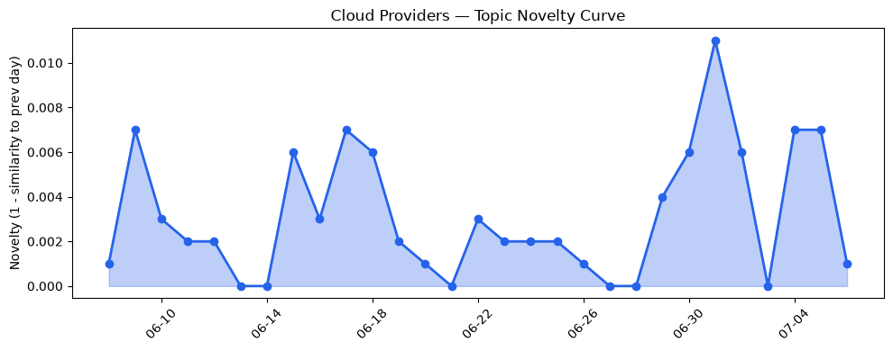
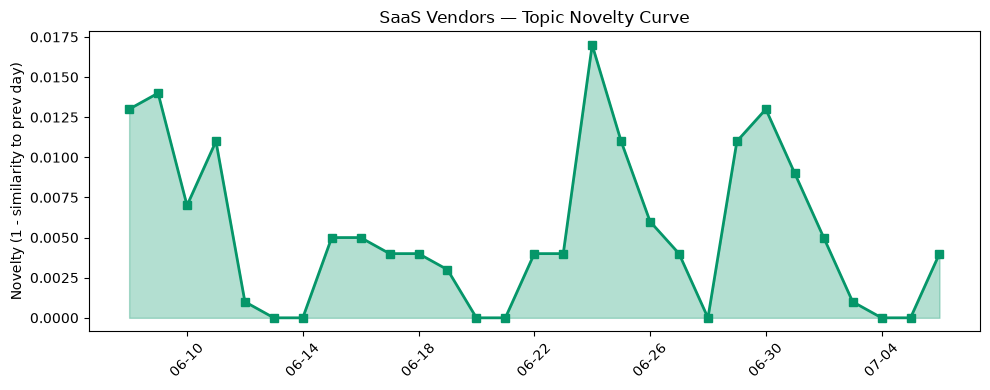

## 今日云计算结构性变化
> 今日的云计算和 SaaS 产业结构分析显示，AWS、Salesforce、Google Cloud 和 Azure 等主要参与者推出新技术和服务，包括 AI 和安全领域的进展，行业资讯中关于 AI 泡沫和数据中心发展的讨论逐渐受到重视。
今天最值得注意的云计算/SaaS 结构性变化是技术层和基础设施层的重大突破，尤其是 AWS、Google Cloud 和 Azure 的新实例类型和区域扩张。同时，应用层和资本信号也呈现出渐进改善的趋势，SaaS 厂商如 Salesforce 和 HubSpot 关注 AI 搜索优化和 CRM 管理。这些变化意味着云计算和 SaaS 产业正在经历快速的技术进步和市场扩张。
- 📈 **持续趋势**：技术层话题已连续8天增强
- 🆕 **新兴方向**：应用层近3天话题突然增强
- 🔺 **突然升温**：基础设施话题近8天呈现持续增强趋势
- 🔑 **新关键词**：Salesforce、安全
- 📉 **消退关键词**：Amazon Bedrock、Graviton5、MCP广场、OpenAI、Tencent Cloud、容器、机器学习、火山引擎、网络安全

## 技术层信号
🔴 重大突破

云原生和容器化技术的进展，包括 AWS Lambda MicroVMs 和 Google Cloud AlloyDB AI Functions，标志着技术层的重大突破。同时，Azure 的 Brain AI 系统也展示了云计算领域对 AI 的深度融合。这些进展意味着云计算和 SaaS 服务将变得更加高效、安全和智能。
根据 [AWS Lambda MicroVMs](https://aws.amazon.com/blogs/aws/run-isolated-sandboxes-with-full-lifecycle-control-aws-lambda-introduces-microvms/) 和 [Google Cloud AlloyDB AI Functions](https://cloud.google.com/blog/products/databases/boost-performance-and-lower-costs-with-alloydb-ai-functions/) 的介绍，可以看出技术层的进步将推动云计算和 SaaS 服务的发展。

## 产业资本信号
🔴 强信号

资本信号方面，AI 和云计算领域的投资热潮持续，Oracle 的股价下跌超过 40% 引发了对 AI 泡沫的担忧。同时，Microsoft 和 Cloudflare 的战略投资和收购动向也表明了资本对云计算和 SaaS 服务的重视。这些信号意味着云计算和 SaaS 服务将继续吸引大量资本投入。
根据 [Even banks and hyperscalers are now sounding the alarm about the AI bubble](https://www.theregister.com/ai-and-ml/2026/07/06/even-banks-and-hyperscalers-are-now-sounding-the-alarm-about-the-ai-bubble/5266123) 的报道，可以看出资本信号的变化将对云计算和 SaaS 服务的发展产生重大影响。

## 潜在拐点判断
基于今日信号和历史趋势，判断是否存在潜在拐点。今日的技术层和基础设施层的重大突破，应用层和资本信号的渐进改善，意味着云计算和 SaaS 服务正在经历快速的技术进步和市场扩张。同时，AI 泡沫的担忧和数据中心发展的讨论也可能成为潜在的拐点。

## 明日观察点
1. 观察技术层和基础设施层的进一步进展，特别是 AWS、Google Cloud 和 Azure 的新实例类型和区域扩张。
2. 关注应用层和资本信号的变化，特别是 SaaS 厂商如 Salesforce 和 HubSpot 的 AI 搜索优化和 CRM 管理。
3. 注意风险信号，特别是欧盟的新进口规则可能影响云计算和 SaaS 服务。

## 长期趋势坐标
今日信号放到月/季尺度，意味着云计算和 SaaS 服务将继续经历快速的技术进步和市场扩张。根据 overall_novelty 和 keyword_trends，可以看出技术层和基础设施层的进步将推动云计算和 SaaS 服务的发展。

## 数据洞察
### 云厂商话题演化
云厂商话题演化显示，今日的云厂商话题向量呈现出延续的趋势，novelty_score 为 0.024，mean_similarity 为 0.976。
### SaaS 厂商话题演化
SaaS 厂商话题演化显示，今日的 SaaS 厂商话题向量呈现出延续的趋势，novelty_score 为 0.052，mean_similarity 为 0.948。
### 趋势图

## 参考来源
- [AWS Lambda MicroVMs](https://aws.amazon.com/blogs/aws/run-isolated-sandboxes-with-full-lifecycle-control-aws-lambda-introduces-microvms/)
- [Google Cloud AlloyDB AI Functions](https://cloud.google.com/blog/products/databases/boost-performance-and-lower-costs-with-alloydb-ai-functions/)
- [Even banks and hyperscalers are now sounding the alarm about the AI bubble](https://www.theregister.com/ai-and-ml/2026/07/06/even-banks-and-hyperscalers-are-now-sounding-the-alarm-about-the-ai-bubble/5266123)
- [Extend Data 360 with the Power of Code: Introducing Code Extension](https://www.salesforce.com/blog/extend-data-360-with-the-power-of-code-introducing-code-extension/)
- [What is AI search optimization? (& why marketers should care)](https://blog.hubspot.com/marketing/what-is-ai-search-optimization)