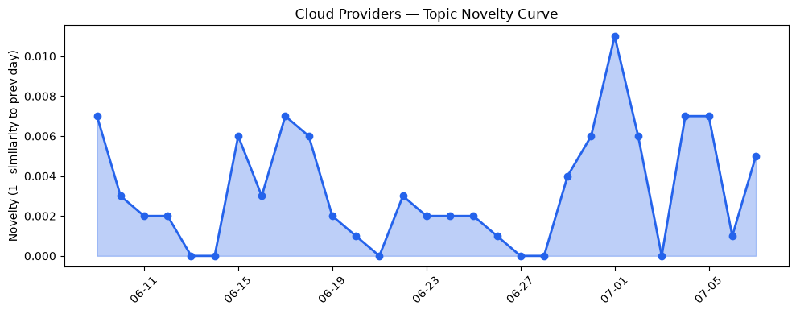
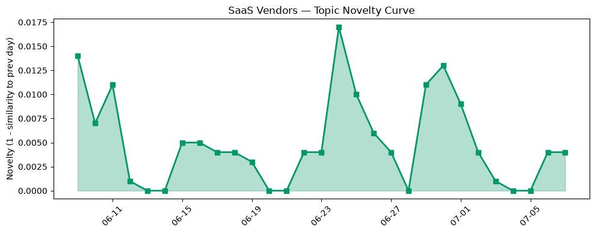

## 今日云计算结构性变化
> 今日云计算和SaaS领域呈现出技术创新、基础设施更新和资本动向等多个维度的结构性变化。
今日最值得注意的变化是AWS、Salesforce、Google Cloud、Azure和Cloudflare等领军企业推出多项技术创新和基础设施更新，这些变化表明云计算和SaaS领域正处于快速发展的阶段。同时，资本动向和风险事件频发，表明市场竞争和监管环境的变化。
- 📈 **持续趋势**：基础设施的话题向量在最近8天内呈现持续增强趋势，表明该方向正在持续升温。
- 🆕 **新兴方向**：资本动向和风险事件成为新的热点话题，表明市场竞争和监管环境的变化。

## 技术层信号
🔴 重大突破

云原生和Serverless计算是技术层信号中的一个重要方面，AWS Lambda的MicroVMs、Google Cloud的Agent Platform和Gemini Enterprise、Azure的Brain AI系统等提供了新的Serverless计算模式和AI应用支持。基础设施更新方面，AWS CloudFormation Express模式、Google Cloud的BGP路由策略和安全功能、Cloudflare的Workers Cache和Monetization Gateway等更新了基础设施和安全功能。
这些技术创新和基础设施更新表明云计算和SaaS领域正处于快速发展的阶段，企业需要跟上这些变化以保持竞争力。
参考：
- [AWS Weekly Roundup: Claude Sonnet 5 on AWS, Amazon WorkSpaces for AI agents, AWS service availability updates, and more (July 6, 2026)](https://aws.amazon.com/blogs/aws/aws-weekly-roundup-claude-sonnet-5-on-aws-amazon-workspaces-for-ai-agents-aws-service-availability-updates-and-more-july-6-2026/)
- [Run isolated sandboxes with full lifecycle control: AWS Lambda introduces MicroVMs](https://aws.amazon.com/blogs/aws/run-isolated-sandboxes-with-full-lifecycle-control-aws-lambda-introduces-microvms/)
- [A developer's guide to publishing agents in Gemini Enterprise and Google Cloud Marketplace](https://cloud.google.com/blog/topics/developers-practitioners/publish-agents-in-gemini-enterprise-and-google-cloud-marketplace/)

## 产业资本信号
🔴 强信号

产业资本信号方面，云计算和SaaS领域的融资活动增加，估值水平和并购活动增加，大厂战略投资和收购活动增加。这些信号表明市场竞争和监管环境的变化，企业需要跟上这些变化以保持竞争力。
参考：
- [VC firm Chemistry is raising $500M for its second fund](https://techcrunch.com/2026/07/07/chemistry-ventures-is-raising-500m-for-its-second-fund/)
- [Amazon and Chobani adopt Strella's AI interviews for customer research as fast-growing startup raises $14M](https://venturebeat.com/technology/amazon-and-chobani-adopt-strellas-ai-interviews-for-customer-research-as)

## 潜在拐点判断
基于今日信号和历史趋势，判断是否存在潜在拐点。今日的技术创新和基础设施更新，资本动向和风险事件频发，表明云计算和SaaS领域正处于快速发展的阶段，企业需要跟上这些变化以保持竞争力。同时，监管环境的变化也可能带来新的挑战和机遇。

## 明日观察点
1. 观察云计算和SaaS领域的技术创新和基础设施更新。
2. 关注资本动向和风险事件的变化。
3. 分析监管环境的变化对云计算和SaaS领域的影响。

## 长期趋势坐标
今日信号放到月/季尺度，云计算和SaaS领域的技术创新和基础设施更新，资本动向和风险事件频发，表明市场竞争和监管环境的变化。企业需要跟上这些变化以保持竞争力。

## 数据洞察
### 云厂商话题演化
云厂商的话题向量在最近30天内呈现出一定的变化，新关键词包括"资本动向"和"风险事件"，上升关键词包括"Azure"、"Salesforce"和"基础设施"，下降关键词包括"Amazon Bedrock"、"Graviton5"、"MCP广场"、"Tencent Cloud"、"容器"、"火山引擎"和"网络安全"。
### SaaS 厂商话题演化
SaaS厂商的话题向量在最近30天内呈现出一定的变化，新关键词包括"资本动向"和"风险事件"，上升关键词包括"Salesforce"和"HubSpot"，下降关键词包括"Zendesk"和"Dropbox"。
### 趋势图

## 参考来源
- [AWS Weekly Roundup: Claude Sonnet 5 on AWS, Amazon WorkSpaces for AI agents, AWS service availability updates, and more (July 6, 2026)](https://aws.amazon.com/blogs/aws/aws-weekly-roundup-claude-sonnet-5-on-aws-amazon-workspaces-for-ai-agents-aws-service-availability-updates-and-more-july-6-2026/)
- [Run isolated sandboxes with full lifecycle control: AWS Lambda introduces MicroVMs](https://aws.amazon.com/blogs/aws/run-isolated-sandboxes-with-full-lifecycle-control-aws-lambda-introduces-microvms/)
- [A developer's guide to publishing agents in Gemini Enterprise and Google Cloud Marketplace](https://cloud.google.com/blog/topics/developers-practitioners/publish-agents-in-gemini-enterprise-and-google-cloud-marketplace/)
- [VC firm Chemistry is raising $500M for its second fund](https://techcrunch.com/2026/07/07/chemistry-ventures-is-raising-500m-for-its-second-fund/)
- [Amazon and Chobani adopt Strella's AI interviews for customer research as fast-growing startup raises $14M](https://venturebeat.com/technology/amazon-and-chobani-adopt-strellas-ai-interviews-for-customer-research-as)