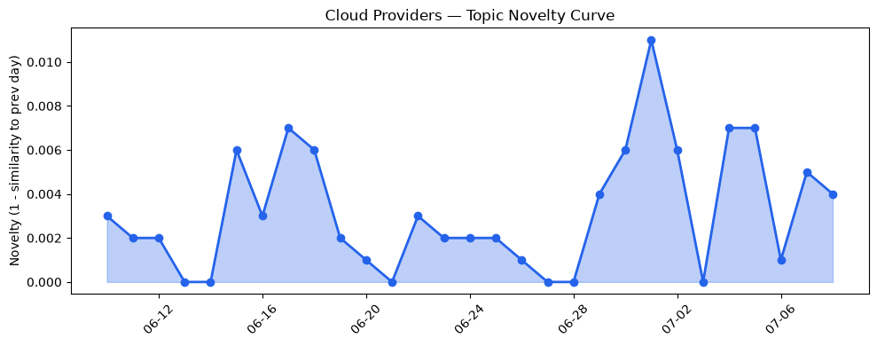
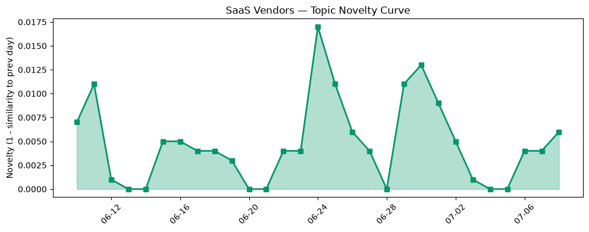

## 今日云计算结构性变化
> 今日云计算和 SaaS 领域的结构性变化和创新主要体现在 AWS、Salesforce、Google Cloud 和 Cloudflare 等公司的新技术、基础设施和应用层的创新。
AWS 和 Google Cloud 推出了新版 Kubernetes 版本回滚功能和 C4N 虚拟机，提高了容器化部署的可靠性和网络性能。同时，Salesforce 和 HubSpot 发布了新的 AI 代理功能和 CRM 功能，进一步扩大了其在客户关系管理市场的影响力。
- 📈 **持续趋势**：技术层话题已连续 8 天增强
- 🆕 **新兴方向**：存储优化、服务器less、网络优化、虚拟机等话题为 30 天内首次出现
- 🔺 **突然升温**：资本信号话题近 3 天突然集中出现
- 🔑 **新关键词**：存储优化、服务器less、网络优化、虚拟机
- 📉 **消退关键词**：Anthropic、Graviton5、火山引擎、网络安全

## 技术层信号
🔴 重大突破

AWS 和 Google Cloud 推出了新版 Kubernetes 版本回滚功能和 C4N 虚拟机，提高了容器化部署的可靠性和网络性能。同时，Cloudflare 推出了新的 Workers Cache 功能，进一步优化了网络性能。
根据 [AWS Weekly Roundup](https://aws.amazon.com/blogs/aws/aws-weekly-roundup-claude-sonnet-5-on-aws-amazon-workspaces-for-ai-agents-aws-service-availability-updates-and-more-july-6-2026/) 和 [C4N, now GA](https://cloud.google.com/blog/products/compute/c4n-network-and-storage-optimized-vms/) 的报道，AWS 和 Google Cloud 的新功能将进一步优化云计算的性能和可靠性。
此外，[Unmasking the crawls with Attribution Business Insights](https://blog.cloudflare.com/attribution-business-insights/) 和 [How we built saga rollbacks for Cloudflare Workflows](https://blog.cloudflare.com/rollbacks-for-workflows/) 的报道显示，Cloudflare 的新功能将进一步优化网络性能和安全性。

## 产业资本信号
🔴 强信号

Strella 获得 1400 万美元的 Series A 融资，表明了投资者对 AI 技术的关注。同时，AWS 和 Google Cloud 推出了新的定价模式和虚拟机，可能会改变云计算市场的价格竞争。
根据 [Amazon and Chobani adopt Strella's AI interviews for customer research as fast-growing startup raises $14M](https://venturebeat.com/technology/amazon-and-chobani-adopt-strellas-ai-interviews-for-customer-research-as) 的报道，Strella 的融资将进一步推动 AI 技术的发展。
此外，[Accelerate your infrastructure deployments by up to 4x with AWS CloudFormation Express mode](https://aws.amazon.com/blogs/aws/accelerate-your-infrastructure-deployments-by-up-to-4x-with-aws-cloudformation-express-mode/) 和 [C4N, now GA](https://cloud.google.com/blog/products/compute/c4n-network-and-storage-optimized-vms/) 的报道显示，AWS 和 Google Cloud 的新功能将进一步优化云计算的性能和可靠性。

## 潜在拐点判断
根据今日信号 + 历史趋势，判断是否存在潜在拐点。今日的信号显示，技术层和资本信号都呈现了重大突破，可能会改变云计算和 SaaS 市场的格局。

## 明日观察点
1. 观察 AWS 和 Google Cloud 的新功能是否会进一步优化云计算的性能和可靠性。
2. 观察 Strella 的融资是否会进一步推动 AI 技术的发展。
3. 观察 Cloudflare 的新功能是否会进一步优化网络性能和安全性。

## 长期趋势坐标
将今日信号放到月/季尺度，今日的信号显示，技术层和资本信号都呈现了重大突破，可能会改变云计算和 SaaS 市场的格局。
根据 [AWS Weekly Roundup](https://aws.amazon.com/blogs/aws/aws-weekly-roundup-claude-sonnet-5-on-aws-amazon-workspaces-for-ai-agents-aws-service-availability-updates-and-more-july-6-2026/) 和 [C4N, now GA](https://cloud.google.com/blog/products/compute/c4n-network-and-storage-optimized-vms/) 的报道，AWS 和 Google Cloud 的新功能将进一步优化云计算的性能和可靠性。

## 数据洞察
### 云厂商话题演化
云厂商的话题向量在最近 30 天内呈现了延续趋势，主要话题包括 AWS、Google Cloud、Cloudflare 等。
### SaaS 厂商话题演化
SaaS 厂商的话题向量在最近 30 天内呈现了延续趋势，主要话题包括 Salesforce、HubSpot 等。
### 趋势图

## 参考来源
- [AWS Weekly Roundup: Claude Sonnet 5 on AWS, Amazon WorkSpaces for AI agents, AWS service availability updates, and more](https://aws.amazon.com/blogs/aws/aws-weekly-roundup-claude-sonnet-5-on-aws-amazon-workspaces-for-ai-agents-aws-service-availability-updates-and-more-july-6-2026/) — AWS Blog
- [Upgrade Amazon EKS clusters with confidence using Kubernetes version rollbacks](https://aws.amazon.com/blogs/aws/upgrade-amazon-eks-clusters-with-confidence-using-kubernetes-version-rollbacks/) — AWS Blog
- [C4N, now GA: Delivering cloud’s highest per vCPU network and block storage I/O for x86 workloads](https://cloud.google.com/blog/products/compute/c4n-network-and-storage-optimized-vms/) — Google Cloud Blog
- [Built to bounce back: How Azure resiliency evolved](https://azure.microsoft.com/en-us/blog/built-to-bounce-back-how-azure-resiliency-evolved/) — Microsoft Azure Blog
- [火山引擎正式推出四款数据产品 将持续完善敏捷数智引擎矩阵](https://www.cnblogs.com/volcengine/p/15640481.html) — 火山引擎博客
- [Unmasking the crawls with Attribution Business Insights](https://blog.cloudflare.com/attribution-business-insights/) — Cloudflare Blog
- [How we built saga rollbacks for Cloudflare Workflows](https://blog.cloudflare.com/rollbacks-for-workflows/) — Cloudflare Blog
- [Unlocking the Cloudflare app ecosystem with OAuth for all](https://blog.cloudflare.com/oauth-for-all/) — Cloudflare Blog
- [What You Can Learn From Two Marketing Cloud Next Onboarding Journeys](https://www.salesforce.com/blog/marketing-cloud-next-onboarding/) — Salesforce Blog
- [How Batteries Plus Reengaged Customers to Generate $15M in Pipeline with a Lean Team](https://www.salesforce.com/blog/batteries-plus-agentforce-builds-sales-pipeline-with-agentforce/) — Salesforce Blog
- [CRM administration: Roles and best practices guide](https://blog.hubspot.com/marketing/crm-administration) — HubSpot Blog
- [Making AI search smarter](https://blog.cloudflare.com/making-ai-search-smarter/) — Cloudflare Blog
- [刘润：一篇文章讲清楚，什么是火山引擎](https://www.cnblogs.com/volcengine/p/15624001.html) — 火山引擎博客
- [Amazon and Chobani adopt Strella's AI interviews for customer research as fast-growing startup raises $14M](https://venturebeat.com/technology/amazon-and-chobani-adopt-strellas-ai-interviews-for-customer-research-as) — VentureBeat Enterprise
- [Accelerate your infrastructure deployments by up to 4x with AWS CloudFormation Express mode](https://aws.amazon.com/blogs/aws/accelerate-your-infrastructure-deployments-by-up-to-4x-with-aws-cloudformation-express-mode/) — AWS Blog
- [Amazon EC2 C9g and C9gd instances powered by AWS Graviton5 processors are now available](https://aws.amazon.com/blogs/aws/amazon-ec2-c9g-and-c9gd-instances-powered-by-aws-graviton5-processors-are-now-available/) — AWS Blog
- [布局云计算，火山引擎的技术发展之路](https://www.cnblogs.com/volcengine/p/15632953.html) — 火山引擎博客
- [Your Worker can now have its own cache in front of it](https://blog.cloudflare.com/workers-cache/) — Cloudflare Blog
- [China tells devs to ditch Claude Code over 'backdoor code' fears](https://www.theregister.com/security/2026/07/08/china-ditch-older-claude-versions-with-backdoor-code/5268371) — The Register
- [AI memory crunch takes a bite out of PC shipments](https://www.theregister.com/personal-tech/2026/07/08/ai-memory-crunch-takes-a-bite-out-of-pc-shipments/5268593) — The Register
- [Tokenization takes the lead in the fight for data security](https://venturebeat.com/technology/tokenization-takes-the-lead-in-the-fight-for-data-security) — VentureBeat Enterprise