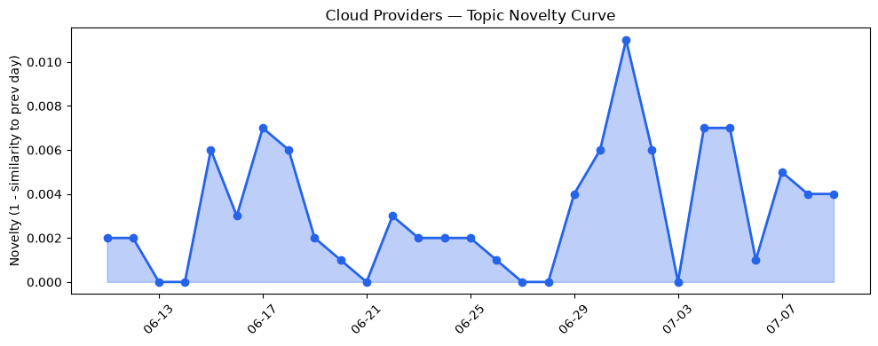
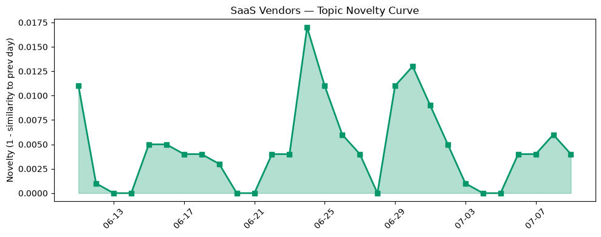

## 今日云计算结构性变化
> 今日核心判断：云计算和SaaS领域出现多项技术进展，包括AWS、Google Cloud、Azure和Cloudflare的新功能发布，以及AI初创公司的融资和估值上升。
今天最值得注意的云计算/SaaS结构性变化是技术层和基础设施层的重大突破。AWS、Google Cloud和Cloudflare推出新的云原生功能，包括Kubernetes版本回滚、Cloud Run sandboxes和Autopilot Clusters。此外，AWS、Google Cloud和Azure更新了其基础设施，包括新的EC2实例类型、C4N网络和存储优化的虚拟机。
- 📈 **持续趋势**：技术层话题已连续8天增强
- 🆕 **新兴方向**：风险信号出现全新话题
- 🔺 **突然升温**：基础设施和技术层近3天突然集中出现
- 🔑 **新关键词**：云产品、可靠性、回滚、安全性、工作流、应用程序开发、流量管理、网站安全
- 📉 **消退关键词**：Anthropic、Graviton5、HubSpot、云安全、数字化转型、数据安全、火山引擎、网络安全

## 技术层信号
🔴 重大突破

云原生和容器化技术的进展是今日技术层信号的主要组成部分。AWS、Google Cloud和Cloudflare推出新的云原生功能，包括Kubernetes版本回滚、Cloud Run sandboxes和Autopilot Clusters。这些功能可以帮助企业更好地管理和部署其应用程序。此外，AWS、Google Cloud和Azure更新了其基础设施，包括新的EC2实例类型、C4N网络和存储优化的虚拟机。
根据 [AWS Weekly Roundup: Claude Sonnet 5 on AWS, Amazon WorkSpaces for AI agents, AWS service availability updates, and more (July 6, 2026)](https://aws.amazon.com/blogs/aws/aws-weekly-roundup-claude-sonnet-5-on-aws-amazon-workspaces-for-ai-agents-aws-service-availability-updates-and-more-july-6-2026/) 和 [Run isolated sandboxes with full lifecycle control: AWS Lambda introduces MicroVMs](https://aws.amazon.com/blogs/aws/run-isolated-sandboxes-with-full-lifecycle-control-aws-lambda-introduces-microvms/) 等文章，可以看到云原生和容器化技术的进展。

## 产业资本信号
🔴 强信号

今日产业资本信号主要体现在AI初创公司的融资和估值上升。根据 [An AI agent startup just let its agent run its $100 million fundraise](https://techcrunch.com/2026/07/09/an-ai-agent-startup-just-let-its-agent-run-its-100-million-fundraise/) 等文章，可以看到AI初创公司的融资和估值上升。
此外，Salesforce和HubSpot推出新的营销创新和CRM管理功能，帮助企业实现数字化转型和营销创新。

## 潜在拐点判断
根据今日信号和历史趋势，可以判断潜在拐点为技术层和基础设施层的重大突破。这些突破可能会带来云计算和SaaS领域的重大变化。

## 明日观察点
1. 观察技术层和基础设施层的进一步发展
2. 关注AI初创公司的融资和估值情况
3. 注意Salesforce和HubSpot的营销创新和CRM管理功能的更新

## 长期趋势坐标
今日信号放到月/季尺度，可以看到技术层和基础设施层的重大突破可能会带来云计算和SaaS领域的长期趋势变化。

## 数据洞察
### 云厂商话题演化
根据数据洞察报告，云厂商话题演化的新颖性评分为0.028，平均相似度为0.972，表明云厂商话题在近期内保持相对稳定。
### SaaS 厂商话题演化
SaaS厂商话题演化的新颖性评分为0.049，平均相似度为0.951，表明SaaS厂商话题在近期内保持相对稳定。
### 趋势图

## 参考来源
- [AWS Weekly Roundup: Claude Sonnet 5 on AWS, Amazon WorkSpaces for AI agents, AWS service availability updates, and more (July 6, 2026)](https://aws.amazon.com/blogs/aws/aws-weekly-roundup-claude-sonnet-5-on-aws-amazon-workspaces-for-ai-agents-aws-service-availability-updates-and-more-july-6-2026/)
- [Run isolated sandboxes with full lifecycle control: AWS Lambda introduces MicroVMs](https://aws.amazon.com/blogs/aws/run-isolated-sandboxes-with-full-lifecycle-control-aws-lambda-introduces-microvms/)
- [Safely run AI-generated code in Cloud Run sandboxes](https://cloud.google.com/blog/topics/developers-practitioners/google-cloud-run-sandboxes-are-in-public-preview/)
- [Autopilot Clusters with GKE managed DRANET: GPUs and TPUs](https://cloud.google.com/blog/topics/developers-practitioners/autopilot-clusters-with-gke-managed-dranet-gpus-and-tpus/)
- [Meet Brain: The AI system behind Azure reliability](https://azure.microsoft.com/en-us/blog/meet-brain-the-ai-system-behind-azure-reliability/)
- [火山引擎正式推出四款数据产品](https://www.cnblogs.com/volcengine/p/15640481.html)
- [Your site, your rules: new AI traffic options for all customers](https://blog.cloudflare.com/content-independence-day-ai-options/)
- [Unmasking the crawls with Attribution Business Insights](https://blog.cloudflare.com/attribution-business-insights/)
- [How we built saga rollbacks for Cloudflare Workflows](https://blog.cloudflare.com/rollbacks-for-workflows/)
- [Marketing For Startups: 5 Steps to Campaign Success](https://www.salesforce.com/blog/small-business/five-steps-to-marketing-a-startup/)
- [How Batteries Plus Reengaged Customers to Generate $15M in Pipeline with a Lean Team](https://www.salesforce.com/blog/batteries-plus-agentforce-builds-sales-pipeline-with-agentforce/)
- [Growth experimentation: A guide for growing marketing teams](https://blog.hubspot.com/marketing/growth-experimentation)
- [CRM administration: Roles and best practices guide](https://blog.hubspot.com/marketing/crm-administration)
- [An AI agent startup just let its agent run its $100 million fundraise](https://techcrunch.com/2026/07/09/an-ai-agent-startup-just-let-its-agent-run-its-100-million-fundraise/)
- [New York Times says OpenAI hid evidence in ChatGPT copyright trial](https://techcrunch.com/2026/07/09/new-york-times-says-openai-hid-evidence-in-chatgpt-copyright-trial/)
- [EU 'Chat Control' snoopfest returns after vote to kill it falls short](https://www.theregister.com/security/2026/07/09/meps-fail-to-prevent-chat-control-snoopfest-revival/5269379)
- [UK.gov withholds £10M payment from Capita over pensions project fiasco](https://www.theregister.com/public-sector/2026/07/09/ukgov-withholds-10m-payment-from-capita-over-pensions-project-fiasco-as-dispute-continues/5269227)