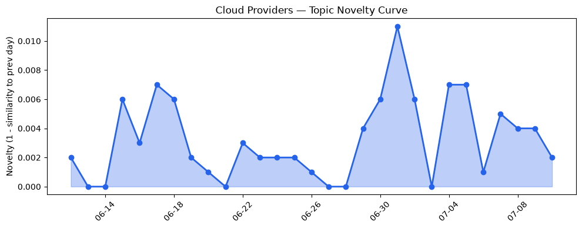
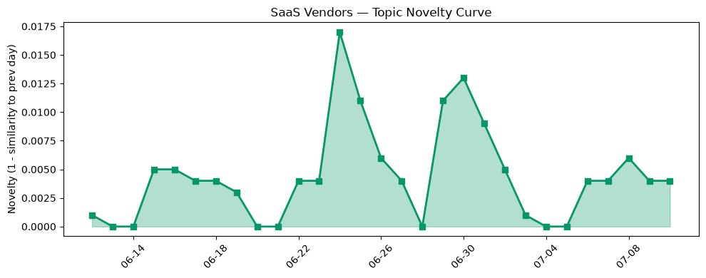

## 今日云计算结构性变化
> 云计算和SaaS领域取得显著进展，包括AWS、Salesforce、Google Cloud和Microsoft Azure在技术和应用层面的创新，以及火山引擎和Cloudflare在云基础设施和AI技术方面的发展。
今天最值得注意的云计算/SaaS结构性变化是技术层面的重大突破，包括AWS、Google Cloud和Microsoft Azure推出新实例和服务，支持Kubernetes和GPU。同时，基础设施层面也取得了重大进展，包括AWS、Google Cloud和Microsoft Azure发布新区域和定价策略。这些变化表明云计算和SaaS领域正在迅速发展和创新。
- 📈 **持续趋势**：技术层话题已连续8天增强
- 🆕 **新兴方向**：资本信号出现全新话题

## 技术层信号
🔴 重大突破

云原生技术取得显著进展，包括AWS、Google Cloud和Microsoft Azure推出新实例和服务，支持Kubernetes和GPU。例如，AWS推出新实例和服务，支持Kubernetes和GPU ([AWS Weekly Roundup: Claude Sonnet 5 on AWS, Amazon WorkSpaces for AI agents, AWS service availability updates, and more (July 6, 2026)](https://aws.amazon.com/blogs/aws/aws-weekly-roundup-claude-sonnet-5-on-aws-amazon-workspaces-for-ai-agents-aws-service-availability-updates-and-more-july-6-2026/))。同时，基础设施层面也取得了重大进展，包括AWS、Google Cloud和Microsoft Azure发布新网络和存储优化的VM。
火山引擎和Cloudflare也在云基础设施和AI技术方面取得了显著进展，例如火山引擎推出四款数据产品 ([火山引擎正式推出四款数据产品](https://www.cnblogs.com/volcengine/p/15640481.html))。

## 产业资本信号
🔴 强信号

资本信号出现全新话题，包括Oratomic获得300M美元融资，用于开发可行的量子计算机 ([Oratomic raises $300M to build a viable quantum computer that needs only 20K qubits](https://techcrunch.com/2026/07/10/oratomic-raises-300m-to-build-a-viable-quantum-computer-that-needs-only-20k-qubits/))。同时，SK Hynix完成265亿美元的IPO ([SK Hynix raises $26.5B in the biggest foreign IPO in US history, is urged to build new US fabs](https://techcrunch.com/2026/07/10/sk-hynix-raises-26-5b-in-the-biggest-foreign-ipo-in-us-history-is-urged-to-build-new-us-fabs/))。
这些变化表明云计算和SaaS领域正在迅速发展和创新，资本信号也在不断增强。

## 潜在拐点判断
根据今日信号和历史趋势，判断是否存在潜在拐点。技术层面的重大突破和资本信号的强信号表明云计算和SaaS领域正在迅速发展和创新，这可能是一个潜在的拐点。

## 明日观察点
1. 观察技术层面的进一步发展和创新。
2. 关注资本信号的变化和发展。
3. 分析云计算和SaaS领域的潜在风险和挑战。

## 长期趋势坐标
今日信号放到月/季尺度，云计算和SaaS领域正在迅速发展和创新，技术层面和资本信号的强信号表明这一趋势将持续。

## 数据洞察
### 云厂商话题演化
今日云厂商话题演化显示，技术层面的重大突破和基础设施层面的进展。例如，AWS、Google Cloud和Microsoft Azure推出新实例和服务，支持Kubernetes和GPU。
### SaaS 厂商话题演化
今日SaaS厂商话题演化显示，Salesforce、HubSpot和火山引擎推出新功能和最佳实践指南。例如，Salesforce推出新AI功能 ([The New AI Trust Architecture: 5 Requirements for Agent-to-Agent Communication](https://www.salesforce.com/blog/new-ai-trust-architecture/))。
### 趋势图

## 参考来源
- [AWS Weekly Roundup: Claude Sonnet 5 on AWS, Amazon WorkSpaces for AI agents, AWS service availability updates, and more (July 6, 2026)](https://aws.amazon.com/blogs/aws/aws-weekly-roundup-claude-sonnet-5-on-aws-amazon-workspaces-for-ai-agents-aws-service-availability-updates-and-more-july-6-2026/)
- [Autopilot Clusters with GKE managed DRANET: GPUs and TPUs](https://cloud.google.com/blog/topics/developers-practitioners/autopilot-clusters-with-gke-managed-dranet-gpus-and-tpus/)
- [Meet Brain: The AI system behind Azure reliability](https://azure.microsoft.com/en-us/blog/meet-brain-the-ai-system-behind-azure-reliability/)
- [火山引擎正式推出四款数据产品](https://www.cnblogs.com/volcengine/p/15640481.html)
- [Making AI search smarter](https://blog.cloudflare.com/making-ai-search-smarter/)
- [Oratomic raises $300M to build a viable quantum computer that needs only 20K qubits](https://techcrunch.com/2026/07/10/oratomic-raises-300m-to-build-a-viable-quantum-computer-that-needs-only-20k-qubits/)
- [SK Hynix raises $26.5B in the biggest foreign IPO in US history, is urged to build new US fabs](https://techcrunch.com/2026/07/10/sk-hynix-raises-26-5b-in-the-biggest-foreign-ipo-in-us-history-is-urged-to-build-new-us-fabs/)
- [The New AI Trust Architecture: 5 Requirements for Agent-to-Agent Communication](https://www.salesforce.com/blog/new-ai-trust-architecture/)
- [Growth experimentation: A guide for growing marketing teams](https://blog.hubspot.com/marketing/growth-experimentation)
- [字节跳动是如何建设云的？](https://www.cnblogs.com/volcengine/p/15633967.html)