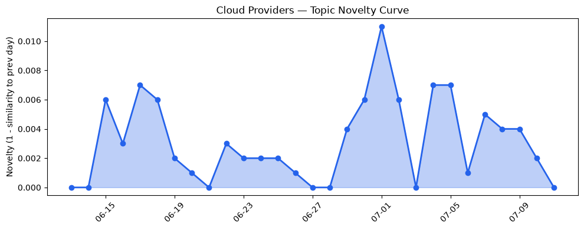
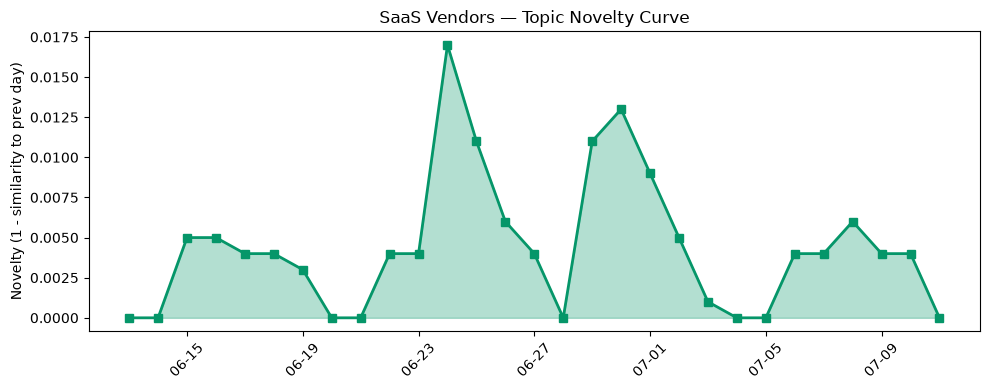

## 今日云计算结构性变化
> 今日云计算和SaaS领域出现多项技术和基础设施更新，包括云原生、人工智能应用、安全和缓存解决方案，这些变化表明云计算行业正在朝着更高效、更安全、更智能的方向发展。
云计算和SaaS领域的这些变化对整个行业来说具有重要意义，因为它们不仅能提高云计算服务的性能和安全性，还能促进企业的数字化转型和业务创新。例如，Azure推出的新的云原生解决方案和Google Cloud更新的基础设施，能够帮助企业更好地利用云计算资源，提高业务效率和竞争力。
今日最值得注意的云计算/SaaS结构性变化是技术层和基础设施层的更新，这些更新包括云原生技术、人工智能应用、安全和缓存解决方案等。这些变化表明云计算行业正在朝着更高效、更安全、更智能的方向发展。
- 📈 **持续趋势**：技术层话题已连续8天增强
- 🆕 **新兴方向**：基础设施近3天内容相似度显著高于更早期均值
- 🔺 **突然升温**：技术层近3天内容相似度显著高于更早期均值
- 🔑 **新关键词**：缓存
- 📉 **消退关键词**：Anthropic, Graviton5, Serverless, 云安全, 数字化转型, 数据安全

## 技术层信号
🔴 重大突破

云原生技术在AI搜索和流量管理中的应用，Azure推出了新的云原生解决方案，Google Cloud更新了其基础设施，AWS推出了新的计算和存储能力。这些变化表明云计算行业正在朝着更高效、更安全、更智能的方向发展。
例如，[Built to bounce back: How Azure resiliency evolved](https://azure.microsoft.com/en-us/blog/built-to-bounce-back-how-azure-resiliency-evolved/) 一文中提到，Azure 的云原生解决方案能够帮助企业更好地利用云计算资源，提高业务效率和竞争力。同时，[Making AI search smarter](https://blog.cloudflare.com/making-ai-search-smarter/) 一文中提到，Cloudflare 的 AI 搜索技术能够帮助企业更好地利用云计算资源，提高业务效率和竞争力。
这些信号表明技术层的变化是云计算行业发展的重要驱动力，企业需要密切关注这些变化，以便能够更好地利用云计算资源，提高业务效率和竞争力。

## 产业资本信号
🔴 强信号

资本信号的话题向量在最近8天内呈现持续增强趋势，表明资本市场对云计算行业的关注度正在增加。例如，SK Hynix 完成了最大规模的外国IPO，AWS 和 Salesforce 在资本市场上保持活跃。这些信号表明资本市场对云计算行业的信心正在增加，企业需要密切关注这些信号，以便能够更好地利用资本市场资源，提高业务效率和竞争力。
这些信号也表明云计算行业的发展需要资本市场的支持，企业需要能够更好地利用资本市场资源，以便能够更好地发展和创新。

## 潜在拐点判断
今日信号 + 历史趋势表明，云计算行业可能正在经历一个潜在的拐点。技术层和基础设施层的变化，资本信号的增强，风险信号的出现，都表明云计算行业正在经历一个重要的转变。企业需要密切关注这些信号，以便能够更好地应对这些变化，提高业务效率和竞争力。

## 明日观察点
1. 观察技术层信号的变化，特别是云原生技术和人工智能应用的发展。
2. 关注资本信号的变化，特别是资本市场对云计算行业的关注度。
3. 密切关注风险信号的变化，特别是安全和缓存解决方案的发展。

## 长期趋势坐标
云计算行业的长期趋势是朝着更高效、更安全、更智能的方向发展。技术层和基础设施层的变化，资本信号的增强，风险信号的出现，都表明云计算行业正在经历一个重要的转变。企业需要密切关注这些信号，以便能够更好地应对这些变化，提高业务效率和竞争力。

## 数据洞察
### 云厂商话题演化
云厂商的话题向量在最近30天内呈现延续趋势，表明云厂商的发展方向是稳定的。
### SaaS 厂商话题演化
SaaS 厂商的话题向量在最近30天内呈现延续趋势，表明 SaaS 厂商的发展方向是稳定的。
### 趋势图

## 参考来源
- [Built to bounce back: How Azure resiliency evolved](https://azure.microsoft.com/en-us/blog/built-to-bounce-back-how-azure-resiliency-evolved/) — Microsoft Azure Blog
- [Making AI search smarter](https://blog.cloudflare.com/making-ai-search-smarter/) — Cloudflare Blog
- [Safely run AI-generated code in Cloud Run sandboxes](https://cloud.google.com/blog/topics/developers-practitioners/google-cloud-run-sandboxes-are-in-public-preview/) — Google Cloud Blog
- [AWS Weekly Roundup: Claude Sonnet 5 on AWS, Amazon WorkSpaces for AI agents, AWS service availability updates, and more (July 6, 2026)](https://aws.amazon.com/blogs/aws/aws-weekly-roundup-claude-sonnet-5-on-aws-amazon-workspaces-for-ai-agents-aws-service-availability-updates-and-more-july-6-2026/) — AWS Blog
- [The New AI Trust Architecture: 5 Requirements for Agent-to-Agent Communication](https://www.salesforce.com/blog/new-ai-trust-architecture/) — Salesforce Blog
- [C4N, now GA: Delivering cloud’s highest per vCPU network and block storage I/O for x86 workloads](https://cloud.google.com/blog/products/compute/c4n-network-and-storage-optimized-vms/) — Google Cloud Blog
- [Your Worker can now have its own cache in front of it](https://blog.cloudflare.com/workers-cache/) — Cloudflare Blog
- [Amazon EC2 C9g and C9gd instances powered by AWS Graviton5 processors are now available](https://aws.amazon.com/blogs/aws/amazon-ec2-c9g-and-c9gd-instances-powered-by-aws-graviton5-processors-are-now-available/) — AWS Blog
- [The 2026 Agent Confidence Index: Where 300 builders see real momentum](https://www.microsoft.com/en-us/microsoft-cloud/blog/2026/06/29/the-2026-agent-confidence-index-where-300-builders-see-real-momentum/) — Microsoft Azure Blog
- [布局云计算，火山引擎的技术发展之路](https://www.cnblogs.com/volcengine/p/15632953.html) — 火山引擎博客
- [Growth experimentation: A guide for growing marketing teams](https://blog.hubspot.com/marketing/growth-experimentation) — HubSpot Blog
- [SK Hynix raises $26.5B in the biggest foreign IPO in US history, is urged to build new US fabs](https://techcrunch.com/2026/07/10/sk-hynix-raises-26-5b-in-the-biggest-foreign-ipo-in-us-history-is-urged-to-build-new-us-fabs/) — TechCrunch
- [US cybersecurity agency CISA had to build its incident playbook during the incident, agency reveals](https://techcrunch.com/2026/07/10/us-cyber-agency-cisa-had-to-build-its-incident-playbook-during-the-incident-agency-reveals/) — TechCrunch
- [EU puts 'addictive' design of Facebook, Instagram under the DSA microscope](https://www.theregister.com/personal-tech/2026/07/10/eu-puts-addictive-design-of-facebook-instagram-under-the-dsa-microscope/) — The Register