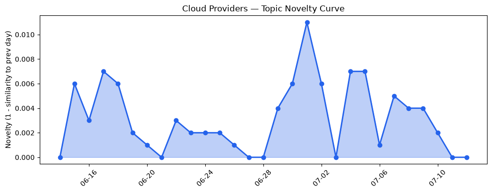
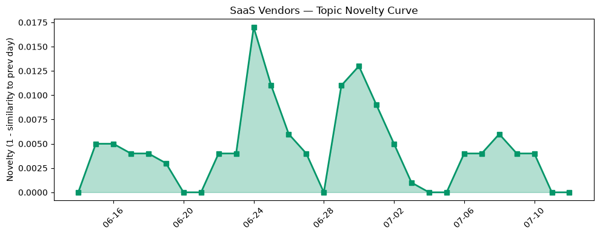

## 今日云计算结构性变化
> 云计算和SaaS领域呈现出多方面的发展和进步，包括技术层面的创新、基础设施的扩张、应用层的丰富、资本信号的变化以及风险信号的出现。
今天最值得注意的云计算/SaaS结构性变化是技术层面的重大突破，包括云原生技术与AI的融合、基础设施的扩张和应用层的丰富。这些变化意味着云计算和SaaS领域正在经历快速的发展和创新，企业需要紧跟这些变化以保持竞争力。
- 📈 **持续趋势**：技术层话题已连续8天增强
- 🆕 **新兴方向**：风险信号出现全新话题
- 🔺 **突然升温**：基础设施近3天话题突然增强
- 🔑 **新关键词**：Azure, Cloudflare
- 📉 **消退关键词**：Anthropic, 云安全, 数字化转型, 数据安全, 监管

## 技术层信号
🔴 重大突破

云原生技术与AI的融合是技术层面的一个重要发展，包括AWS的Kubernetes版本回滚功能、Google Cloud的AlphaEvolve和Autopilot Clusters。这些技术的融合可以帮助企业更好地利用云计算和AI的优势，提高企业的效率和竞争力。
另外，基础设施的扩张也是一个重要的发展，包括AWS Graviton5处理器的发布和Google Cloud的C4N网络和存储优化的虚拟机。这些基础设施的扩张可以帮助企业更好地利用云计算的资源，提高企业的效率和竞争力。
这些技术层面的发展意味着云计算和SaaS领域正在经历快速的发展和创新，企业需要紧跟这些变化以保持竞争力。

## 产业资本信号
⚪ 无显著变化

今日资本信号没有显著的变化，表明资本市场对云计算和SaaS领域的投资和信心没有发生重大变化。然而，资本信号的变化可以反映出市场对云计算和SaaS领域的信心和投资意愿，企业需要密切关注这些变化以保持竞争力。

## 潜在拐点判断
根据今日信号和历史趋势，判断是否存在潜在拐点。今日的技术层面的重大突破和基础设施的扩张可能意味着云计算和SaaS领域正在经历快速的发展和创新，企业需要紧跟这些变化以保持竞争力。然而，资本信号的变化可以反映出市场对云计算和SaaS领域的信心和投资意愿，企业需要密切关注这些变化以保持竞争力。

## 明日观察点
1. 观察技术层面的发展，包括云原生技术与AI的融合和基础设施的扩张。
2. 关注资本信号的变化，包括资本市场对云计算和SaaS领域的投资和信心。
3. 密切关注风险信号的变化，包括网络安全和监管的变化。

## 长期趋势坐标
今日信号放到月/季尺度，云计算和SaaS领域正在经历快速的发展和创新，企业需要紧跟这些变化以保持竞争力。技术层面的重大突破和基础设施的扩张可能意味着云计算和SaaS领域正在经历快速的发展和创新，企业需要密切关注这些变化以保持竞争力。

## 数据洞察
### 云厂商话题演化
云厂商的话题向量在最近30天内呈现出延续的趋势，今日的novelty_score为0.024，mean_similarity为0.976。
### SaaS 厂商话题演化
SaaS厂商的话题向量在最近30天内呈现出延续的趋势，今日的novelty_score为0.047，mean_similarity为0.953。
### 趋势图

## 参考来源
- [Upgrade Amazon EKS clusters with confidence using Kubernetes version rollbacks](https://aws.amazon.com/blogs/aws/upgrade-amazon-eks-clusters-with-confidence-using-kubernetes-version-rollbacks/) — AWS Blog
- [Solve harder problems with AlphaEvolve, now available to everyone on Google Cloud](https://cloud.google.com/blog/products/ai-machine-learning/alphaevolve-is-available-for-everyone/) — Google Cloud Blog
- [Making AI search smarter](https://blog.cloudflare.com/making-ai-search-smarter/) — Cloudflare Blog
- [Built to bounce back: How Azure resiliency evolved](https://azure.microsoft.com/en-us/blog/built-to-bounce-back-how-azure-resiliency-evolved/) — Microsoft Azure Blog
- [Improving Smart Tiered Cache for Public Cloud Regions](https://blog.cloudflare.com/smart-tiered-cache-for-public-clouds/) — Cloudflare Blog
- [The New AI Trust Architecture: 5 Requirements for Agent-to-Agent Communication](https://www.salesforce.com/blog/new-ai-trust-architecture/) — Salesforce Blog
- [How Kogan.com Automated 67% of Customer Inquiries and Tripled Resolution](https://www.salesforce.com/blog/kogan-agentforce/) — Salesforce Blog
- [Growth experimentation: A guide for growing marketing teams](https://blog.hubspot.com/marketing/growth-experimentation) — HubSpot Blog
- [What are semantic keywords? Here's how to find & use them](https://blog.hubspot.com/marketing/semantic-keywords) — HubSpot Blog
- [Amazon EC2 C9g and C9gd instances powered by AWS Graviton5 processors are now available](https://aws.amazon.com/blogs/aws/amazon-ec2-c9g-and-c9gd-instances-powered-by-aws-graviton5-processors-are-now-available/) — AWS Blog
- [C4N, now GA: Delivering cloud’s highest per vCPU network and block storage I/O for x86 workloads](https://cloud.google.com/blog/products/compute/c4n-network-and-storage-optimized-vms/) — Google Cloud Blog
- [Irish datacenters now guzzle 23% of the country's electricity](https://www.theregister.com/on-prem/2026/07/11/irish-datacenters-now-guzzle-23-of-the-countrys-electricity/5270013) — The Register
- [Orbital datacenter gold rush needs an environmental review, FCC told](https://www.theregister.com/on-prem/2026/07/10/orbital-datacenter-gold-rush-needs-an-environmental-review-fcc-told/5269863) — The Register
- [Destructive Windows backdoor stuffs multiple wipers and ransomware code into a single package](https://www.theregister.com/security/2026/07/10/destructive-windows-backdoor-stuffs-multiple-wipers-and-ransomware-code-into-a-single-package/5270053) — The Register