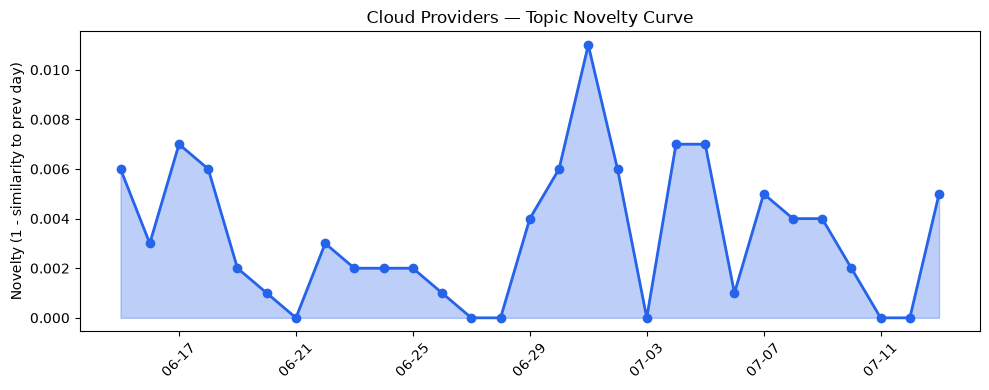
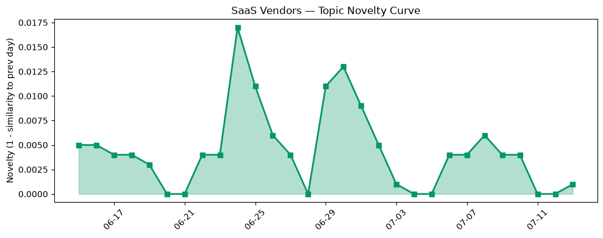

## 今日云计算结构性变化
> 今日云计算和SaaS领域的结构性变化主要体现在技术层、基础设施、应用层和资本流向等方面，各大厂商如AWS、Google Cloud、Azure和Salesforce等都在推出新功能和服务。
云计算和SaaS领域正在经历快速的发展，尤其是在AI、安全和数字化转型方面。今日最值得注意的云计算/SaaS结构性变化是技术层和应用层的重大突破，基础设施的渐进改善，以及资本流向的强信号。
- 📈 **持续趋势**：技术层话题已连续8天增强
- 🆕 **新兴方向**：风险信号出现全新话题
- 🔺 **突然升温**：应用层和基础设施近3天话题突然增强
- 🔑 **新关键词**：Azure
- 📉 **消退关键词**：Anthropic、云安全、基础设施、数据安全、监管

## 技术层信号
🔴 重大突破

云原生/容器/K8s/Serverless、数据库/存储/网络、AI与云融合有着显著的进展。AWS、Google Cloud和Azure推出新功能，包括Amazon SQS、k8s-aibom和Azure的云原生技术。AWS、Google Cloud和Azure更新了其基础设施，包括数据管理和网络安全。这些变化表明云计算和SaaS领域正在快速发展，尤其是在AI、安全和数字化转型方面。
例如，[Amazon SQS turns 20: Two decades of reliable messaging at scale](https://aws.amazon.com/blogs/aws/amazon-sqs-turns-20-two-decades-of-reliable-messaging-at-scale/)、[Securing the AI supply chain on GKE: Introducing k8s-aibom for automated AI BOMs](https://cloud.google.com/blog/products/identity-security/introducing-k8s-aibom-on-gke-for-automated-ai-bills-of-materials/)和[Frontier models and production agents: Advancing Microsoft Foundry for the agentic era](https://azure.microsoft.com/en-us/blog/frontier-models-and-production-agents-advancing-microsoft-foundry-for-the-agentic-era/)等文章都体现了这一趋势。

## 产业资本信号
🔴 强信号

**基础设施变化**：Google Cloud的C4N网络和存储优化虚拟机已推出，火山引擎发布新云产品。**应用层变化**：Salesforce和HubSpot推出新功能，包括Agentforce、Marketing Cloud Next和CRM解决方案。**资本流向**：Anthropic开始为印度市场本地化Claude定价，Strella获得1400万美元的A轮融资。这些变化表明云计算和SaaS领域的资本流向正在加强，尤其是在AI、安全和数字化转型方面。
例如，[C4N, now GA: Delivering cloud’s highest per vCPU network and block storage I/O for x86 workloads](https://cloud.google.com/blog/products/compute/c4n-network-and-storage-optimized-vms/)、[布局云计算，火山引擎的技术发展之路](https://www.cnblogs.com/volcengine/p/15632953.html)和[Amazon and Chobani adopt Strella's AI interviews for customer research as fast-growing startup raises $14M](https://venturebeat.com/technology/amazon-and-chobani-adopt-strellas-ai-interviews-for-customer-research-as)等文章都体现了这一趋势。

## 潜在拐点判断
云计算和SaaS领域的结构性变化可能会带来潜在的拐点，尤其是在AI、安全和数字化转型方面。今日的信号和历史趋势表明，技术层和应用层的重大突破，基础设施的渐进改善，以及资本流向的强信号，都可能会加速云计算和SaaS领域的发展，带来新的机会和挑战。

## 明日观察点
1. 观察技术层和应用层的进一步发展，尤其是在AI、安全和数字化转型方面。
2. 关注资本流向的变化，尤其是在云计算和SaaS领域的投资和并购活动。
3. 分析风险信号的变化，尤其是在网络安全和数据安全方面。

## 长期趋势坐标
云计算和SaaS领域的长期趋势坐标表明，技术层和应用层的重大突破，基础设施的渐进改善，以及资本流向的强信号，都将继续推动云计算和SaaS领域的发展。未来，云计算和SaaS领域将继续演进，尤其是在AI、安全和数字化转型方面。

## 数据洞察
### 云厂商话题演化
云厂商的话题向量在最近30天内呈现延续趋势，novelty_score为0.022，mean_similarity为0.978。
### SaaS厂商话题演化
SaaS厂商的话题向量在最近30天内呈现延续趋势，novelty_score为0.045，mean_similarity为0.955。
### 趋势图

## 参考来源
- [Amazon SQS turns 20: Two decades of reliable messaging at scale](https://aws.amazon.com/blogs/aws/amazon-sqs-turns-20-two-decades-of-reliable-messaging-at-scale/) — AWS Blog
- [Securing the AI supply chain on GKE: Introducing k8s-aibom for automated AI BOMs](https://cloud.google.com/blog/products/identity-security/introducing-k8s-aibom-on-gke-for-automated-ai-bills-of-materials/) — Google Cloud Blog
- [Frontier models and production agents: Advancing Microsoft Foundry for the agentic era](https://azure.microsoft.com/en-us/blog/frontier-models-and-production-agents-advancing-microsoft-foundry-for-the-agentic-era/) — Microsoft Azure Blog
- [C4N, now GA: Delivering cloud’s highest per vCPU network and block storage I/O for x86 workloads](https://cloud.google.com/blog/products/compute/c4n-network-and-storage-optimized-vms/) — Google Cloud Blog
- [布局云计算，火山引擎的技术发展之路](https://www.cnblogs.com/volcengine/p/15632953.html) — 火山引擎博客
- [Amazon and Chobani adopt Strella's AI interviews for customer research as fast-growing startup raises $14M](https://venturebeat.com/technology/amazon-and-chobani-adopt-strellas-ai-interviews-for-customer-research-as) — VentureBeat Enterprise