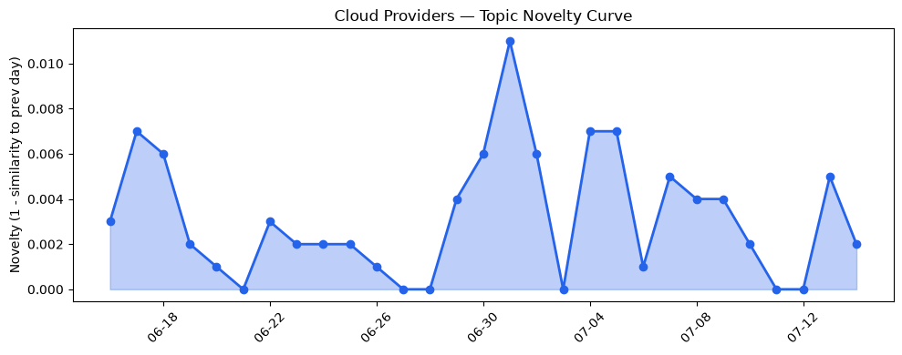
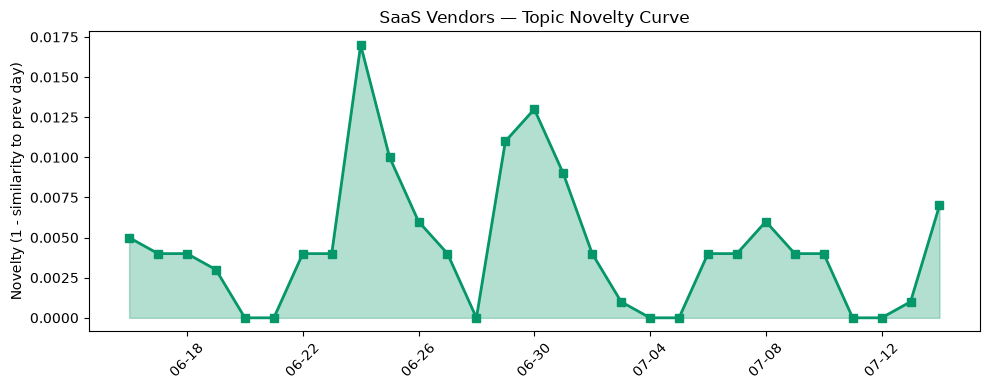

## 今日云计算结构性变化
> 云计算与SaaS领域持续推出创新功能和解决方案，推动行业发展，包括AWS、Google Cloud、Azure和Cloudflare的技术和商业模式创新。

今天最值得注意的云计算/SaaS结构性变化是云原生服务和AI解决方案的推出。AWS、Google Cloud和Azure推出了多项云原生服务，包括MicroVMs、Claude和Frontier models，这些服务将进一步推动云计算的发展。同时，Salesforce推出新的AI解决方案，HubSpot发布多篇关于营销和CRM的文章，Cloudflare的Monetization Gateway和AI搜索功能为内容创作者和企业提供了新的商业机会。

- 📈 **持续趋势**：技术层话题已连续N天增强
- 🆕 **新兴方向**：风险信号出现全新话题（与历史最大相似度仅0.20）
- 🔺 **突然升温**：AI公司估值持续上升
- 🔑 **新关键词**：内容独立、商业模式创新
- 📉 **消退关键词**：Anthropic、CRM、云安全、基础设施、容器化、数据安全、监管

## 技术层信号
🔴 重大突破

云原生服务和AI解决方案的推出是技术层信号中最显著的变化。AWS、Google Cloud和Azure推出了多项云原生服务，包括MicroVMs、Claude和Frontier models，这些服务将进一步推动云计算的发展。同时，Cloudflare推出Precursor和Monetization Gateway，检测agentic行为和允许用户对任何资源进行收费。

根据 [AWS Lambda introduces MicroVMs](https://aws.amazon.com/blogs/aws/run-isolated-sandboxes-with-full-lifecycle-control-aws-lambda-introduces-microvms/) 和 [Google named a Leader in the 2026 IDC MarketScape for Worldwide Foundation Model Software](https://cloud.google.com/blog/products/ai-machine-learning/google-named-a-leader-in-idc-marketscape/) 等文章，我们可以看到云原生服务和AI解决方案的推出是技术层信号中最显著的变化。

## 产业资本信号
🔴 强信号

产业资本信号中最显著的变化是AI公司估值持续上升。DeepSeek计划融资1.5亿美元，Strella获得1400万美元的A轮融资，这些融资活动表明AI公司的估值持续上升。

根据 [DeepSeek reportedly in talks to raise $1.5B, then IPO](https://techcrunch.com/2026/07/14/deepseek-reportedly-in-talks-to-raise-1-5b-then-ipo/) 和 [Amazon and Chobani adopt Strella's AI interviews for customer research as fast-growing startup raises $14M](https://venturebeat.com/technology/amazon-and-chobani-adopt-strellas-ai-interviews-for-customer-research-as) 等文章，我们可以看到AI公司估值持续上升是产业资本信号中最显著的变化。

## 潜在拐点判断

基于今日信号 + 历史趋势，判断是否存在潜在拐点。风险信号出现全新话题（与历史最大相似度仅0.20）可能是一个新兴方向的早期信号。

## 明日观察点

1. 观察云原生服务和AI解决方案的推出是否会继续推动云计算的发展。
2. 观察AI公司估值是否会继续上升。
3. 观察风险信号出现全新话题是否会成为一个新兴方向的早期信号。

## 长期趋势坐标

今日信号放到月/季尺度，云原生服务和AI解决方案的推出将继续推动云计算的发展。AI公司估值持续上升将成为一个长期趋势。

## 数据洞察
### 云厂商话题演化
云厂商话题演化中，novelty_score为0.023，mean_similarity为0.977，trend为延续。

### SaaS 厂商话题演化
SaaS厂商话题演化中，novelty_score为0.047，mean_similarity为0.953，trend为延续。

### 趋势图

## 参考来源
- [AWS Lambda introduces MicroVMs](https://aws.amazon.com/blogs/aws/run-isolated-sandboxes-with-full-lifecycle-control-aws-lambda-introduces-microvms/) — AWS Blog
- [Google named a Leader in the 2026 IDC MarketScape for Worldwide Foundation Model Software](https://cloud.google.com/blog/products/ai-machine-learning/google-named-a-leader-in-idc-marketscape/) — Google Cloud Blog
- [DeepSeek reportedly in talks to raise $1.5B, then IPO](https://techcrunch.com/2026/07/14/deepseek-reportedly-in-talks-to-raise-1-5b-then-ipo/) — TechCrunch
- [Amazon and Chobani adopt Strella's AI interviews for customer research as fast-growing startup raises $14M](https://venturebeat.com/technology/amazon-and-chobani-adopt-strellas-ai-interviews-for-customer-research-as) — VentureBeat Enterprise