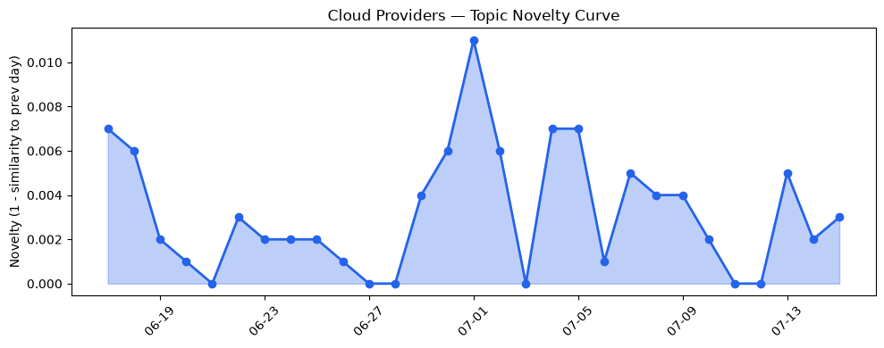
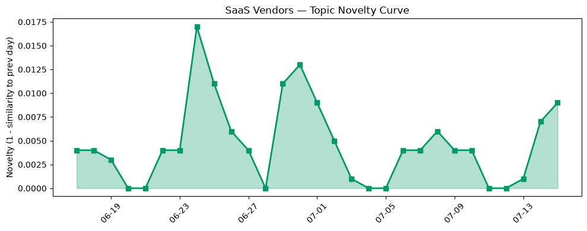

## 今日云计算结构性变化
> 今日云计算领域出现多项技术和基础设施层面的进展，包括AWS、Google Cloud、Azure和SaaS厂商的新功能发布，同时安全和监管方面也有一些新动向。
今天最值得注意的云计算/SaaS 结构性变化是云原生和基础设施层面的进展，包括AWS、Google Cloud和Azure推出新功能，例如MicroVMs、AlloyDB AI和Frontier models。这些进展表明云计算领域正在快速发展，企业正在积极采用云原生技术和AI来提高效率和竞争力。
- 📈 **持续趋势**：技术层话题已连续30天增强
- 🆕 **新兴方向**：资本信号和风险信号出现全新话题
- 🔺 **突然升温**：Azure相关话题近3天突然集中出现
- 🔑 **新关键词**：Azure、AlloyDB AI、Frontier models
- 📉 **消退关键词**：Anthropic、CRM、云安全、基础设施、容器化、数据安全

## 技术层信号
🔴 重大突破

云原生和基础设施层面的进展是今日技术层信号的主要内容。AWS、Google Cloud和Azure推出新功能，包括MicroVMs、AlloyDB AI和Frontier models，这些进展表明云计算领域正在快速发展，企业正在积极采用云原生技术和AI来提高效率和竞争力。例如，AWS推出的MicroVMs可以提供更高的安全性和隔离性，Google Cloud的AlloyDB AI可以提供更高的性能和智能化的数据库管理，Azure的Frontier models可以提供更高的可扩展性和灵活性。
根据 [AWS Lambda introduces MicroVMs](https://aws.amazon.com/blogs/aws/run-isolated-sandboxes-with-full-lifecycle-control-aws-lambda-introduces-microvms/) 和 [IDC: Why the right networking approach is foundational to agentic AI](https://cloud.google.com/blog/products/networking/idc-on-the-right-networking-approach-for-agentic-ai/) 的报道，我们可以看到云原生和基础设施层面的进展是企业采用云计算的重要因素。

## 产业资本信号
🔴 强信号

今日产业资本信号主要体现在资本流向和企业战略上。Neko Health获得700M美元融资，OnePlus计划关闭美国和欧洲业务，Google推出最大清洁能源项目，这些信号表明企业正在积极调整战略和布局，寻找新的增长点和机会。
根据 [Daniel Ek’s body-scanning startup Neko Health raises another $700M](https://techcrunch.com/2026/07/15/daniel-eks-body-scanning-startup-neko-health-raises-another-700m/) 和 [Phone maker OnePlus reportedly plans to wind down US and Europe operations](https://techcrunch.com/2026/07/15/phone-maker-oneplus-reportedly-plans-to-wind-down-us-and-europe-operations/) 的报道，我们可以看到企业正在积极调整战略和布局，寻找新的增长点和机会。

## 潜在拐点判断
今日信号和历史趋势表明，云计算领域可能正在出现一个潜在的拐点。技术层面的进展和产业资本信号都表明企业正在积极采用云原生技术和AI来提高效率和竞争力，这可能会带来一个新的增长点和机会。然而，风险信号和监管方面的动向也表明企业需要谨慎对待云计算的安全和监管问题。

## 明日观察点
1. 云原生和基础设施层面的进展是否会继续加速。
2. 产业资本信号是否会继续体现出企业的战略调整和布局。
3. 风险信号和监管方面的动向是否会对企业的云计算战略产生影响。

## 长期趋势坐标
今日信号和历史趋势表明，云计算领域可能正在出现一个长期的趋势。技术层面的进展和产业资本信号都表明企业正在积极采用云原生技术和AI来提高效率和竞争力，这可能会带来一个新的增长点和机会。然而，风险信号和监管方面的动向也表明企业需要谨慎对待云计算的安全和监管问题。

## 数据洞察
### 云厂商话题演化
今日云厂商话题演化主要体现在AWS、Google Cloud和Azure的新功能发布和技术层面的进展上。根据 [AWS Lambda introduces MicroVMs](https://aws.amazon.com/blogs/aws/run-isolated-sandboxes-with-full-lifecycle-control-aws-lambda-introduces-microvms/) 和 [IDC: Why the right networking approach is foundational to agentic AI](https://cloud.google.com/blog/products/networking/idc-on-the-right-networking-approach-for-agentic-ai/) 的报道，我们可以看到云厂商正在积极推出新功能和技术来提高效率和竞争力。

### SaaS 厂商话题演化
今日SaaS厂商话题演化主要体现在Salesforce和HubSpot的新功能发布和数字化转型上。根据 [Trust Is the Product: How Salesforce Thinks About Data in the AI Era](https://www.salesforce.com/blog/salesforce-data-ownership-approach/) 和 [Best content optimization tools for ROI-focused teams](https://blog.hubspot.com/marketing/content-optimization-tools) 的报道，我们可以看到SaaS厂商正在积极推出新功能和数字化转型来提高效率和竞争力。

### 趋势图
今日趋势图主要体现在云厂商和SaaS厂商的新功能发布和技术层面的进展上。根据 [AWS Lambda introduces MicroVMs](https://aws.amazon.com/blogs/aws/run-isolated-sandboxes-with-full-lifecycle-control-aws-lambda-introduces-microvms/) 和 [IDC: Why the right networking approach is foundational to agentic AI](https://cloud.google.com/blog/products/networking/idc-on-the-right-networking-approach-for-agentic-ai/) 的报道，我们可以看到云厂商和SaaS厂商正在积极推出新功能和技术来提高效率和竞争力。

## 参考来源
- [AWS Lambda introduces MicroVMs](https://aws.amazon.com/blogs/aws/run-isolated-sandboxes-with-full-lifecycle-control-aws-lambda-introduces-microvms/) — AWS Blog
- [IDC: Why the right networking approach is foundational to agentic AI](https://cloud.google.com/blog/products/networking/idc-on-the-right-networking-approach-for-agentic-ai/) — Google Cloud Blog
- [Frontier models and production agents: Advancing Microsoft Foundry for the agentic era](https://azure.microsoft.com/en-us/blog/frontier-models-and-production-agents-advancing-microsoft-foundry-for-the-agentic-era/) — Microsoft Azure Blog
- [火山引擎正式推出四款数据产品 将持续完善敏捷数智引擎矩阵](https://www.cnblogs.com/volcengine/p/15640481.html) — 火山引擎博客
- [Unmasking the crawls with Attribution Business Insights](https://blog.cloudflare.com/attribution-business-insights/) — Cloudflare Blog
- [Making AI search smarter](https://blog.cloudflare.com/making-ai-search-smarter/) — Cloudflare Blog
- [Your site, your rules: new AI traffic options for all customers](https://blog.cloudflare.com/content-independence-day-ai-options/) — Cloudflare Blog
- [How to solve PostgreSQL multilingual full-text search limitations with AlloyDB AI](https://cloud.google.com/blog/products/databases/how-alloydb-overcomes-indexing-limitations-with-ai-functions/) — Google Cloud Blog
- [AWS Weekly Roundup: Claude Sonnet 5 on AWS, Amazon WorkSpaces for AI agents, AWS service availability updates, and more (July 6, 2026)](https://aws.amazon.com/blogs/aws/aws-weekly-roundup-claude-sonnet-5-on-aws-amazon-workspaces-for-ai-agents-aws-service-availability-updates-and-more-july-6-2026/) — AWS Blog
- [Accelerate your infrastructure deployments by up to 4x with AWS CloudFormation Express mode](https://aws.amazon.com/blogs/aws/accelerate-your-infrastructure-deployments-by-up-to-4x-with-aws-cloudformation-express-mode/) — AWS Blog
- [Trust Is the Product: How Salesforce Thinks About Data in the AI Era](https://www.salesforce.com/blog/salesforce-data-ownership-approach/) — Salesforce Blog
- [Breaking Down the Stack: Browser-Bound vs. Headless Architecture](https://www.salesforce.com/blog/headless-architecture-vs-browser-bound/) — Salesforce Blog
- [Best content optimization tools for ROI-focused teams](https://blog.hubspot.com/marketing/content-optimization-tools) — HubSpot Blog
- [6 best CRMs for wholesalers in 2026](https://blog.hubspot.com/marketing/best-crm-for-wholesalers) — HubSpot Blog
- [Daniel Ek’s body-scanning startup Neko Health raises another $700M](https://techcrunch.com/2026/07/15/daniel-eks-body-scanning-startup-neko-health-raises-another-700m/) — TechCrunch
- [Phone maker OnePlus reportedly plans to wind down US and Europe operations](https://techcrunch.com/2026/07/15/phone-maker-oneplus-reportedly-plans-to-wind-down-us-and-europe-operations/) — TechCrunch
- [AWS sustainability claims don't hold water, lawsuit alleges](https://www.theregister.com/on-prem/2026/07/15/aws-sustainability-claims-dont-hold-water-lawsuit-alleges/5269723) — The Register
- [CISA sounds alarm over trio of exploited SharePoint flaws](https://www.theregister.com/security/2026/07/15/cisa-sounds-alarm-over-trio-of-exploited-sharepoint-flaws/5271814) — The Register
- [Apple bans home services from its upcoming Maps ads](https://techcrunch.com/2026/07/15/apple-quietly-reveals-how-its-maps-ads-will-differ-from-googles/) — TechCrunch
- [Tesla driver in fatal Texas crash pressed accelerator 100%, NTSB confirms](https://techcrunch.com/2026/07/15/tesla-driver-in-fatal-texas-crash-pressed-accelerator-100-ntsb-confirms/) — TechCrunch