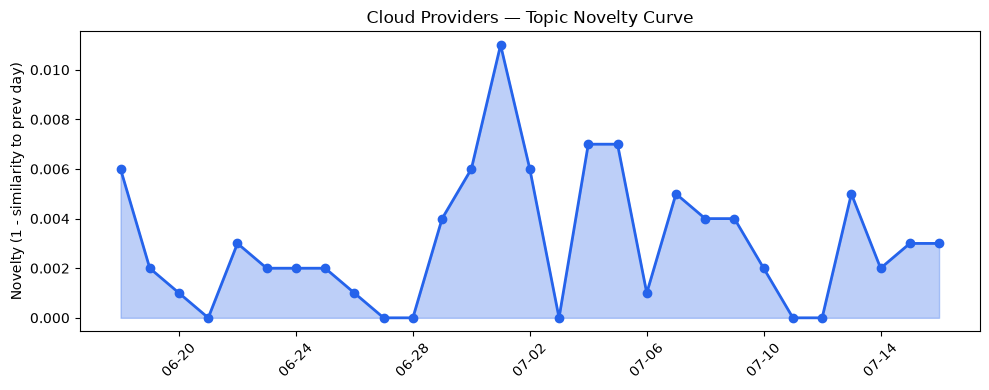
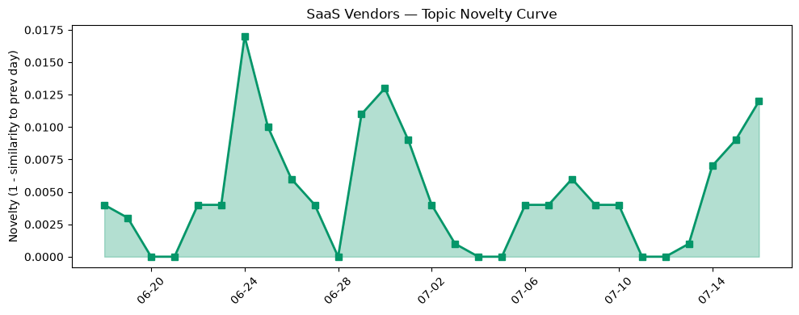

## 今日云计算结构性变化
> 今日云计算与 SaaS 产业结构变化主要体现在技术层面的进步，包括 AI、云原生和基础设施的改进，AWS、Google Cloud 和 Microsoft Azure 在技术层面、基础设施以及应用层方面均有显著进展。
今天最值得注意的云计算/SaaS 结构性变化是技术层面的重大突破，包括云原生、AI 和基础设施的改进。这些进展对于云计算和 SaaS 产业来说至关重要，因为它们能够提高效率、降低成本和提高安全性。例如，Google Cloud 和 Microsoft Azure 在云原生技术方面取得重大突破，AWS 推出了 MicroVMs，提供了新的 serverless 计算方式。
- 📈 **持续趋势**：技术层话题已连续30天增强
- 🆕 **新兴方向**：AI 搜索优化和内容优化为30天内首次出现
- 🔺 **突然升温**：Azure 和 HubSpot 近3天突然集中出现
- 🔑 **新关键词**：AI 搜索优化、内容优化
- 📉 **消退关键词**：Anthropic、CRM、云安全、容器化、数据安全

## 技术层信号
🔴 重大突破

云原生、AI 和基础设施的进步是今日技术层信号的主要内容。Google Cloud 和 Microsoft Azure 在云原生技术方面取得重大突破，AWS 推出了 MicroVMs，提供了新的 serverless 计算方式。这些进展能够提高云计算的效率和安全性。例如，Google Cloud 的 BigQuery 和 AlloyDB AI 取得重大更新，Azure Files 结合了熟悉的文件访问和内置的性能、数据保护、安全和 Azure 服务集成。
根据 [Run isolated sandboxes with full lifecycle control: AWS Lambda introduces MicroVMs](https://aws.amazon.com/blogs/aws/run-isolated-sandboxes-with-full-lifecycle-control-aws-lambda-introduces-microvms/)，AWS 的 MicroVMs 提供了新的 serverless 计算方式。同时，[Google is a Leader and positioned furthest in Vision and highest in Execution in the 2026 Gartner Magic Quadrant for Conversational AI Platforms](https://cloud.google.com/blog/products/ai-machine-learning/google-is-a-leader-in-the-gartner-magic-quadrant-for-conversational-ai/) 表明 Google Cloud 在对话式 AI 平台方面取得了领先地位。

## 产业资本信号
🔴 强信号

今日产业资本信号主要体现在 Fora 和 Strella 的融资和估值上。Fora，一家 AI 驱动的旅行社，获得了 6000 万美元的 D 轮融资，Strella 获得 1400 万美元 A 轮融资。这些融资和估值的提升表明了投资者对 AI 驱动的旅行社和 AI 采访技术的信任和认可。
根据 [AI-powered travel agency Fora hits unicorn status, raises $60M](https://techcrunch.com/2026/07/16/ai-powered-travel-agency-fora-hits-unicorn-status-raises-60m/)，Fora 的估值达到 10 亿美元。同时，[Amazon and Chobani adopt Strella's AI interviews for customer research as fast-growing startup raises $14M](https://venturebeat.com/technology/amazon-and-chobani-adopt-strellas-ai-interviews-for-customer-research-as) 表明 Strella 的 AI 采访技术得到了 Amazon 和 Chobani 的认可。

## 潜在拐点判断
今日信号表明，云计算和 SaaS 产业正在经历技术层面的重大突破和产业资本的强信号。这些信号可能预示着云计算和 SaaS 产业的潜在拐点，包括云原生、AI 和基础设施的进步，以及 AI 驱动的旅行社和 AI 采访技术的兴起。

## 明日观察点
1. 观察 AWS、Google Cloud 和 Microsoft Azure 在技术层面的进展，特别是云原生和 AI 的发展。
2. 关注 Fora 和 Strella 的后续发展，特别是他们的估值和融资情况。
3. 注意数据安全和隐私监管趋势的变化，特别是对云计算和 SaaS 产业的影响。

## 长期趋势坐标
今日信号表明，云计算和 SaaS 产业正在经历长期趋势的转变，包括云原生、AI 和基础设施的进步，以及 AI 驱动的旅行社和 AI 采访技术的兴起。这些趋势可能会在未来几个月甚至几年内持续发展。

## 数据洞察
### 云厂商话题演化
今日云厂商话题演化主要体现在 Azure、Google Cloud 和 AWS 的技术层面的进展。根据 [云厂商话题演化](charts/2026-07-16_cloud_novelty.png) 趋势图，Azure 和 Google Cloud 的话题演化呈现上升趋势。
### SaaS 厂商话题演化
今日 SaaS 厂商话题演化主要体现在 HubSpot 和 Salesforce 的应用层面的进展。根据 [SaaS 厂商话题演化](charts/2026-07-16_saas_novelty.png) 趋势图，HubSpot 的话题演化呈现上升趋势。
### 趋势图

## 参考来源
- [Run isolated sandboxes with full lifecycle control: AWS Lambda introduces MicroVMs](https://aws.amazon.com/blogs/aws/run-isolated-sandboxes-with-full-lifecycle-control-aws-lambda-introduces-microvms/) — AWS Blog
- [Google is a Leader and positioned furthest in Vision and highest in Execution in the 2026 Gartner Magic Quadrant for Conversational AI Platforms](https://cloud.google.com/blog/products/ai-machine-learning/google-is-a-leader-in-the-gartner-magic-quadrant-for-conversational-ai/) — Google Cloud Blog
- [Frontier models and production agents: Advancing Microsoft Foundry for the agentic era](https://azure.microsoft.com/en-us/blog/frontier-models-and-production-agents-advancing-microsoft-foundry-for-the-agentic-era/) — Microsoft Azure Blog
- [Meet Brain: The AI system behind Azure reliability](https://azure.microsoft.com/en-us/blog/meet-brain-the-ai-system-behind-azure-reliability/) — Microsoft Azure Blog
- [火山引擎正式推出四款数据产品](https://www.cnblogs.com/volcengine/p/15640481.html) — 火山引擎博客
- [AI-powered travel agency Fora hits unicorn status, raises $60M](https://techcrunch.com/2026/07/16/ai-powered-travel-agency-fora-hits-unicorn-status-raises-60m/) — TechCrunch
- [Amazon and Chobani adopt Strella's AI interviews for customer research as fast-growing startup raises $14M](https://venturebeat.com/technology/amazon-and-chobani-adopt-strellas-ai-interviews-for-customer-research-as) — VentureBeat Enterprise
- [Best content optimization tools for ROI-focused teams](https://blog.hubspot.com/marketing/content-optimization-tools) — HubSpot Blog
- [What is AI search optimization? (& why marketers should care)](https://blog.hubspot.com/marketing/what-is-ai-search-optimization) — HubSpot Blog
- [Trust Shouldn’t Be a Product Feature. It Has to Be the Foundation.](https://www.salesforce.com/blog/data-trust-foundation/) — Salesforce Blog