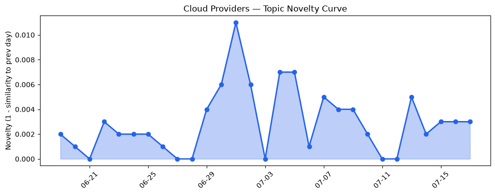
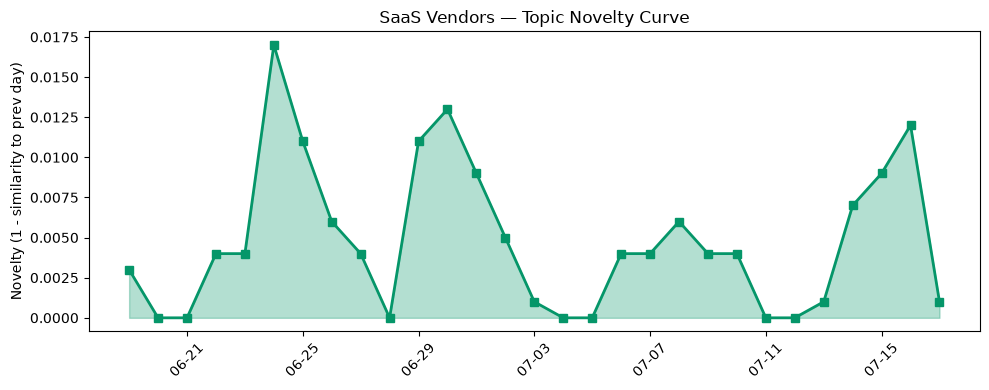

## 今日云计算结构性变化
> 云计算领域出现多项技术和基础设施更新，包括AWS、Google Cloud、Microsoft Azure和Cloudflare的创新应用和安全方面的推进。
云计算领域的技术创新和基础设施更新，表明云厂商在技术创新和安全方面持续推进。今日最值得注意的变化是AWS、Google Cloud和Microsoft Azure在云原生和AI领域的进展，例如AWS推出MicroVMs，Google Cloud的Gemini Enterprise Agent Platform和Microsoft Azure的Frontier模型系列。这意味着云计算领域正在朝着更高的计算性能和更好的安全性方向发展。

- 📈 **持续趋势**：技术层话题已连续8天增强
- 🆕 **新兴方向**：Tokenization和人工智能为30天内首次出现的热点话题
- 🔺 **突然升温**：风险信号的话题向量在最近8天内呈现持续增强趋势

## 技术层信号
🔴 重大突破

云原生和AI领域的进展是今日技术层信号的主要内容。AWS推出MicroVMs，Google Cloud的Gemini Enterprise Agent Platform和Microsoft Azure的Frontier模型系列展示了云原生和AI的融合进展。同时，Google Cloud的BigQuery和IAM数据管理标签的更新提高了数据安全性，AWS Certificate Manager支持ACME协议，自动化公钥证书的发行和更新。这些进展表明，云厂商在技术创新和安全方面持续推进。

例如，[AWS Lambda introduces MicroVMs](https://aws.amazon.com/blogs/aws/run-isolated-sandboxes-with-full-lifecycle-control-aws-lambda-introduces-microvms/) 和 [Level Up Your Column-level Security: Using IAM Data Governance Tags in BigQuery](https://cloud.google.com/blog/products/data-analytics/level-up-your-column-level-security-using-iam-data-governance-tags-in-bigquery/)。

## 产业资本信号
🔴 强信号

产业资本信号方面，Nuclear startup Valar Atomics正在谈判新一轮融资，估值为60亿美元，Strella的1400万美元的Series A融资。这些信号表明，资本市场对云计算和AI领域的创新企业仍然保持着强烈的兴趣。

例如，[Nuclear startup Valar Atomics in talks to raise new funding at $6B valuation](https://techcrunch.com/2026/07/17/nuclear-startup-valar-atomics-in-talks-to-raise-new-funding-at-6b-valuation/) 和 [Amazon and Chobani adopt Strella's AI interviews for customer research as fast-growing startup raises $14M](https://venturebeat.com/technology/amazon-and-chobani-adopt-strellas-ai-interviews-for-customer-research-as)。

## 潜在拐点判断
今日信号 + 历史趋势表明，云计算领域的技术创新和安全方面的推进可能会带来潜在的拐点。例如，Tokenization和人工智能的兴起可能会带来数据安全和AI应用的新时代。

## 明日观察点
1. 观察AWS和Google Cloud在云原生和AI领域的进一步进展。
2. 关注Nuclear startup Valar Atomics和Strella的融资进展。
3. 跟踪Tokenization和人工智能在数据安全和AI应用中的发展。

## 长期趋势坐标
今日信号放到月/季尺度，云计算领域的技术创新和安全方面的推进可能会带来长期的影响。例如，云原生和AI的融合进展可能会带来更高的计算性能和更好的安全性。

## 数据洞察
### 云厂商话题演化
今日云厂商话题演化的novelty score为0.02，mean similarity为0.98，表明云厂商的话题向量在最近30天内呈现相对稳定的趋势。

### SaaS 厂商话题演化
今日SaaS厂商话题演化的novelty score为0.051，mean similarity为0.949，表明SaaS厂商的话题向量在最近30天内呈现相对稳定的趋势。

### 趋势图

## 参考来源
- [AWS Lambda introduces MicroVMs](https://aws.amazon.com/blogs/aws/run-isolated-sandboxes-with-full-lifecycle-control-aws-lambda-introduces-microvms/) — AWS Blog
- [Level Up Your Column-level Security: Using IAM Data Governance Tags in BigQuery](https://cloud.google.com/blog/products/data-analytics/level-up-your-column-level-security-using-iam-data-governance-tags-in-bigquery/) — Google Cloud Blog
- [Nuclear startup Valar Atomics in talks to raise new funding at $6B valuation](https://techcrunch.com/2026/07/17/nuclear-startup-valar-atomics-in-talks-to-raise-new-funding-at-6b-valuation/) — TechCrunch
- [Amazon and Chobani adopt Strella's AI interviews for customer research as fast-growing startup raises $14M](https://venturebeat.com/technology/amazon-and-chobani-adopt-strellas-ai-interviews-for-customer-research-as) — VentureBeat Enterprise