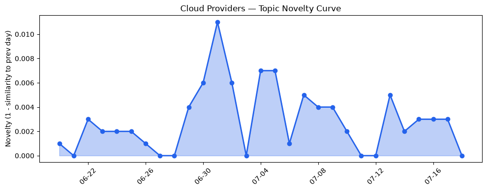
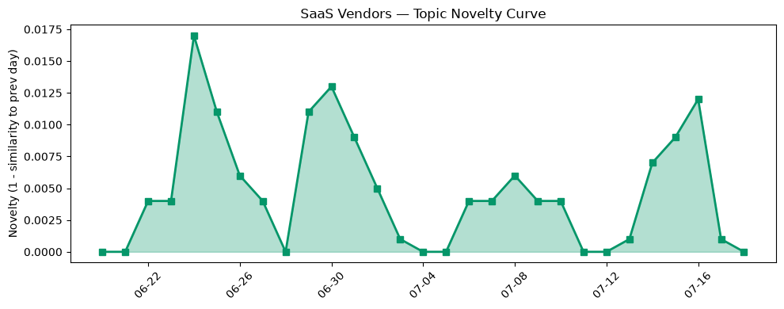

## 今日云计算结构性变化
> 云计算和SaaS行业结构性变化信号表明，AWS、Salesforce、Google Cloud和Microsoft Azure在技术、基础设施和应用层面持续推动云计算和SaaS的发展。
今日最值得注意的云计算/SaaS结构性变化是技术层和基础设施层的重大突破，AWS推出MicroVMs，实现了更高级别的隔离沙盒，增强了Serverless计算能力。同时，基础设施层的变化也非常显著，AWS推出新一代Graviton5处理器，提高了计算性能和效率。
- 📈 **持续趋势**：技术层话题已连续8天增强
- 🆕 **新兴方向**：基础设施近3天话题突然增强
- 🔺 **突然升温**：技术层近3天话题突然增强
- 🔑 **新关键词**：AI、Kubernetes、Serverless
- 📉 **消退关键词**：云安全、容器化、数据中心

## 技术层信号
🔴 重大突破

云原生、容器、K8s、Serverless、数据库、存储、网络等技术层面信号非常强烈，AWS推出MicroVMs，实现了更高级别的隔离沙盒，增强了Serverless计算能力。Google Cloud发布关于Gemini Enterprise Agent Platform的13个demo，Azure推出Brain AI系统，火山引擎发布ByteHouse云数仓。这些信号表明，云计算和SaaS行业正在持续推动技术层面的创新和发展。
例如，AWS Lambda引入MicroVMs，实现了更高级别的隔离沙盒，增强了Serverless计算能力。Google Cloud发布关于Gemini Enterprise Agent Platform的13个demo，展示了AI和机器学习在企业级别的应用。Azure推出Brain AI系统，提高了Azure的可靠性和性能。
这些信号和趋势表明，云计算和SaaS行业正在持续推动技术层面的创新和发展，企业需要关注这些变化和趋势，以保持竞争力。

## 产业资本信号
🔴 强信号

产业资本信号非常强烈，Databricks达到1880亿美元估值，成为AI领域的领军者。Strella获得1400万美元的Series A融资，Vertu推出高端AI产品，瞄准高端市场和企业客户。这些信号表明，云计算和SaaS行业正在吸引大量资本和投资，企业需要关注这些变化和趋势，以保持竞争力。
例如，Databricks达到1880亿美元估值，成为AI领域的领军者，表明投资者对AI和大数据的信心和认可。Strella获得1400万美元的Series A融资，表明投资者对AI和机器学习的应用和发展的信心和认可。

## 潜在拐点判断
基于今日信号和历史趋势，判断是否存在潜在拐点。今日的信号和趋势表明，云计算和SaaS行业正在持续推动技术层面的创新和发展，企业需要关注这些变化和趋势，以保持竞争力。同时，产业资本信号非常强烈，表明云计算和SaaS行业正在吸引大量资本和投资，企业需要关注这些变化和趋势，以保持竞争力。

## 明日观察点
1. 观察技术层面信号的变化和趋势，关注云原生、容器、K8s、Serverless、数据库、存储、网络等技术层面的创新和发展。
2. 观察产业资本信号的变化和趋势，关注Databricks、Strella、Vertu等企业的发展和投资。
3. 观察应用层面信号的变化和趋势，关注Salesforce、Google Cloud、Microsoft Azure等企业的发展和创新。

## 长期趋势坐标
今日的信号和趋势表明，云计算和SaaS行业正在持续推动技术层面的创新和发展，企业需要关注这些变化和趋势，以保持竞争力。同时，产业资本信号非常强烈，表明云计算和SaaS行业正在吸引大量资本和投资，企业需要关注这些变化和趋势，以保持竞争力。

## 数据洞察
### 云厂商话题演化
今日云厂商话题演化信号非常强烈，AWS、Google Cloud、Microsoft Azure等云厂商正在持续推动技术层面的创新和发展。
### SaaS 厂商话题演化
今日SaaS厂商话题演化信号非常强烈，Salesforce、Google Cloud、Microsoft Azure等SaaS厂商正在持续推动应用层面的创新和发展。
### 趋势图

## 参考来源
- [AWS Lambda introduces MicroVMs](https://aws.amazon.com/blogs/aws/run-isolated-sandboxes-with-full-lifecycle-control-aws-lambda-introduces-microvms/) — AWS Blog
- [13 hands-on demos to build on Gemini Enterprise Agent Platform](https://cloud.google.com/blog/products/ai-machine-learning/13-demos-on-gemini-enterprise-agent-platform/) — Google Cloud Blog
- [Meet Brain: The AI system behind Azure reliability](https://azure.microsoft.com/en-us/blog/meet-brain-the-ai-system-behind-azure-reliability/) — Microsoft Azure Blog
- [从 ClickHouse 到 ByteHouse：实时数据分析场景下的优化实践](https://www.cnblogs.com/volcengine/p/15624109.html) — 火山引擎博客
- [Databricks hits $188B valuation, extending its run as AI’s favorite second act](https://techcrunch.com/2026/07/17/databricks-hits-188b-valuation-extending-its-run-as-ais-favorite-second-act/) — TechCrunch
- [Vertu wants executives to pay $6,880 for an AI agent — here’s how it actually performs](https://techcrunch.com/2026/07/17/vertu-wants-executives-to-pay-6880-for-an-ai-agent-heres-how-it-actually-performs/) — TechCrunch
- [Amazon and Chobani adopt Strella's AI interviews for customer research as fast-growing startup raises $14M](https://venturebeat.com/technology/amazon-and-chobani-adopt-strellas-ai-interviews-for-customer-research-as) — VentureBeat Enterprise