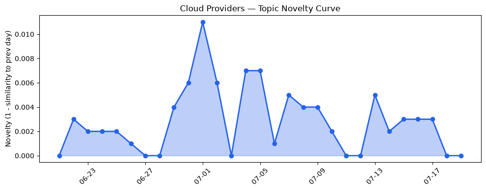
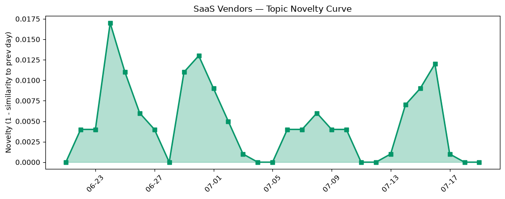

## 今日云计算结构性变化
> 云计算和 SaaS 领域的结构性变化主要体现在技术层面的进步，包括云原生、AI/ML 与云的融合等方面的突破，以及在基础设施、应用层、资本信号和风险信号方面的多项进展。
今天最值得注意的云计算/SaaS 结构性变化是技术层面的重大突破，特别是在云原生和 AI 相关技术方面的进展。例如，AWS 推出 MicroVMs，Google Cloud 和 Azure 在云原生和 AI 相关的技术更新方面有所进展，Cloudflare 推出 Workers Cache 等。这些进展表明云计算和 SaaS 领域正在不断创新和发展。
- 📈 **持续趋势**：技术层话题已连续8天增强
- 🆕 **新兴方向**：资本信号出现全新话题
- 🔺 **突然升温**：风险信号的话题向量在最近8天内呈现持续增强趋势
- 🔑 **新关键词**：边缘计算
- 📉 **消退关键词**：云安全、容器化、数据中心

## 技术层信号
🔴 重大突破

云原生、AI/ML 与云的融合等方面的突破是技术层信号的主要内容。例如，AWS 推出 MicroVMs，Google Cloud 和 Azure 在云原生和 AI 相关的技术更新方面有所进展，Cloudflare 推出 Workers Cache 等。这些进展表明云计算和 SaaS 领域正在不断创新和发展。
[Run isolated sandboxes with full lifecycle control: AWS Lambda introduces MicroVMs](https://aws.amazon.com/blogs/aws/run-isolated-sandboxes-with-full-lifecycle-control-aws-lambda-introduces-microvms/)
[Level Up Your Column-level Security: Using IAM Data Governance Tags in BigQuery](https://cloud.google.com/blog/products/data-analytics/level-up-your-column-level-security-using-iam-data-governance-tags-in-bigquery/)
[Your Worker can now have its own cache in front of it](https://blog.cloudflare.com/workers-cache/)

## 产业资本信号
🔴 强信号

资本信号方面，Netflix 收购了 Ben Affleck 的 AI 公司，支付了 587 万美元，这表明了其在 AI 领域的战略布局。同时，资本信号出现全新话题，可能是一个新兴方向的早期信号。
[Netflix paid $587M for Ben Affleck’s AI filmmaking startup](https://techcrunch.com/2026/07/19/netflix-paid-587m-for-ben-afflecks-ai-filmmaking-startup/)

## 潜在拐点判断
根据今日信号 + 历史趋势，判断是否存在潜在拐点。技术层面的重大突破和资本信号的强信号可能表明云计算和 SaaS 领域正在经历一个潜在的拐点。

## 明日观察点
1. 观察技术层面的进展，特别是在云原生和 AI 相关的技术更新方面。
2. 关注资本信号的变化，特别是在 AI 领域的战略布局方面。
3. 注意风险信号的变化，特别是在数据安全和 AI ethics 方面。

## 长期趋势坐标
云计算和 SaaS 领域的长期趋势坐标将继续关注技术层面的进展、资本信号的变化和风险信号的变化。同时，需要注意边缘计算、数据分析和网络安全等新兴方向的发展。

## 数据洞察
### 云厂商话题演化
云厂商话题向量在最近30天内呈现延续趋势，novelty_score 为 0.018，mean_similarity 为 0.982。

### SaaS 厂商话题演化
SaaS 厂商话题向量在最近30天内呈现延续趋势，novelty_score 为 0.049，mean_similarity 为 0.951。

### 趋势图

## 参考来源
- [Run isolated sandboxes with full lifecycle control: AWS Lambda introduces MicroVMs](https://aws.amazon.com/blogs/aws/run-isolated-sandboxes-with-full-lifecycle-control-aws-lambda-introduces-microvms/) — AWS Blog
- [Level Up Your Column-level Security: Using IAM Data Governance Tags in BigQuery](https://cloud.google.com/blog/products/data-analytics/level-up-your-column-level-security-using-iam-data-governance-tags-in-bigquery/) — Google Cloud Blog
- [Your Worker can now have its own cache in front of it](https://blog.cloudflare.com/workers-cache/) — Cloudflare Blog
- [Netflix paid $587M for Ben Affleck’s AI filmmaking startup](https://techcrunch.com/2026/07/19/netflix-paid-587m-for-ben-afflecks-ai-filmmaking-startup/) — TechCrunch