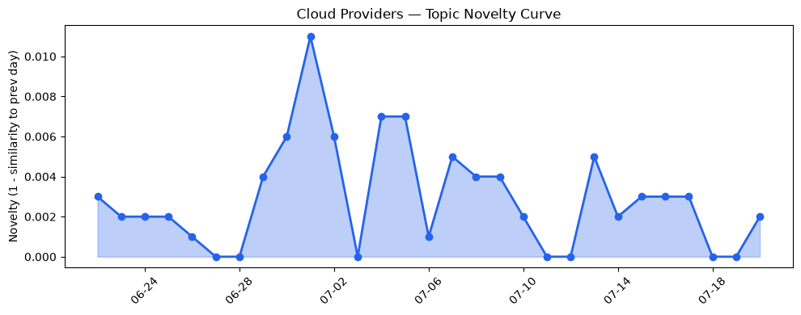
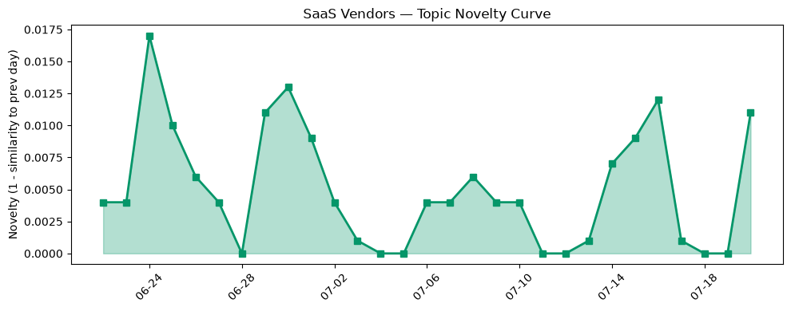

## 今日云计算结构性变化
> 今日云计算结构性变化的核心判断是：AWS、Google Cloud和Salesforce等领军企业在云计算和SaaS领域持续创新，技术和基础设施更新频繁，资本信号显示出强烈的融资和战略投资动向，风险信号主要体现在监管和安全方面。
今天最值得注意的云计算/SaaS结构性变化是技术层和基础设施的更新。AWS推出MicroVMs，支持Kubernetes版本回滚，Google Cloud的C4A-metal和Panasonic Automotive vSkipGen的合作等。这意味着云计算领域的技术创新正在持续推进。
趋势报告中有信号显示，技术层和风险信号的话题向量在最近8天内呈现持续增强趋势，基础设施近3天内容相似度显著高于更早期均值，资本信号出现全新话题。

- 📈 **持续趋势**：技术层和风险信号的话题向量已连续8天增强
- 🆕 **新兴方向**：资本信号出现全新话题
- 🔺 **突然升温**：基础设施话题近3天突然集中出现
- 🔑 **新关键词**：Attribution Business Insights，Workers Cache，战略投资，融资
- 📉 **消退关键词**：容器化，数据中心，机器学习

## 技术层信号
🔴 重大突破

云原生/容器/K8s/Serverless、数据库/存储/网络、AI与云融合有着显著的进展。AWS推出MicroVMs，支持Kubernetes版本回滚，Google Cloud的C4A-metal和Panasonic Automotive vSkipGen的合作等。这意味着云计算领域的技术创新正在持续推进。[AWS Weekly Roundup: One-click Lambda setup prompt, OpenAI GPT-5.6 models on Bedrock, and more](https://aws.amazon.com/blogs/aws/aws-weekly-roundup-one-click-lambda-setup-prompt-openai-gpt-5-6-models-on-bedrock-and-more-july-20-2026/) 和 [Accelerating automotive innovation with C4A-metal and Panasonic Automotive vSkipGen](https://cloud.google.com/blog/topics/partners/panasonic-automotive-vskipgen-runs-on-axion-based-c4a-metal/) 等文章体现了这一趋势。
此外，Cloudflare的Internal DNS和Workers Cache的发布，也体现了技术层的持续创新。[Cloudflare Internal DNS is now generally available](https://blog.cloudflare.com/internal-dns/) 和 [Your Worker can now have its own cache in front of it](https://blog.cloudflare.com/workers-cache/) 等文章提供了更多细节。

## 产业资本信号
🔴 强信号

资本信号显示出强烈的融资和战略投资动向。Natural获得3000万美元融资，Infinity获得1500万美元融资等。这意味着投资者对AI和云计算领域的公司表现出强烈兴趣。[Natural raises $30M to reinvent payments for AI agents — and take on Stripe](https://techcrunch.com/2026/07/20/natural-raises-30m-to-reinvent-payments-for-ai-agents-and-take-on-stripe/) 和 [Inference startup Infinity raises $15M from Touring Capital, OpenAI and Anthropic researchers](https://techcrunch.com/2026/07/20/inference-startup-infinity-raises-15m-from-touring-capital-openai-and-athropic-researchers/) 等文章提供了更多细节。
此外，OpenAI和Anthropic研究人员投资Infinity，也体现了这一趋势。

## 潜在拐点判断
基于今日信号和历史趋势，判断是否存在潜在拐点。技术层和基础设施的更新，资本信号的强烈，风险信号的增强等，都可能是潜在拐点的信号。但需要进一步观察和分析，才能确认是否真的是拐点。

## 明日观察点
1. 观察技术层信号是否继续增强
2. 关注资本信号的发展
3. 监测风险信号的变化

## 长期趋势坐标
今日信号放到月/季尺度，技术层和基础设施的更新，资本信号的强烈，风险信号的增强等，都可能是长期趋势的重要组成部分。

## 数据洞察
### 云厂商话题演化
云厂商话题演化的新颖度评分为0.019，平均相似度为0.981，趋势为延续。
### SaaS 厂商话题演化
SaaS厂商话题演化的新颖度评分为0.051，平均相似度为0.949，趋势为延续。
### 趋势图

## 参考来源
- [AWS Weekly Roundup: One-click Lambda setup prompt, OpenAI GPT-5.6 models on Bedrock, and more](https://aws.amazon.com/blogs/aws/aws-weekly-roundup-one-click-lambda-setup-prompt-openai-gpt-5-6-models-on-bedrock-and-more-july-20-2026/) — AWS Blog
- [Accelerating automotive innovation with C4A-metal and Panasonic Automotive vSkipGen](https://cloud.google.com/blog/topics/partners/panasonic-automotive-vskipgen-runs-on-axion-based-c4a-metal/) — Google Cloud Blog
- [Natural raises $30M to reinvent payments for AI agents — and take on Stripe](https://techcrunch.com/2026/07/20/natural-raises-30m-to-reinvent-payments-for-ai-agents-and-take-on-stripe/) — TechCrunch
- [Inference startup Infinity raises $15M from Touring Capital, OpenAI and Anthropic researchers](https://techcrunch.com/2026/07/20/inference-startup-infinity-raises-15m-from-touring-capital-openai-and-athropic-researchers/) — TechCrunch
- [Cloudflare Internal DNS is now generally available](https://blog.cloudflare.com/internal-dns/) — Cloudflare Blog
- [Your Worker can now have its own cache in front of it](https://blog.cloudflare.com/workers-cache/) — Cloudflare Blog