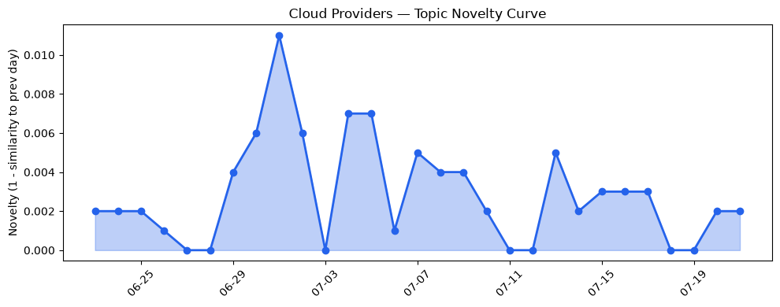
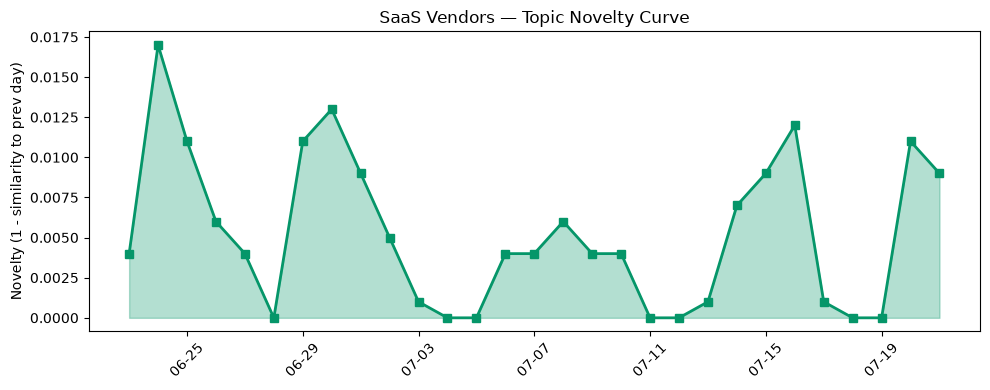

## 今日云计算结构性变化
> 今日云计算结构性变化的核心判断是：AWS、Google Cloud、Azure 和 SaaS 厂商如 Salesforce 和 HubSpot 在技术、基础设施和应用方面取得了显著进展，包括 serverless 计算、云原生、AI 和数字化转型。
今天最值得注意的云计算/SaaS 结构性变化是云原生和 serverless 计算的快速发展，例如 AWS Lambda MicroVMs 和 Google Cloud AlloyDB。同时，基础设施的更新，如 AWS CloudFormation Express mode 和 Google Cloud 的定价和区域扩张策略，也是值得关注的变化。这些变化意味着云计算和 SaaS 领域正在经历快速的技术进步和基础设施升级。
- 📈 **持续趋势**：技术层话题已连续 8 天增强
- 🆕 **新兴方向**：serverless 计算成为新的热点话题
- 🔺 **突然升温**：风险信号的话题向量近 3 天突然集中出现
- 🔑 **新关键词**：serverless
- 📉 **消退关键词**：容器化、数据中心、机器学习

## 技术层信号
🔴 重大突破

云原生和 serverless 计算是今日技术层信号的重点。AWS Lambda MicroVMs 和 Google Cloud AlloyDB 是两个值得关注的例子，分别提供了新的云原生和安全功能。同时，AWS CloudFormation Express mode 和 Google Cloud 的基础设施更新也表明了技术层的快速进步。这些信号意味着云计算和 SaaS 领域正在经历快速的技术进步和基础设施升级。
例如，AWS Lambda MicroVMs 提供了新的云原生和安全功能，[Run isolated sandboxes with full lifecycle control: AWS Lambda introduces MicroVMs](https://aws.amazon.com/blogs/aws/run-isolated-sandboxes-with-full-lifecycle-control-aws-lambda-introduces-microvms/)。Google Cloud 的 AlloyDB 也提供了新的云原生功能，[Supercharging pgvector: 4x faster HNSW vector search with AlloyDB](https://cloud.google.com/blog/products/databases/supercharge-pgvector-4x-faster-hnsw-with-alloydb/)。
这些技术层信号表明，云计算和 SaaS 领域正在经历快速的技术进步和基础设施升级。

## 产业资本信号
🔴 强信号

产业资本信号的重点是基础设施变化和应用层变化。AWS CloudFormation Express mode 和 Google Cloud 的定价和区域扩张策略是两个值得关注的例子，分别提供了加速基础设施部署和更新定价和区域扩张策略的功能。同时，SaaS 厂商如 Salesforce 和 HubSpot 也在应用层方面取得了显著进展，例如 Salesforce 的 Agent Script 和 Agentic Commerce Search 功能。
例如，AWS CloudFormation Express mode 提供了加速基础设施部署的功能，[Accelerate your infrastructure deployments by up to 4x with AWS CloudFormation Express mode](https://aws.amazon.com/blogs/aws/accelerate-your-infrastructure-deployments-by-up-to-4x-with-aws-cloudformation-express-mode/)。Google Cloud 的定价和区域扩张策略也表明了基础设施的更新，[Making highly available, multi-region Cloud Run services just got easier](https://cloud.google.com/blog/products/serverless/cloud-run-multi-region-services-enhanced-for-high-availability/)。
这些产业资本信号意味着云计算和 SaaS 领域正在经历快速的基础设施升级和应用层进步。

## 潜在拐点判断
今日信号和历史趋势表明，云计算和 SaaS 领域可能正在经历一个潜在的拐点。技术层信号的快速进步和基础设施的升级意味着云计算和 SaaS 领域正在经历快速的技术进步和基础设施升级。同时，应用层的进步和产业资本信号的强烈也意味着云计算和 SaaS 领域正在经历快速的应用层进步和基础设施升级。
如果这种趋势继续，云计算和 SaaS 领域可能会经历一个快速的增长和发展阶段，带来新的商业机会和挑战。

## 明日观察点
1. 观察云原生和 serverless 计算的进一步发展和应用。
2. 关注基础设施的更新和升级，特别是 AWS 和 Google Cloud 的定价和区域扩张策略。
3. 分析 SaaS 厂商如 Salesforce 和 HubSpot 的应用层进步和产业资本信号的强烈。

## 长期趋势坐标
今日信号和历史趋势表明，云计算和 SaaS 领域正在经历快速的技术进步和基础设施升级。长期趋势坐标意味着云计算和 SaaS 领域可能会经历一个快速的增长和发展阶段，带来新的商业机会和挑战。
例如，[Overall Novelty](https://venturebeat.com/technology/tokenization-takes-the-lead-in-the-fight-for-data-security) 和 [Keyword Trends](https://blog.hubspot.com/marketing/saas-seo-tools) 表明，云计算和 SaaS 领域正在经历快速的技术进步和应用层进步。

## 数据洞察
### 云厂商话题演化
今日云厂商话题演化的 novelty score 为 0.018，mean similarity 为 0.982，表明云厂商话题在近期内变化较小，但仍然存在一定的新颖性。
### SaaS 厂商话题演化
今日 SaaS 厂商话题演化的 novelty score 为 0.054，mean similarity 为 0.946，表明 SaaS 厂商话题在近期内变化较大，存在一定的新颖性。
### 趋势图

## 参考来源
- [Run isolated sandboxes with full lifecycle control: AWS Lambda introduces MicroVMs](https://aws.amazon.com/blogs/aws/run-isolated-sandboxes-with-full-lifecycle-control-aws-lambda-introduces-microvms/)
- [Supercharging pgvector: 4x faster HNSW vector search with AlloyDB](https://cloud.google.com/blog/products/databases/supercharge-pgvector-4x-faster-hnsw-with-alloydb/)
- [Accelerate your infrastructure deployments by up to 4x with AWS CloudFormation Express mode](https://aws.amazon.com/blogs/aws/accelerate-your-infrastructure-deployments-by-up-to-4x-with-aws-cloudformation-express-mode/)
- [Making highly available, multi-region Cloud Run services just got easier](https://cloud.google.com/blog/products/serverless/cloud-run-multi-region-services-enhanced-for-high-availability/)
- [5 Reasons to Upgrade Your Agent to Agent Script](https://www.salesforce.com/blog/upgrade-to-agent-script/)
- [Beyond Keywords: How Agentic Commerce Search Understands True Shopper Intent](https://www.salesforce.com/blog/new-agentic-commerce-search-capabilities/)
- [SEO tools for SaaS: 13 best options to scale your content ops](https://blog.hubspot.com/marketing/saas-seo-tools)
- [CRM data migration: A practical process overview](https://blog.hubspot.com/marketing/crm-data-migration)
- [火山引擎正式推出四款数据产品 将持续完善敏捷数智引擎矩阵](https://www.cnblogs.com/volcengine/p/15640481.html)
- [Amazon and Chobani adopt Strella's AI interviews for customer research as fast-growing startup raises $14M](https://venturebeat.com/technology/amazon-and-chobani-adopt-strellas-ai-interviews-for-customer-research-as)
- [Oracle faces $100M annual bill to back Wisconsin datacenter power promises](https://www.theregister.com/ai-and-ml/2026/07/21/oracle-faces-100m-annual-bill-to-back-wisconsin-datacenter-power-promises/5275728)
- [Iran says it's struck offline AWS facility in Bahrain ... again](https://www.theregister.com/off-prem/2026/07/21/iran-says-its-struck-offline-aws-facility-in-bahrain-again/5275762)
- [Tokenization takes the lead in the fight for data security](https://venturebeat.com/technology/tokenization-takes-the-lead-in-the-fight-for-data-security)
- [LG monitors are using Windows 11 feature to serve adware](https://www.theregister.com/personal-tech/2026/07/21/lg-monitors-are-using-windows-11-feature-to-serve-adware/)
- [Kratos phishing-as-a-service kit loses its battle with international law enforcement](https://www.theregister.com/security/2026/07/21/german-authorities-lead-takedown-of-kratos-phishing-platform/5275666)