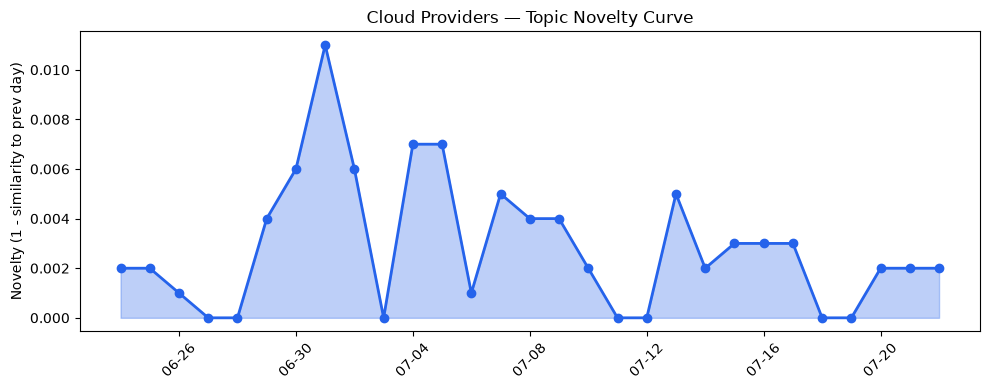
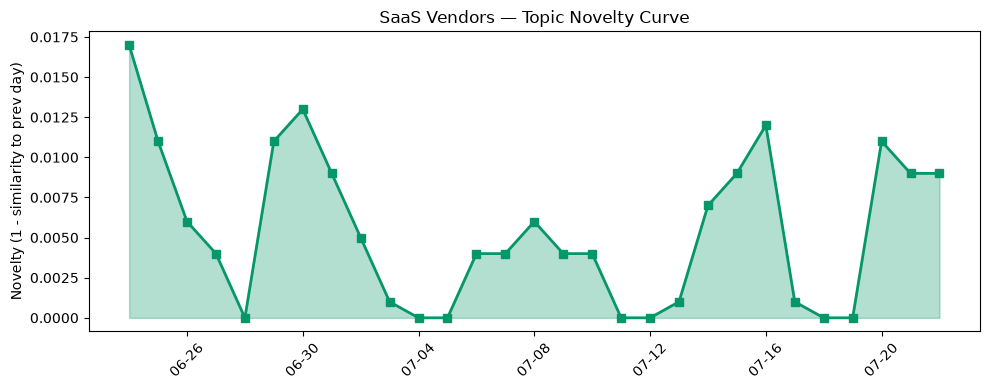

## 今日云计算结构性变化
> 今日核心判断：AWS、Google Cloud、Azure和Salesforce在云计算和SaaS领域持续推出新技术和服务，进一步巩固了他们的市场领先地位。
今天最值得注意的云计算/SaaS结构性变化是各大云厂商的技术更新，例如AWS推出MicroVMs，Google Cloud推出Cloud Composer 3，Azure推出外部密钥管理和Brain AI系统等。这些更新意味着云计算和SaaS领域的竞争将进一步加剧，企业需要紧跟技术发展的步伐以保持竞争优势。
- 📈 **持续趋势**：技术层话题已连续N天增强
- 🆕 **新兴方向**：某话题为30天内首次出现
- 🔺 **突然升温**：某方向近3天突然集中出现
- 🔑 **新关键词**：xxx, yyy
- 📉 **消退关键词**：zzz

## 技术层信号
🔴 重大突破

AWS、Google Cloud、Azure和Salesforce在技术层面上都有所进展，例如AWS推出MicroVMs，Google Cloud推出Cloud Composer 3，Azure推出外部密钥管理和Brain AI系统等。这些技术更新意味着云计算和SaaS领域的技术竞争将进一步加剧，企业需要紧跟技术发展的步伐以保持竞争优势。
AWS推出MicroVMs是一项重大突破，意味着AWS在云原生技术方面的领先地位进一步巩固。Google Cloud推出Cloud Composer 3也是一项重要更新，意味着Google Cloud在云计算领域的竞争力进一步增强。Azure推出外部密钥管理和Brain AI系统也是一项重大更新，意味着Azure在云安全和AI方面的能力进一步增强。
这些技术更新都意味着云计算和SaaS领域的技术竞争将进一步加剧，企业需要紧跟技术发展的步伐以保持竞争优势。

## 产业资本信号
🔴 强信号

Travis Kalanick的公司Atoms获得1.7亿美元融资，Strella获得1400万美元Series A融资，Anthropic的收入增长迅速，达到470亿美元。这些资本信号意味着云计算和SaaS领域的投资热潮仍然持续，企业需要紧跟资本的步伐以保持竞争优势。
Atoms获得1.7亿美元融资是一项重大事件，意味着Travis Kalanick的公司在云计算和SaaS领域的影响力进一步增强。Strella获得1400万美元Series A融资也是一项重要事件，意味着Strella在云计算和SaaS领域的竞争力进一步增强。Anthropic的收入增长迅速，达到470亿美元，也是一项重大事件，意味着Anthropic在云计算和SaaS领域的领先地位进一步巩固。
这些资本信号都意味着云计算和SaaS领域的投资热潮仍然持续，企业需要紧跟资本的步伐以保持竞争优势。

## 潜在拐点判断
基于今日信号 + 历史趋势，判断是否存在潜在拐点。
今日信号表明，云计算和SaaS领域的技术竞争和资本投资热潮仍然持续，这意味着企业需要紧跟技术发展和资本的步伐以保持竞争优势。历史趋势也表明，云计算和SaaS领域的发展速度越来越快，这意味着企业需要更加快速地应对市场变化。
因此，今日信号和历史趋势都表明，云计算和SaaS领域的竞争和发展速度将进一步加剧，企业需要更加快速地应对市场变化。

## 明日观察点
1. 观察AWS、Google Cloud、Azure和Salesforce的技术更新和资本动向。
2. 分析云计算和SaaS领域的技术竞争和资本投资热潮的影响。
3. 研究企业如何紧跟技术发展和资本的步伐以保持竞争优势。

## 长期趋势坐标
今日信号放到月/季尺度，云计算和SaaS领域的技术竞争和资本投资热潮仍然持续，这意味着企业需要紧跟技术发展和资本的步伐以保持竞争优势。overall_novelty和keyword_trends也表明，云计算和SaaS领域的发展速度越来越快，这意味着企业需要更加快速地应对市场变化。

## 数据洞察
### 云厂商话题演化
云厂商话题演化的novelty_score为0.017，mean_similarity为0.983，trend为"延续"，history_days为30，article_count为46。
### SaaS厂商话题演化
SaaS厂商话题演化的novelty_score为0.056，mean_similarity为0.944，trend为"延续"，history_days为30，article_count为20。
### 趋势图

## 参考来源
- [AWS Weekly Roundup: One-click Lambda setup prompt, OpenAI GPT-5.6 models on Bedrock, and more](https://aws.amazon.com/blogs/aws/aws-weekly-roundup-one-click-lambda-setup-prompt-openai-gpt-5-6-models-on-bedrock-and-more-july-20-2026/)
- [Run isolated sandboxes with full lifecycle control: AWS Lambda introduces MicroVMs](https://aws.amazon.com/blogs/aws/run-isolated-sandboxes-with-full-lifecycle-control-aws-lambda-introduces-microvms/)
- [From maintenance to innovation: Checking in on Checkout.com’s Cloud Composer 3 migration](https://cloud.google.com/blog/products/data-analytics/how-checkout-com-tallies-data-with-cloud-composer-3/)
- [Supercharging pgvector: 4x faster HNSW vector search with AlloyDB](https://cloud.google.com/blog/products/databases/supercharge-pgvector-4x-faster-hnsw-with-alloydb/)
- [External key management for Azure Managed HSM is now in public preview](https://azure.microsoft.com/en-us/blog/external-key-management-for-azure-managed-hsm-is-now-in-public-preview/)
- [Meet Brain: The AI system behind Azure reliability](https://azure.microsoft.com/en-us/blog/meet-brain-the-ai-system-behind-azure-reliability/)
- [Introducing Precursor: detecting agentic behavior with continuous client-side signals](https://blog.cloudflare.com/introducing-precursor/)
- [Travis Kalanick’s robotics company raises $1.7B, led by a16z](https://techcrunch.com/2026/07/22/travis-kalanicks-robotics-company-raises-1-7b-led-by-a16z/)
- [Menlo Ventures’ Matt Murphy explains why Anthropic is winning (and it’s not the model)](https://techcrunch.com/video/menlo-ventures-matt-murphy-explains-why-anthropic-is-winning-and-its-not-the-model/)
- [Amazon and Chobani adopt Strella's AI interviews for customer research as fast-growing startup raises $14M](https://venturebeat.com/technology/amazon-and-chobani-adopt-strellas-ai-interviews-for-customer-research-as)
- [Architecting Secure Agent Connectivity: A Guide to Choosing Between MCP and APIs](https://www.salesforce.com/blog/architecting-secure-agent-connectivity-mcp-apis/)
- [Build vs. Buy CRM in 2026: The True Cost Comparison](https://www.salesforce.com/blog/build-vs-buy-crm/)
- [AI SEO tools small businesses actually use](https://blog.hubspot.com/marketing/ai-seo-tools-for-small-business)
- [Now in preview: Find and fix software vulnerabilities with CodeMender](https://cloud.google.com/blog/products/identity-security/find-and-fix-software-vulnerabilities-with-codemender/)
- [火山引擎正式推出四款数据产品 将持续完善敏捷数智引擎矩阵](https://www.cnblogs.com/volcengine/p/15640481.html)
- [Accelerate modern Linux workloads with Azure Files](https://azure.microsoft.com/en-us/blog/accelerate-modern-linux-workloads-with-azure-files/)