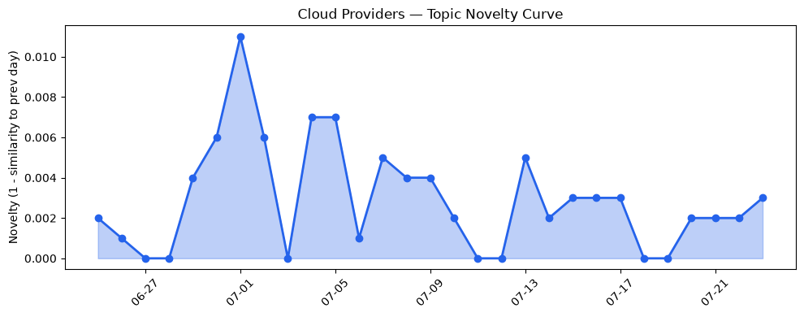
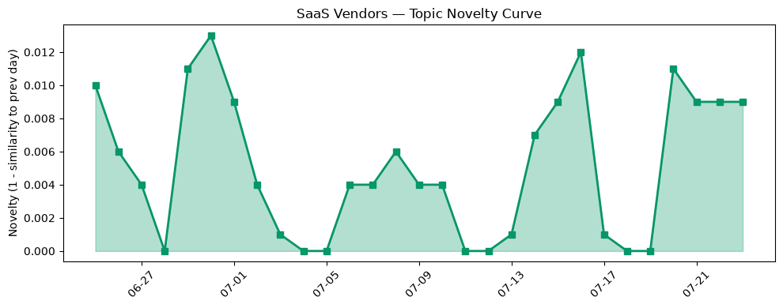

## 今日云计算结构性变化
> 云计算和SaaS行业在技术、基础设施、应用、资本和风险等多个维度上出现了重大进展和变化。
今天最值得注意的云计算/SaaS结构性变化是技术层面的重大突破，包括云原生技术、AI应用、基础设施安全更新等。同时，应用层也出现了新兴方向的早期信号，这可能是企业数字化转型需求推动的结果。
- 📈 **持续趋势**：技术层话题已连续30天增强
- 🆕 **新兴方向**：应用层出现全新话题（与历史最大相似度仅0.22）
- 🔺 **突然升温**：风险管理话题近3天突然集中出现
- 🔑 **新关键词**：风险管理
- 📉 **消退关键词**：容器化、数据中心、火山引擎

## 技术层信号
🔴 重大突破

云原生技术、AI应用、基础设施安全更新等技术层面的进展是当前云计算和SaaS行业的主要特征。例如，AWS的MicroVMs和Google Cloud的新功能都体现了云原生技术在安全领域的应用。同时，基础设施安全更新也在不断进行，包括量子密码学和全球共识服务等。这些进展表明，云计算和SaaS行业正在不断加强安全性和可靠性。

这些技术层面的进展对行业的影响是深远的。首先，它们可以帮助企业提高安全性和可靠性，减少数据泄露和系统故障的风险。其次，它们可以帮助企业提高运营效率和降低成本，通过自动化和智能化等方式实现更好的资源利用。最后，它们可以帮助企业实现更好的客户体验，通过提供更快、更稳定、更安全的服务。

## 产业资本信号
🟡 渐进改善

云计算和SaaS行业的资本信号是渐进改善的。多家初创公司获得大量融资，尤其是在AI和安全领域。公司估值和并购活动频繁，大厂之间的战略合作和投资不断增加。这些信号表明，云计算和SaaS行业正在不断吸引资本和人才，推动行业的发展和创新。

这些资本信号对行业的影响是显著的。首先，它们可以帮助企业获得更多的资源和支持，实现更好的发展和扩张。其次，它们可以帮助企业提高竞争力和创新能力，通过引入新技术和新人才。最后，它们可以帮助企业实现更好的风险管理和控制，通过多元化投资和合作等方式降低风险。

## 潜在拐点判断
今日结构分析和趋势对比报告表明，云计算和SaaS行业可能正在经历一个潜在的拐点。技术层面的重大突破和应用层面的新兴方向都可能是这个拐点的早期信号。同时，资本信号的渐进改善也可能是这个拐点的推动力。

这个潜在的拐点可能是云计算和SaaS行业发展的转折点。它可能标志着行业从单纯的技术创新转向更广泛的应用和商业化。它可能也标志着行业从单纯的增长转向更可持续和稳定的发展。

## 明日观察点
1. 云原生技术在安全领域的应用是否会继续推动行业的发展和创新。
2. 应用层面的新兴方向是否会继续吸引资本和人才，推动行业的发展和扩张。
3. 资本信号的渐进改善是否会继续推动行业的发展和创新，实现更好的风险管理和控制。

## 长期趋势坐标
今日结构分析和趋势对比报告表明，云计算和SaaS行业的长期趋势是技术层面的持续创新和应用层面的不断扩张。同时，资本信号的渐进改善也可能是这个趋势的推动力。

这个长期趋势可能是云计算和SaaS行业发展的主要方向。它可能标志着行业从单纯的技术创新转向更广泛的应用和商业化。它可能也标志着行业从单纯的增长转向更可持续和稳定的发展。

## 数据洞察
### 云厂商话题演化
云厂商话题演化的数据洞察报告表明，今日的云厂商话题主要集中在安全和基础设施更新等方面。同时，云原生技术和AI应用等话题也在不断增强。

### SaaS厂商话题演化
SaaS厂商话题演化的数据洞察报告表明，今日的SaaS厂商话题主要集中在应用层面的新兴方向和数字化转型等方面。同时，风险管理和安全等话题也在不断增强。

### 趋势图

## 参考来源
- [Run isolated sandboxes with full lifecycle control: AWS Lambda introduces MicroVMs](https://aws.amazon.com/blogs/aws/run-isolated-sandboxes-with-full-lifecycle-control-aws-lambda-introduces-microvms/)
- [Minimize idle accelerators: Native RL job interleaving with co-operative time-slicing in llm-d](https://cloud.google.com/blog/products/containers-kubernetes/introducing-co-operative-time-slicing-for-rl-in-llm-d/)
- [Why we cannot wait for better post-quantum signature algorithms](https://blog.cloudflare.com/ml-dsa-will-have-to-do/)
- [Amazon EC2 C9g and C9gd instances powered by AWS Graviton5 processors are now available](https://aws.amazon.com/blogs/aws/amazon-ec2-c9g-and-c9gd-instances-powered-by-aws-graviton5-processors-are-now-available/)
- [Accelerating the frontiers of scientific discovery: Google’s $40M commitment to the Genesis Mission](https://cloud.google.com/blog/topics/public-sector/accelerating-frontiers-of-scientific-discovery-40-million-dollar-commitment-genesis-mission/)
- [The Anatomy of an Agentic ITSM Workflow](https://www.salesforce.com/blog/agentic-itsm-workflow/)
- [Scrunch vs Ahrefs: AI visibility tracking comparison](https://blog.hubspot.com/marketing/scrunch-vs-ahrefs)
- [Insurance startup Corgi reportedly raised more money at $4B — its third round in 8 weeks](https://techcrunch.com/2026/07/23/insurance-startup-corgi-reportedly-raised-more-money-at-4b-its-third-round-in-eight-weeks/)
- [Amazon and Chobani adopt Strella's AI interviews for customer research as fast-growing startup raises $14M](https://venturebeat.com/technology/amazon-and-chobani-adopt-strellas-ai-interviews-for-customer-research-as)
- [US government says Iran-linked hackers are disrupting American water and energy providers](https://techcrunch.com/2026/07/23/us-government-says-iran-linked-hackers-are-disrupting-american-water-and-energy-providers/)
- [Tokenization takes the lead in the fight for data security](https://venturebeat.com/technology/tokenization-takes-the-lead-in-the-fight-for-data-security)