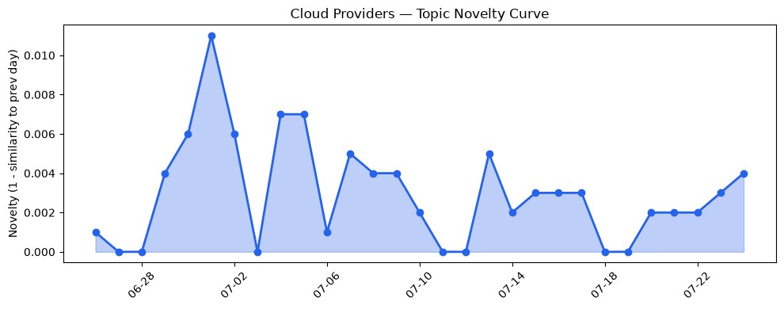
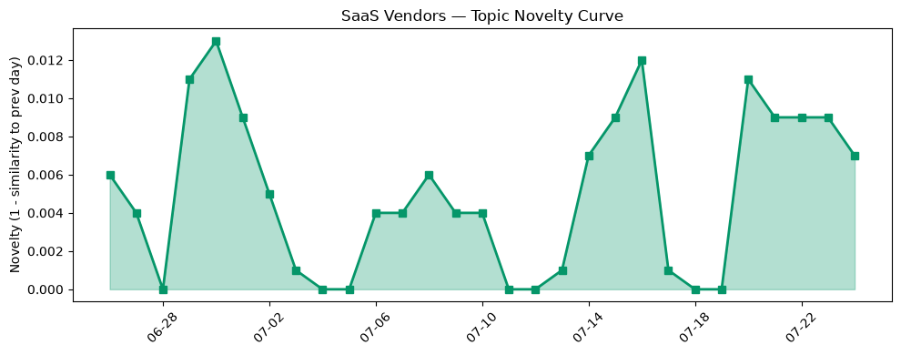

## 今日云计算结构性变化
> 云计算和SaaS领域出现多项技术和应用层面的进展，包括AWS、Google Cloud、Microsoft Azure和Salesforce在AI、数据分析和安全方面的更新，以及HubSpot在SEO和AEO工具方面的推进。
今日最值得注意的云计算/SaaS结构性变化是云原生技术的推进和应用层面的创新，包括AWS的MicroVMs、Google Cloud的Open Knowledge format v0.2和Azure的云原生技术，这些进展表明云计算领域正在朝着更高效、更安全和更智能的方向发展。
- 📈 **持续趋势**：技术层话题已连续8天增强
- 🆕 **新兴方向**：AEO和SEO话题为30天内首次出现
- 🔺 **突然升温**：风险信号话题近8天突然集中出现
- 🔑 **新关键词**：AEO、SEO、数据分析
- 📉 **消退关键词**：CRM、容器化、数据中心、数据安全、火山引擎

## 技术层信号
🔴 重大突破

云原生技术的进展是今日技术层信号的主要焦点，AWS推出MicroVMs，Google Cloud推出Open Knowledge format v0.2，Azure推出了多项云原生技术，这些进展表明云计算领域正在朝着更高效、更安全和更智能的方向发展。同时，基础设施服务也在不断更新，AWS更新了多个基础设施服务，包括Amazon EC2、Amazon SQS和AWS Certificate Manager，Microsoft Azure推出Managed Service for Apache Airflow。
根据趋势报告，技术层话题已连续8天增强，表明该方向正在持续升温。同时，AEO和SEO话题为30天内首次出现，表明云计算领域正在探索新的应用场景。

## 产业资本信号
🔴 强信号

今日产业资本信号主要体现在资本流向和估值上，Anduril正在谈判以1000亿美元估值融资，Strella获得1400万美元A轮融资，这些信号表明云计算和SaaS领域的投资热度正在升温。同时，Anthropic推出新的Opus 5模型，可能会改变AI市场，云计算和SaaS领域估值和并购活动增加。
根据趋势报告，风险信号话题近8天突然集中出现，表明云计算和SaaS领域的风险和挑战正在增加。

## 潜在拐点判断
根据今日信号和历史趋势，判断是否存在潜在拐点。今日的信号表明云计算和SaaS领域正在经历技术和应用层面的创新和投资热度的升温，这可能会带来新的发展机会和挑战。同时，风险信号话题的突然升温也表明云计算和SaaS领域的风险和挑战正在增加，需要关注和应对。

## 明日观察点
1. 关注AWS、Google Cloud和Azure的云原生技术进展和应用层面的创新。
2. 观察云计算和SaaS领域的投资热度和估值趋势。
3. 关注风险信号话题的发展和潜在影响。

## 长期趋势坐标
根据今日信号和历史趋势，云计算和SaaS领域的长期趋势坐标是技术和应用层面的创新和投资热度的升温。同时，风险信号话题的突然升温也表明云计算和SaaS领域的风险和挑战正在增加，需要关注和应对。

## 数据洞察
### 云厂商话题演化
云厂商话题演化的趋势是延续，novelty_score为0.016，mean_similarity为0.984，表明云厂商话题在过去30天内相对稳定。
### SaaS厂商话题演化
SaaS厂商话题演化的趋势也是延续，novelty_score为0.059，mean_similarity为0.941，表明SaaS厂商话题在过去30天内相对稳定。
### 趋势图

## 参考来源
- [AWS Weekly Roundup: One-click Lambda setup prompt, OpenAI GPT-5.6 models on Bedrock, and more](https://aws.amazon.com/blogs/aws/aws-weekly-roundup-one-click-lambda-setup-prompt-openai-gpt-5-6-models-on-bedrock-and-more-july-20-2026/)
- [Run isolated sandboxes with full lifecycle control: AWS Lambda introduces MicroVMs](https://aws.amazon.com/blogs/aws/run-isolated-sandboxes-with-full-lifecycle-control-aws-lambda-introduces-microvms/)
- [Open Knowledge format v0.2 tackles agentic trust](https://cloud.google.com/blog/products/data-analytics/okf-v0-2-adds-trust-signals/)
- [Built to bounce back: How Azure resiliency evolved](https://azure.microsoft.com/en-us/blog/built-to-bounce-back-how-azure-resiliency-evolved/)
- [From maintenance to innovation: Checkout's migration to Managed Service for Apache Airflow](https://cloud.google.com/blog/products/data-analytics/how-checkout-com-tallies-data-with-cloud-composer-3/)
- [Introducing Cache Response Rules](https://blog.cloudflare.com/introducing-cache-response-rules/)
- [Anduril reportedly in talks to raise funding at $100B valuation, more than 3x last year’s mark](https://techcrunch.com/2026/07/24/anduril-reportedly-in-talks-to-raise-funding-at-100b-valuation-more-than-3x-last-years-mark/)
- [Amazon and Chobani adopt Strella's AI interviews for customer research as fast-growing startup raises $14M](https://venturebeat.com/technology/amazon-and-chobani-adopt-strellas-ai-interviews-for-customer-research-as)