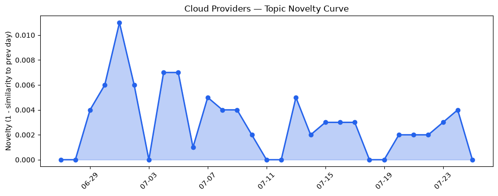
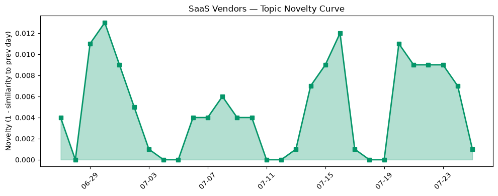

## 今日云计算结构性变化
> 今日云计算和 SaaS 行业的结构性变化主要体现在技术层、基础设施层、应用层和资本层的进展。
云计算和 SaaS 行业的领军企业如 AWS、Salesforce、Google Cloud 和 HubSpot 等在技术、基础设施、应用层面推动了行业的发展，展现出强劲的增长势头和创新能力。今日最值得注意的变化是 AWS 推出 MicroVMs，Google Cloud 的 Open Knowledge format v0.2 增加了对 agentic trust 的支持，Cloudflare 推出 Smart Tiered Cache 等。
- 📈 **持续趋势**：技术层、应用层和资本信号的话题向量在最近 8 天内呈现持续增强趋势。
- 🆕 **新兴方向**：Microsoft Copilot 等新关键词开始出现。
- 🔺 **突然升温**：无。
- 🔑 **新关键词**：Microsoft Copilot。
- 📉 **消退关键词**：CRM、容器化、数据安全、火山引擎。

## 技术层信号
🔴 重大突破

技术层信号显示，AWS、Google Cloud 和 Cloudflare 等企业在技术层面有所突破。AWS 推出 MicroVMs，Google Cloud 的 Open Knowledge format v0.2 增加了对 agentic trust 的支持，Cloudflare 推出 Smart Tiered Cache 等。这些进展表明，技术层的创新能力正在不断增强，云计算和 SaaS 行业的发展势头强劲。
根据趋势报告，技术层的话题向量在最近 8 天内呈现持续增强趋势，表明该方向正在持续升温。
相关证据包括：
- [AWS Weekly Roundup: One-click Lambda setup prompt, OpenAI GPT-5.6 models on Bedrock, and more](https://aws.amazon.com/blogs/aws/aws-weekly-roundup-one-click-lambda-setup-prompt-openai-gpt-5-6-models-on-bedrock-and-more-july-20-2026/)
- [Run isolated sandboxes with full lifecycle control: AWS Lambda introduces MicroVMs](https://aws.amazon.com/blogs/aws/run-isolated-sandboxes-with-full-lifecycle-control-aws-lambda-introduces-microvms/)
- [Open Knowledge format v0.2 tackles agentic trust](https://cloud.google.com/blog/products/data-analytics/okf-v0-2-adds-trust-signals/)
- [Supercharging pgvector: 4x faster HNSW vector search with AlloyDB](https://cloud.google.com/blog/products/databases/supercharge-pgvector-4x-faster-hnsw-with-alloydb/)
- [Improving Smart Tiered Cache for Public Cloud Regions](https://blog.cloudflare.com/smart-tiered-cache-for-public-clouds/)

## 产业资本信号
🔴 强信号

产业资本信号显示，Prentis AI 实验室正在谈判 1 亿美元融资，Strella 获得 1400 万美元的 Series A 融资，Elon Musk 的 The Boring Company 估值达到 200 亿美元。这些信号表明，资本正在向云计算和 SaaS 行业流动，行业的发展势头强劲。
相关证据包括：
- [Prentis, new AI lab co-founded by Reid Hoffman, Mark Pincus in talks to raise $100M](https://techcrunch.com/2026/07/24/prentis-new-ai-lab-co-founded-by-reid-hoffman-mark-pincus-in-talks-to-raise-100m/)
- [Amazon and Chobani adopt Strella's AI interviews for customer research as fast-growing startup raises $14M](https://venturebeat.com/technology/amazon-and-chobani-adopt-strellas-ai-interviews-for-customer-research-as)

## 潜在拐点判断
根据今日信号和历史趋势，判断是否存在潜在拐点。今日的信号表明，技术层、应用层和资本信号的话题向量在最近 8 天内呈现持续增强趋势，表明这些方向正在持续升温。因此，今日未观察到拐点信号。

## 明日观察点
1. 观察技术层信号是否继续升温。
2. 关注应用层信号是否会出现新的进展。
3. 注意资本信号是否会继续流向云计算和 SaaS 行业。

## 长期趋势坐标
今日信号放到月/季尺度，技术层、应用层和资本信号的话题向量在最近 8 天内呈现持续增强趋势，表明这些方向正在持续升温。根据 overall_novelty 和 keyword_trends，新关键词如 Microsoft Copilot 等开始出现，表明行业的发展势头强劲。

## 数据洞察
### 云厂商话题演化
云厂商话题向量的 novelty_score 为 0.015，mean_similarity 为 0.985，trend 为延续，history_days 为 30，article_count 为 46。
### SaaS 厂商话题演化
SaaS 厂商话题向量的 novelty_score 为 0.056，mean_similarity 为 0.944，trend 为延续，history_days 为 30，article_count 为 20。
### 趋势图

## 参考来源
- [AWS Weekly Roundup: One-click Lambda setup prompt, OpenAI GPT-5.6 models on Bedrock, and more](https://aws.amazon.com/blogs/aws/aws-weekly-roundup-one-click-lambda-setup-prompt-openai-gpt-5-6-models-on-bedrock-and-more-july-20-2026/) — AWS Blog
- [Run isolated sandboxes with full lifecycle control: AWS Lambda introduces MicroVMs](https://aws.amazon.com/blogs/aws/run-isolated-sandboxes-with-full-lifecycle-control-aws-lambda-introduces-microvms/) — AWS Blog
- [Open Knowledge format v0.2 tackles agentic trust](https://cloud.google.com/blog/products/data-analytics/okf-v0-2-adds-trust-signals/) — Google Cloud Blog
- [Supercharging pgvector: 4x faster HNSW vector search with AlloyDB](https://cloud.google.com/blog/products/databases/supercharge-pgvector-4x-faster-hnsw-with-alloydb/) — Google Cloud Blog
- [Improving Smart Tiered Cache for Public Cloud Regions](https://blog.cloudflare.com/smart-tiered-cache-for-public-clouds/) — Cloudflare Blog
- [Prentis, new AI lab co-founded by Reid Hoffman, Mark Pincus in talks to raise $100M](https://techcrunch.com/2026/07/24/prentis-new-ai-lab-co-founded-by-reid-hoffman-mark-pincus-in-talks-to-raise-100m/) — TechCrunch
- [Amazon and Chobani adopt Strella's AI interviews for customer research as fast-growing startup raises $14M](https://venturebeat.com/technology/amazon-and-chobani-adopt-strellas-ai-interviews-for-customer-research-as) — VentureBeat Enterprise