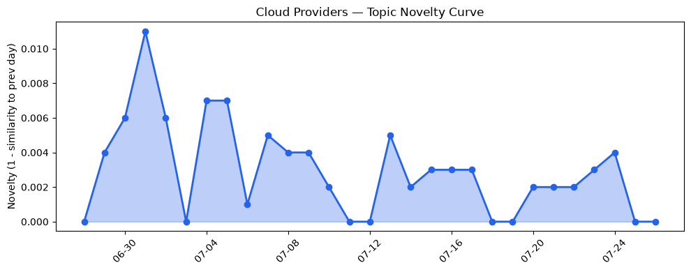
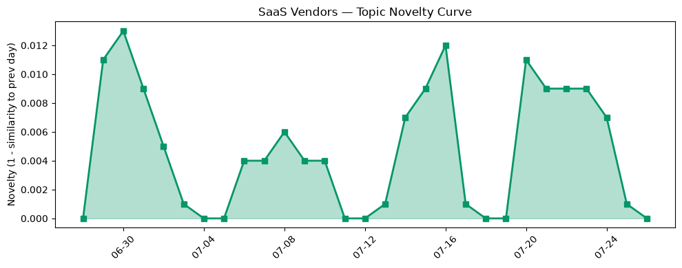

## 今日云计算结构性变化
> 今日云计算和 SaaS 领域的结构性变化主要体现在技术、基础设施、应用层和资本信号的快速发展，伴随着风险信号的变化。

今日最值得注意的云计算/SaaS 结构性变化是应用层面的重大突破，AWS、Salesforce、Google Cloud 和 HubSpot 等公司在技术和应用层面上持续推进云计算和 SaaS 的发展。同时，基础设施的渐进改善和资本信号的中等信号也值得关注。

- 📈 **持续趋势**：应用层的话题向量在最近8天内呈现持续增强趋势，表明该方向正在持续升温。
- 🆕 **新兴方向**：风险信号出现全新话题，这可能是一个新兴方向的早期信号。
- 🔺 **突然升温**：应用层近3天内容相似度显著高于更早期均值，表明该方向话题突然增强。
- 🔑 **新关键词**：AWS Lambda、Agentic Transformation、Amazon SQS、Meerkat、Smart Tiered Cache、应用层面、技术创新等。
- 📉 **消退关键词**：CRM、容器化、数据安全、火山引擎、监管等。

## 技术层信号
🔴 重大突破

云原生和容器化技术的发展，AWS 推出 MicroVMs，实现了更高级别的隔离和安全；Cloudflare 推出 Smart Tiered Cache，支持多云环境的缓存优化。同时，AI 和机器学习技术的应用也在不断推进，Salesforce 的 Agentic Transformation 和 AI 服务的应用；HubSpot 发布多篇关于 SEO 和 AI 应用的文章。

例如，AWS 的 MicroVMs 技术可以提供更高的安全性和隔离性，适用于需要高安全性的应用场景。Cloudflare 的 Smart Tiered Cache 技术可以优化多云环境的缓存，提高应用的性能和可用性。

## 产业资本信号
🟡 中等信号

资本信号的变化主要体现在投资方向的变化，Anthropic 推出 Opus 5，价格较 Fable 降低；Tech leaders 发表公开信，讨论 AI 价值。同时，估值和并购的动向也值得关注，AMD 和 Cloudflare 的战略动向等。

例如，Anthropic 的 Opus 5 产品可以提供更高的性价比，适用于需要高性能和低成本的应用场景。Tech leaders 的公开信可以推动 AI 技术的发展和应用。

## 潜在拐点判断
根据今日信号和历史趋势，判断是否存在潜在拐点。今日的信号表明，应用层面的重大突破和风险信号的变化可能是一个新兴方向的早期信号。

## 明日观察点
1. 观察应用层面的持续趋势和突然升温的情况。
2. 关注风险信号的变化和新兴方向的发展。
3. 注意资本信号的变化和投资方向的调整。

## 长期趋势坐标
今日的信号放到月/季尺度，可以看到应用层面的重大突破和风险信号的变化可能是一个长期趋势的开始。同时，资本信号的变化和投资方向的调整也值得长期关注。

## 数据洞察
### 云厂商话题演化
云厂商的话题向量在最近30天内呈现延续趋势，mean_similarity 为 0.986，novelty_score 为 0.014。

### SaaS 厂商话题演化
SaaS 厂商的话题向量在最近30天内呈现延续趋势，mean_similarity 为 0.945，novelty_score 为 0.055。

### 趋势图

## 参考来源
- [AWS Weekly Roundup: One-click Lambda setup prompt, OpenAI GPT-5.6 models on Bedrock, and more](https://aws.amazon.com/blogs/aws/aws-weekly-roundup-one-click-lambda-setup-prompt-openai-gpt-5-6-models-on-bedrock-and-more-july-20-2026/)
- [Run isolated sandboxes with full lifecycle control: AWS Lambda introduces MicroVMs](https://aws.amazon.com/blogs/aws/run-isolated-sandboxes-with-full-lifecycle-control-aws-lambda-introduces-microvms/)
- [Improving Smart Tiered Cache for Public Cloud Regions](https://blog.cloudflare.com/smart-tiered-cache-for-public-clouds/)
- [Introducing Meerkat: an experiment in global consensus](https://blog.cloudflare.com/meerkat-introduction/)
- [Elon Musk’s Boring Company reportedly raising funding at a $20 billion valuation](https://techcrunch.com/2026/07/25/elon-musks-boring-company-reportedly-raising-funding-at-a-20-billion-valuation/)
- [Anthropic debuts Opus 5 at half the price of its Fable sibling](https://www.theregister.com/ai-and-ml/2026/07/25/anthropic-debuts-opus-5-at-half-the-price-of-its-fable-sibling/)
- [Tech leaders issue letter to train Uncle Sam about value of open weight AI](https://www.theregister.com/ai-and-ml/2026/07/24/tech-leaders-issue-letter-to-train-uncle-sam-about-value-of-open-weight-ai/)
- [Hugging Face CEO calls for ‘radical transparency’ after ‘unprecedented’ OpenAI hack](https://techcrunch.com/2026/07/26/hugging-face-ceo-calls-for-radical-transparency-after-unprecedented-openai-hack/)
- [Pope's official prayer app commits cardinal sin, leaks 700K+ users' info](https://www.theregister.com/security/2026/07/24/popes-official-prayer-app-commits-cardinal-sin-leaks-700k-users-info/)
- [Europol flags 4,340 'horrific' URLs linked to The Com](https://www.theregister.com/cyber-crime/2026/07/24/europol-flags-4340-horrific-urls-linked-to-the-com/)
- [Agentic Transformation Pitfall: The Confident, Wrong Answers](https://www.salesforce.com/blog/ai-agent-answer-accuracy/)
- [The Anatomy of an Agentic ITSM Workflow](https://www.salesforce.com/blog/agentic-itsm-workflow/)
- [Which SEO tools are worth it for small businesses?](https://blog.hubspot.com/marketing/seo-tools-for-small-business)
- [AI SEO tools small businesses actually use](https://blog.hubspot.com/marketing/ai-seo-tools-for-small-business)