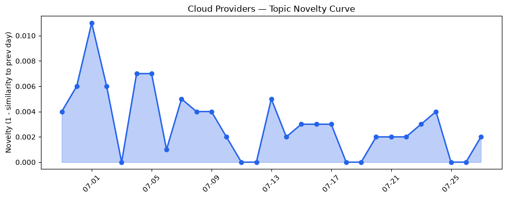
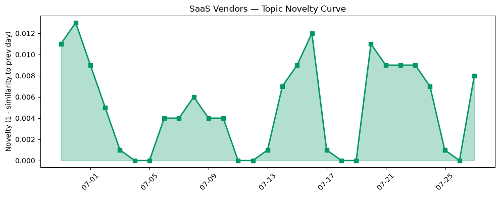

## 今日云计算结构性变化
> 今日云计算和SaaS领域出现多项技术进展和产品发布，但同时也面临安全和监管挑战，资本动向强劲。
云计算和SaaS领域的技术进展和产品发布，表明该领域的持续创新和发展。但同时，安全和监管挑战的出现，要求云计算和SaaS厂商加强安全措施和合规性。资本动向的强劲，意味着该领域的投资和融资活动将持续升温。
- 📈 **持续趋势**：技术层话题已连续8天增强
- 🆕 **新兴方向**：应用层和基础设施的话题向量在最近8天内呈现持续增强趋势
- 🔺 **突然升温**：风险信号的话题向量在最近8天内呈现持续增强趋势
- 🔑 **新关键词**：Strella
- 📉 **消退关键词**：CRM, 容器化, 数据安全

## 技术层信号
🔴 重大突破

云原生和容器化技术的进展，意味着云计算和SaaS领域的基础设施将变得更加强大和灵活。例如，Azure的Microsoft Foundry和GPT-5.6，Google Cloud的SAP Business Data Cloud Connect for BigQuery等，都是云原生和容器化技术的应用和发展。
同时，AI和机器学习的融合，也将推动云计算和SaaS领域的智能化和自动化。例如，AWS的Amazon EC2 C9g和C9gd实例，Azure的External key management for Azure Managed HSM等，都是AI和机器学习技术的应用和发展。
[AWS Weekly Roundup: Claude Sonnet 5 on AWS, Amazon WorkSpaces for AI agents, AWS service availability updates, and more](https://aws.amazon.com/blogs/aws/aws-weekly-roundup-claude-sonnet-5-on-aws-amazon-workspaces-for-ai-agents-aws-service-availability-updates-and-more-july-6-2026/)
[Announcing general availability of SAP Business Data Cloud Connect for BigQuery](https://cloud.google.com/blog/products/sap-google-cloud/sap-and-google-cloud-launch-bdc-connect-for-bigquery/)
[AT&T and Microsoft scale trillion-token workloads with Microsoft Foundry and AMD](https://azure.microsoft.com/en-us/blog/att-and-microsoft-scale-trillion-token-workloads-with-microsoft-foundry-and-amd/)

## 产业资本信号
🔴 强信号

云计算和SaaS领域的资本动向强劲，意味着该领域的投资和融资活动将持续升温。例如，Strella的1400万美元A轮融资，Tech sector pours $1T into AI等，都是云计算和SaaS领域的资本动向的体现。
同时，云计算和SaaS厂商的战略收购和合作，也将推动该领域的发展和整合。例如，Amazon和Chobani采用Strella的AI采访工具等，都是云计算和SaaS领域的战略合作的体现。
[Amazon and Chobani adopt Strella's AI interviews for customer research as fast-growing startup raises $14M](https://venturebeat.com/technology/amazon-and-chobani-adopt-strellas-ai-interviews-for-customer-research-as)
[Tech sector pours $1T into AI and sends customers the bill](https://www.theregister.com/ai-and-ml/2026/07/27/tech-sector-pours-1t-into-ai-and-sends-customers-the-bill/)

## 潜在拐点判断
云计算和SaaS领域的技术进展和产品发布，表明该领域的持续创新和发展。但同时，安全和监管挑战的出现，要求云计算和SaaS厂商加强安全措施和合规性。资本动向的强劲，意味着该领域的投资和融资活动将持续升温。
因此，云计算和SaaS领域可能面临的一个潜在拐点是，如何在技术进展和安全挑战之间找到平衡，如何在资本动向的驱动下，实现可持续的发展和创新。

## 明日观察点
1. 云计算和SaaS领域的技术进展和产品发布，将如何推动该领域的发展和创新？
2. 安全和监管挑战，将如何影响云计算和SaaS厂商的发展和运营？
3. 资本动向的强劲，将如何推动云计算和SaaS领域的投资和融资活动？

## 长期趋势坐标
云计算和SaaS领域的长期趋势，将由技术进展、安全挑战和资本动向共同驱动。因此，需要持续关注这些因素的发展和变化，才能准确判断云计算和SaaS领域的长期趋势。

## 数据洞察
### 云厂商话题演化
云厂商的话题向量在最近30天内呈现延续趋势，表明云厂商的技术进展和产品发布将持续推动该领域的发展和创新。
### SaaS 厂商话题演化
SaaS厂商的话题向量在最近30天内呈现延续趋势，表明SaaS厂商的技术进展和产品发布将持续推动该领域的发展和创新。
### 趋势图

## 参考来源
- [AWS Weekly Roundup: Claude Sonnet 5 on AWS, Amazon WorkSpaces for AI agents, AWS service availability updates, and more](https://aws.amazon.com/blogs/aws/aws-weekly-roundup-claude-sonnet-5-on-aws-amazon-workspaces-for-ai-agents-aws-service-availability-updates-and-more-july-6-2026/) — AWS Blog
- [Announcing general availability of SAP Business Data Cloud Connect for BigQuery](https://cloud.google.com/blog/products/sap-google-cloud/sap-and-google-cloud-launch-bdc-connect-for-bigquery/) — Google Cloud Blog
- [AT&T and Microsoft scale trillion-token workloads with Microsoft Foundry and AMD](https://azure.microsoft.com/en-us/blog/att-and-microsoft-scale-trillion-token-workloads-with-microsoft-foundry-and-amd/) — Microsoft Azure Blog
- [Amazon and Chobani adopt Strella's AI interviews for customer research as fast-growing startup raises $14M](https://venturebeat.com/technology/amazon-and-chobani-adopt-strellas-ai-interviews-for-customer-research-as) — VentureBeat Enterprise
- [Tech sector pours $1T into AI and sends customers the bill](https://www.theregister.com/ai-and-ml/2026/07/27/tech-sector-pours-1t-into-ai-and-sends-customers-the-bill/) — The Register