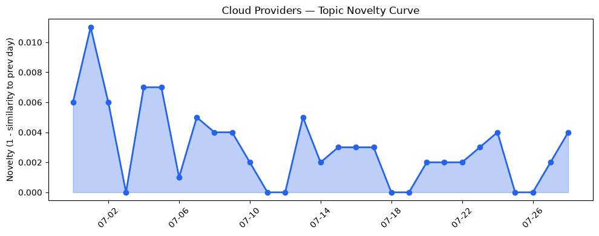
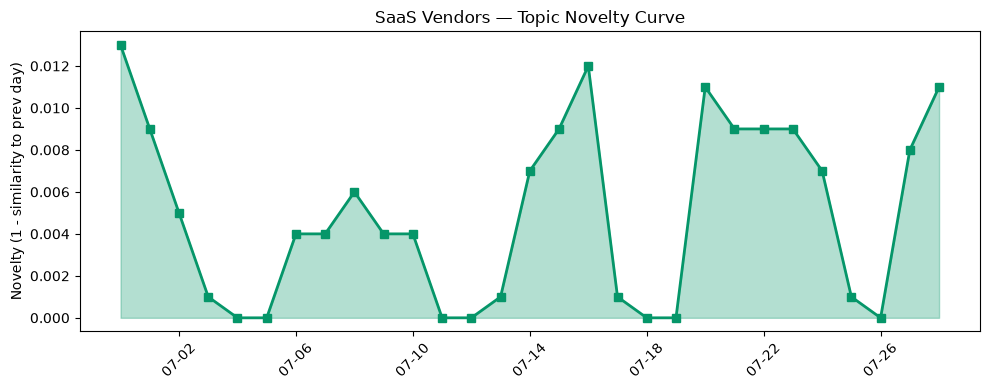

## 今日云计算结构性变化
> 云计算领域技术、基础设施、应用和资本层面有所进展，尤其是AWS、Google Cloud、Microsoft Azure、Cloudflare和Salesforce的产品更新与技术发展。
今日最值得注意的云计算/SaaS结构性变化是AWS、Google Cloud、Microsoft Azure、Cloudflare和Salesforce等云计算和SaaS厂商的产品更新和技术发展，这些变化表明云计算领域的竞争和创新仍在持续。同时，趋势报告显示资本信号的话题向量在最近8天内呈现持续增强趋势，表明资本层面对云计算和SaaS领域的关注度在增加。
- 📈 **持续趋势**：资本信号的话题向量在最近8天内呈现持续增强趋势。
- 🟡 **渐进改善**：基础设施和应用层面有所改善，云计算和SaaS厂商继续推出新功能和服务。
- 🔴 **重大突破**：技术层面有重大突破，AWS、Google Cloud和Cloudflare推出新功能和服务。

## 技术层信号
🔴 重大突破

云原生、容器、K8s、Serverless、数据库、存储、网络和AI等技术层面有重大突破，AWS、Google Cloud和Cloudflare推出新功能和服务，如Claude Opus 5、Conversational Analytics和Precursor行为验证引擎。这些发展表明云计算领域的技术竞争和创新仍在持续。例如，[AWS Weekly Roundup: Local Zone in Athens, Claude Opus 5 on AWS, Lambda durable execution for .NET, and more](https://aws.amazon.com/blogs/aws/aws-weekly-roundup-july-27-2026/)介绍了AWS的最新更新，包括Claude Opus 5和Lambda durable execution for .NET。同时，[Bringing Conversational Analytics to your entire data ecosystem](https://cloud.google.com/blog/products/data-analytics/conversational-analytics-in-google-data-cloud-in-q326/)介绍了Google Cloud的Conversational Analytics功能。

## 产业资本信号
🟡 中等信号

产业资本信号显示投资者继续关注云计算和SaaS领域，多家公司获得融资，行业估值继续上涨。例如，[Bot-detection startup Spur nabs $200M from Insight](https://techcrunch.com/2026/07/28/bot-detection-startup-spur-nabs-200m-from-insight/)介绍了Bot-detection startup Spur获得200M美元融资。同时，[Waymo, robotaxi operators face fresh scrutiny over emergency response failures](https://techcrunch.com/2026/07/28/waymo-robotaxi-operators-face-fresh-scrutiny-over-emergency-response-failures/)介绍了Waymo和robotaxi operators面临的监管挑战。

## 潜在拐点判断
根据今日信号和历史趋势，判断是否存在潜在拐点。今日的信号表明云计算领域的技术竞争和创新仍在持续，资本层面对云计算和SaaS领域的关注度在增加。这些发展可能表明云计算领域正在经历一个潜在的拐点，云计算和SaaS厂商需要继续创新和投资以保持竞争优势。

## 明日观察点
1. 观察AWS、Google Cloud和Microsoft Azure的产品更新和技术发展。
2. 关注资本信号和行业估值的变化。
3. 分析云计算和SaaS厂商的竞争和创新。

## 长期趋势坐标
今日信号放到月/季尺度，云计算领域的技术竞争和创新仍在持续，资本层面对云计算和SaaS领域的关注度在增加。这些发展可能表明云计算领域正在经历一个长期的增长趋势，云计算和SaaS厂商需要继续创新和投资以保持竞争优势。

## 数据洞察
### 云厂商话题演化
云厂商话题演化显示云计算领域的技术竞争和创新仍在持续，AWS、Google Cloud和Microsoft Azure等云计算厂商继续推出新功能和服务。例如，[AWS Weekly Roundup: Local Zone in Athens, Claude Opus 5 on AWS, Lambda durable execution for .NET, and more](https://aws.amazon.com/blogs/aws/aws-weekly-roundup-july-27-2026/)介绍了AWS的最新更新。

### SaaS 厂商话题演化
SaaS厂商话题演化显示SaaS领域的竞争和创新仍在持续，Salesforce和HubSpot等SaaS厂商继续推出新功能和服务。例如，[3 Ways to Connect Agentforce Agents and Slackbot to External MCP Servers](https://www.salesforce.com/blog/connect-agentforce-external-mcp-servers/)介绍了Salesforce的最新更新。

### 趋势图

## 参考来源
- [AWS Weekly Roundup: Local Zone in Athens, Claude Opus 5 on AWS, Lambda durable execution for .NET, and more](https://aws.amazon.com/blogs/aws/aws-weekly-roundup-july-27-2026/) — AWS Blog
- [Bringing Conversational Analytics to your entire data ecosystem](https://cloud.google.com/blog/products/data-analytics/conversational-analytics-in-google-data-cloud-in-q326/) — Google Cloud Blog
- [Introducing Precursor: detecting agentic behavior with continuous client-side signals](https://blog.cloudflare.com/introducing-precursor/) — Cloudflare Blog
- [Future-proofing data integrity: Quantum-safe digital signatures in Cloud KMS](https://cloud.google.com/blog/products/identity-security/future-proofing-data-integrity-quantum-safe-digital-signatures-in-cloud-kms/) — Google Cloud Blog
- [AT&T and Microsoft scale trillion-token workloads with Microsoft Foundry and AMD](https://azure.microsoft.com/en-us/blog/att-and-microsoft-scale-trillion-token-workloads-with-microsoft-foundry-and-amd/) — Microsoft Azure Blog
- [火山引擎正式推出四款数据产品 将持续完善敏捷数智引擎矩阵](https://www.cnblogs.com/volcengine/p/15640481.html) — 火山引擎博客
- [Improving Smart Tiered Cache for Public Cloud Regions](https://blog.cloudflare.com/smart-tiered-cache-for-public-clouds/) — Cloudflare Blog
- [Amazon EC2 C9g and C9gd instances powered by AWS Graviton5 processors are now available](https://aws.amazon.com/blogs/aws/amazon-ec2-c9g-and-c9gd-instances-powered-by-aws-graviton5-processors-are-now-available/) — AWS Blog
- [布局云计算，火山引擎的技术发展之路](https://www.cnblogs.com/volcengine/p/15632953.html) — 火山引擎博客
- [Azure Databricks delivers proven business value](https://azure.microsoft.com/en-us/blog/azure-databricks-delivers-proven-business-value/) — Microsoft Azure Blog
- [Bot-detection startup Spur nabs $200M from Insight](https://techcrunch.com/2026/07/28/bot-detection-startup-spur-nabs-200m-from-insight/) — TechCrunch
- [Waymo, robotaxi operators face fresh scrutiny over emergency response failures](https://techcrunch.com/2026/07/28/waymo-robotaxi-operators-face-fresh-scrutiny-over-emergency-response-failures/) — TechCrunch
- [Tokenization takes the lead in the fight for data security](https://venturebeat.com/technology/tokenization-takes-the-lead-in-the-fight-for-data-security) — VentureBeat Enterprise
- [War machines can run amok with AI in control](https://www.theregister.com/ai-and-ml/2026/07/28/war-machines-can-run-amok-with-ai-in-control/5279937) — The Register
- [AI-found bugs aren't proving any easier to exploit despite the hype](https://www.theregister.com/security/2026/07/28/ai-found-bugs-arent-proving-any-easier-to-exploit-despite-the-hype/5279637) — The Register
- [Hugging Face rebuilt a third of its infrastructure after OpenAI agents ran amok](https://www.theregister.com/ai-and-ml/2026/07/28/openais-agent-siege-forced-significant-rebuild-at-hugging-face/5279577) — The Register
- [3 Ways to Connect Agentforce Agents and Slackbot to External MCP Servers](https://www.salesforce.com/blog/connect-agentforce-external-mcp-servers/) — Salesforce Blog
- [HubSpot AEO vs. Rank Prompt: Which AI visibility tool should you choose?](https://blog.hubspot.com/marketing/hubspot-vs-rank-prompt) — HubSpot Blog
- [Best Buy scales AI workloads and secures access with Workforce Identity Federation](https://cloud.google.com/blog/topics/retail/best-buy-scales-secure-ai-access-with-workforce-identity-federation/) — Google Cloud Blog