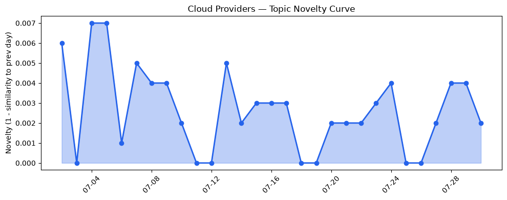
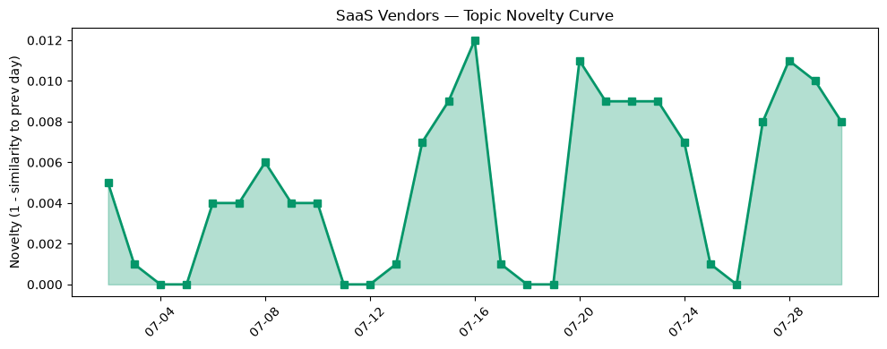

## 今日云计算结构性变化
> 今日核心判断：AWS、Google Cloud 和 Salesforce 等领军企业在技术层面、基础设施扩张以及应用层面持续推进，尤其是 AI 和安全领域的创新和投资，同时监管环境和供应链风险继续演变。
今日最值得注意的云计算/SaaS 结构性变化是技术进步、安全和资本动向的持续推进。这种变化之所以重要，是因为它反映了云计算和 SaaS 行业的持续创新和扩张，尤其是在 AI 和安全领域。同时，监管环境和供应链风险的变化也对行业产生了重要影响。
- 📈 **持续趋势**：技术层、基础设施和应用层话题已连续8天增强
- 🆕 **新兴方向**：资本信号和风险信号出现全新话题
- 🔺 **突然升温**：AI 和安全领域的创新和投资突然集中出现
- 🔑 **新关键词**：Gemini Enterprise、数据保护、量子安全
- 📉 **消退关键词**：CRM、云原生、容器化、数字化转型、数据安全

## 技术层信号
🔴 重大突破

云原生、容器和 Serverless 技术的进步是技术层信号的重要组成部分。AWS、Google Cloud 和 Azure 的云原生能力增强，包括 GKE、AlloyDB 和 Gemini Enterprise，这些技术的进步使得企业能够更好地利用云计算资源。同时，基础设施服务的更新，包括 Amazon EC2 C9g 和 C9gd 实例的发布，也为企业提供了更强大的计算能力。[AWS Weekly Roundup: Local Zone in Athens, Claude Opus 5 on AWS, Lambda durable execution for .NET, and more](https://aws.amazon.com/blogs/aws/aws-weekly-roundup-july-27-2026/)、[Do more with less: How GKE can reduce your cost per agent by 75%](https://cloud.google.com/blog/products/containers-kubernetes/reduce-your-agents-costs-with-gke-agent-sandbox/) 和 [What customers value most in Microsoft Databases—from reliability to AI readiness](https://azure.microsoft.com/en-us/blog/what-customers-value-most-in-microsoft-databases-from-reliability-to-ai-readiness/) 等文章为我们提供了这些技术进步的详细信息。

## 产业资本信号
🔴 强信号

产业资本信号的变化主要体现在资本流向和企业战略上。Simile 获得 2 亿美元投资，估值达到 20 亿美元，这表明资本市场对云计算和 SaaS 领域的投资热情。Okta 收购 AI 安全初创公司 Permiso，金额约为 2 亿美元，这也反映了企业对安全领域的重视。[Synthetic-user startup Simile raises $200M at $2B valuation 5 months after $100M Series A](https://techcrunch.com/2026/07/30/synthetic-user-startup-simile-raises-200m-at-2b-valuation-5-months-after-100m-series-a/) 和 [Okta buys AI security startup Permiso — source says for about $200M](https://techcrunch.com/2026/07/30/okta-buys-ai-security-startup-permiso-source-says-for-about-200m/) 等文章为我们提供了这些资本信号的详细信息。

## 潜在拐点判断
基于今日信号 + 历史趋势，判断是否存在潜在拐点。今日的信号表明，技术进步、安全和资本动向的持续推进可能会成为云计算和 SaaS 行业的拐点。这种拐点可能会带来新的发展机会和挑战，企业需要关注这些变化，并做出相应的战略调整。

## 明日观察点
1. 关注 AI 和安全领域的创新和投资是否会继续推进。
2. 观察资本信号和风险信号的变化是否会对行业产生重要影响。
3. 关注监管环境和供应链风险的变化是否会影响企业的战略决策。

## 长期趋势坐标
今日信号放到月/季尺度，反映了云计算和 SaaS 行业的长期趋势。技术进步、安全和资本动向的持续推进可能会成为行业的长期趋势，企业需要关注这些变化，并做出相应的战略调整。

## 数据洞察
### 云厂商话题演化
云厂商话题演化的 novelty_score 为 0.016，mean_similarity 为 0.984，表明云厂商话题在最近 30 天内呈现延续趋势。
### SaaS 厂商话题演化
SaaS 厂商话题演化的 novelty_score 为 0.06，mean_similarity 为 0.94，表明 SaaS 厂商话题在最近 30 天内呈现延续趋势。
### 趋势图

## 参考来源
- [AWS Weekly Roundup: Local Zone in Athens, Claude Opus 5 on AWS, Lambda durable execution for .NET, and more](https://aws.amazon.com/blogs/aws/aws-weekly-roundup-july-27-2026/) — AWS Blog
- [Do more with less: How GKE can reduce your cost per agent by 75%](https://cloud.google.com/blog/products/containers-kubernetes/reduce-your-agents-costs-with-gke-agent-sandbox/) — Google Cloud Blog
- [What customers value most in Microsoft Databases—from reliability to AI readiness](https://azure.microsoft.com/en-us/blog/what-customers-value-most-in-microsoft-databases-from-reliability-to-ai-readiness/) — Microsoft Azure Blog
- [Synthetic-user startup Simile raises $200M at $2B valuation 5 months after $100M Series A](https://techcrunch.com/2026/07/30/synthetic-user-startup-simile-raises-200m-at-2b-valuation-5-months-after-100m-series-a/) — TechCrunch
- [Okta buys AI security startup Permiso — source says for about $200M](https://techcrunch.com/2026/07/30/okta-buys-ai-security-startup-permiso-source-says-for-about-200m/) — TechCrunch