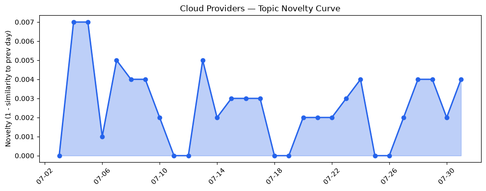
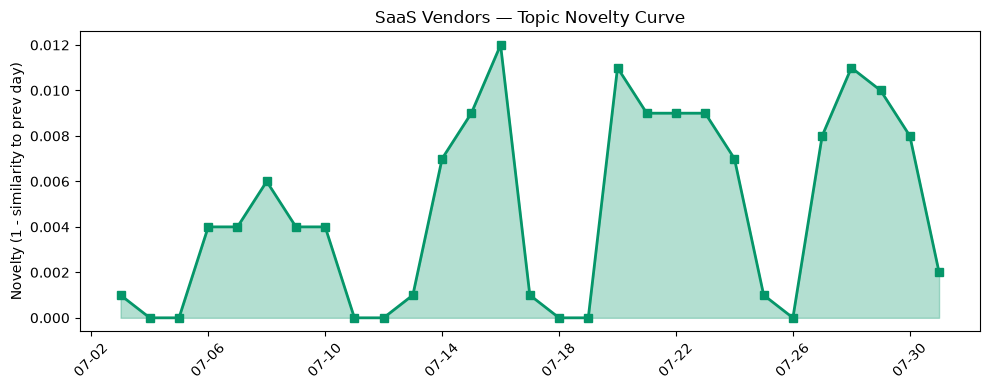

## 今日云计算结构性变化
> 今日云计算和 SaaS 领域的结构性变化主要体现在技术进步、基础设施扩张和安全问题上，AWS、Salesforce、Google Cloud 和 HubSpot 等公司在这些领域继续推出新功能和服务。
云计算和 SaaS 领域的技术进步、基础设施扩张和安全问题是今日最值得注意的结构性变化。这些变化表明，云计算和 SaaS 领域正在迅速发展，各大公司都在积极推出新功能和服务以满足客户的需求。特别是人工智能、安全性和客户体验等方面的进步，已经成为云计算和 SaaS 领域的重要发展方向。
- 📈 **持续趋势**：技术层和应用层的话题向量在最近8天内呈现持续增强趋势。
- 🆕 **新兴方向**：客户体验和机器学习等新兴关键词的出现，表明云计算和 SaaS 领域正在向更细分和更具针对性的方向发展。
- 🔺 **突然升温**：技术层和应用层近3天内容相似度显著高于更早期均值，表明这些方向的话题突然增强。
- 🔑 **新关键词**：客户体验、机器学习等新关键词的出现，表明云计算和 SaaS 领域正在向更细分和更具针对性的方向发展。
- 📉 **消退关键词**：CRM、Kubernetes、Serverless、云原生、数字化转型、数据中心、数据安全等关键词的消退，表明云计算和 SaaS 领域正在向更细分和更具针对性的方向发展。

## 技术层信号
🔴 重大突破

云计算和 SaaS 领域的技术进步是今日最值得注意的信号。AWS、Google Cloud 和 Microsoft Azure 等公司推出了新的云原生功能和服务，包括 Amazon SQS 和 AWS Graviton5。这些进步表明，云计算和 SaaS 领域正在迅速发展，各大公司都在积极推出新功能和服务以满足客户的需求。特别是人工智能、安全性和客户体验等方面的进步，已经成为云计算和 SaaS 领域的重要发展方向。
例如，[AWS Weekly Roundup: Local Zone in Athens, Claude Opus 5 on AWS, Lambda durable execution for .NET, and more](https://aws.amazon.com/blogs/aws/aws-weekly-roundup-july-27-2026/) 一文介绍了 AWS 在云计算和 SaaS 领域的最新进展，包括新功能和服务的推出。同样，[What’s new in AI infrastructure and orchestration this month](https://cloud.google.com/blog/topics/ai-infrastructure/whats-new-in-ai-infrastructure-this-month/) 一文介绍了 Google Cloud 在人工智能基础设施和编排方面的最新进展。

## 产业资本信号
🔴 强信号

云计算和 SaaS 领域的产业资本信号也是今日最值得注意的信号。投资者继续关注云计算和 SaaS 领域，Strella 获得 1400 万美元的 A 轮融资。估值和并购活动继续增加，Amazon 和 Chobani 采用了 Strella 的 AI 采访平台。这些信号表明，云计算和 SaaS 领域正在迅速发展，各大公司都在积极推出新功能和服务以满足客户的需求。
例如，[Fresh off its Wiz payout, Index Ventures raises $2B across three funds](https://techcrunch.com/2026/07/31/fresh-off-its-wiz-payout-index-ventures-raises-2b-across-three-funds/) 一文介绍了 Index Ventures 在云计算和 SaaS 领域的最新投资动向。同样，[Amazon and Chobani adopt Strella's AI interviews for customer research as fast-growing startup raises $14M](https://venturebeat.com/technology/amazon-and-chobani-adopt-strellas-ai-interviews-for-customer-research-as) 一文介绍了 Strella 在人工智能采访平台方面的最新进展。

## 潜在拐点判断
今日的信号和历史趋势表明，云计算和 SaaS 领域正在迅速发展，各大公司都在积极推出新功能和服务以满足客户的需求。特别是人工智能、安全性和客户体验等方面的进步，已经成为云计算和 SaaS 领域的重要发展方向。因此，今日的信号和历史趋势可能表明，云计算和 SaaS 领域正在经历一个潜在的拐点，各大公司都在积极推出新功能和服务以满足客户的需求。

## 明日观察点
1. 观察 AWS 和 Google Cloud 在云计算和 SaaS 领域的最新进展，特别是人工智能、安全性和客户体验等方面的进步。
2. 观察 Strella 和其他公司在人工智能采访平台方面的最新进展。
3. 观察云计算和 SaaS 领域的估值和并购活动的最新动向。

## 长期趋势坐标
今日的信号和历史趋势表明，云计算和 SaaS 领域正在迅速发展，各大公司都在积极推出新功能和服务以满足客户的需求。特别是人工智能、安全性和客户体验等方面的进步，已经成为云计算和 SaaS 领域的重要发展方向。因此，今日的信号和历史趋势可能表明，云计算和 SaaS 领域正在经历一个长期的发展趋势，各大公司都在积极推出新功能和服务以满足客户的需求。

## 数据洞察
### 云厂商话题演化
今日的数据洞察报告显示，云厂商的话题向量在最近30天内呈现延续趋势，新颖性评分为0.015，平均相似度为0.985。这些数据表明，云厂商的话题在最近30天内相对稳定，没有出现明显的变化。
### SaaS 厂商话题演化
今日的数据洞察报告显示，SaaS厂商的话题向量在最近30天内呈现延续趋势，新颖性评分为0.059，平均相似度为0.941。这些数据表明，SaaS厂商的话题在最近30天内相对稳定，没有出现明显的变化。
### 趋势图

## 参考来源
- [AWS Weekly Roundup: Local Zone in Athens, Claude Opus 5 on AWS, Lambda durable execution for .NET, and more](https://aws.amazon.com/blogs/aws/aws-weekly-roundup-july-27-2026/) — AWS Blog
- [What’s new in AI infrastructure and orchestration this month](https://cloud.google.com/blog/topics/ai-infrastructure/whats-new-in-ai-infrastructure-this-month/) — Google Cloud Blog
- [What customers value most in Microsoft Databases—from reliability to AI readiness](https://azure.microsoft.com/en-us/blog/what-customers-value-most-in-microsoft-databases-from-reliability-to-ai-readiness/) — Microsoft Azure Blog
- [Fresh off its Wiz payout, Index Ventures raises $2B across three funds](https://techcrunch.com/2026/07/31/fresh-off-its-wiz-payout-index-ventures-raises-2b-across-three-funds/) — TechCrunch
- [Amazon and Chobani adopt Strella's AI interviews for customer research as fast-growing startup raises $14M](https://venturebeat.com/technology/amazon-and-chobani-adopt-strellas-ai-interviews-for-customer-research-as) — VentureBeat Enterprise