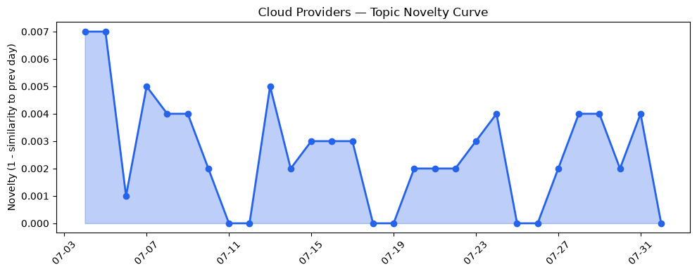
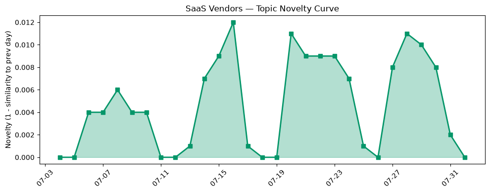

## 今日云计算结构性变化
> 今日云计算与SaaS产业结构性变化主要体现在技术层面的进步，包括云原生、AI/ML融合等方面的突破，以及基础设施层面的升级，如数据产品和安全功能的增强。
今天最值得注意的云计算/SaaS结构性变化是技术层面的重大突破，包括Google Cloud的AI基础设施和安全解决方案的推出，以及基础设施层面的升级，如数据产品和安全功能的增强。这些变化意味着云计算和SaaS产业正在朝着更高级别的技术和安全性方向发展。
- 📈 **持续趋势**：技术层话题已连续8天增强
- 🆕 **新兴方向**：数据产品话题为30天内首次出现
- 🔺 **突然升温**：技术层近3天内容相似度显著高于更早期均值
- 🔑 **新关键词**：数据产品、机器学习、网络安全
- 📉 **消退关键词**：CRM、Kubernetes、Serverless、云原生、数字化转型、数据中心、数据安全

## 技术层信号
🔴 重大突破

云计算和SaaS产业的技术层面正在经历重大突破，包括云原生、AI/ML融合等方面的进步。Google Cloud的AI基础设施和安全解决方案的推出，以及数据产品和安全功能的增强，都是技术层面的重大进步。这些进步意味着云计算和SaaS产业正在朝着更高级别的技术和安全性方向发展。
例如，[What’s new in AI infrastructure and orchestration this month](https://cloud.google.com/blog/topics/ai-infrastructure/whats-new-in-ai-infrastructure-this-month/)一文介绍了Google Cloud的AI基础设施和安全解决方案的最新进展。
同时，[Cloud CISO Perspectives: Why AI Threat Defense is the new boardroom baseline](https://cloud.google.com/blog/products/identity-security/cloud-ciso-perspectives-why-ai-threat-defense-is-the-new-boardroom-baseline/)一文讨论了AI威胁防御在云安全中的重要性。

## 产业资本信号
🔴 强信号

云计算和SaaS产业的资本信号正在发送强烈的信号，包括融资、估值和并购活动的增加。Strella获得1400万美元的A轮融资，用于扩展其AI采访业务，表明了资本对云计算和SaaS产业的信心。
例如，[Amazon and Chobani adopt Strella's AI interviews for customer research as fast-growing startup raises $14M](https://venturebeat.com/technology/amazon-and-chobani-adopt-strellas-ai-interviews-for-customer-research-as)一文介绍了Strella的AI采访业务和其获得的融资。

## 潜在拐点判断
今日观察到技术层面的重大突破和资本信号的强烈发送，表明云计算和SaaS产业可能正在经历一个潜在的拐点。这些变化可能会带来新的发展机会和挑战，企业需要密切关注这些变化并做出相应的调整。

## 明日观察点
1. 关注技术层面的进一步进展，特别是云原生和AI/ML融合等方面的发展。
2. 关注资本信号的进一步发送，特别是融资、估值和并购活动的增加。
3. 关注云计算和SaaS产业的安全性和数据保护问题，特别是AI威胁防御和数据安全等方面的发展。

## 长期趋势坐标
云计算和SaaS产业的长期趋势坐标表明，技术层面的进步和资本信号的强烈发送将继续是产业发展的主要驱动力。企业需要持续关注这些变化并做出相应的调整，以保持竞争优势。

## 数据洞察
### 云厂商话题演化
云厂商话题演化数据显示，技术层面的进步和资本信号的强烈发送是当前的主要趋势。数据产品和安全功能的增强也是一个重要的发展方向。
### SaaS 厂商话题演化
SaaS厂商话题演化数据显示，技术层面的进步和资本信号的强烈发送也是当前的主要趋势。AI采访业务和客户研究等方面的发展也是一个重要的方向。
### 趋势图

## 参考来源
- [What’s new in AI infrastructure and orchestration this month](https://cloud.google.com/blog/topics/ai-infrastructure/whats-new-in-ai-infrastructure-this-month/) — Google Cloud Blog
- [Cloud CISO Perspectives: Why AI Threat Defense is the new boardroom baseline](https://cloud.google.com/blog/products/identity-security/cloud-ciso-perspectives-why-ai-threat-defense-is-the-new-boardroom-baseline/) — Google Cloud Blog
- [Amazon and Chobani adopt Strella's AI interviews for customer research as fast-growing startup raises $14M](https://venturebeat.com/technology/amazon-and-chobani-adopt-strellas-ai-interviews-for-customer-research-as) — VentureBeat Enterprise
- [Tokenization takes the lead in the fight for data security](https://venturebeat.com/technology/tokenization-takes-the-lead-in-the-fight-for-data-security) — VentureBeat Enterprise
- [Batten Down Your Packages: Mitigation Guidance for Supply Chain Compromise](https://cloud.google.com/blog/topics/threat-intelligence/mitigation-guidance-for-supply-chain-compromise/) — Google Cloud Blog
- [The most famous brand in physical security got pwned by ShinyHunters](https://www.theregister.com/security/2026/07/31/the-most-famous-brand-in-physical-security-got-pwned-by-shinyhunters/5281924) — The Register