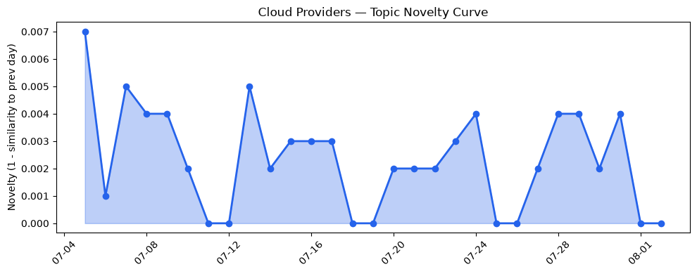
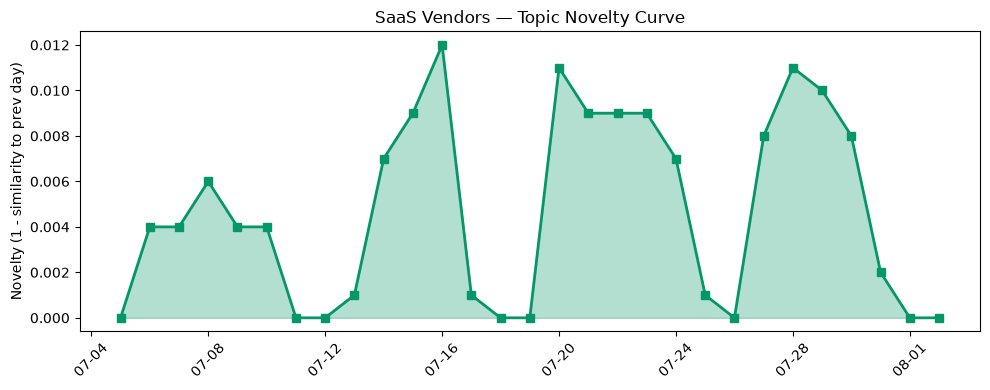

## 今日云计算结构性变化
> 今日云计算和SaaS领域持续推动技术创新，基础设施升级和应用层扩展，同时资本信号和风险信号也在不断变化。
云计算和SaaS领域的结构性变化主要体现在技术层、基础设施、应用层和资本信号等方面。其中，技术层的突破包括Google Cloud和Microsoft Azure的新一代云原生服务和AI基础设施的推出，基础设施的升级包括Google Cloud和Microsoft Azure的区域扩张和算力供应的增加，应用层的扩展包括HubSpot的新一代客户关系管理工具和AI驱动的营销解决方案的推出。
- 📈 **持续趋势**：技术层话题已连续8天增强
- 🆕 **新兴方向**：数据分析和网络安全话题为30天内首次出现
- 🔺 **突然升温**：风险信号近3天突然集中出现
- 🔑 **新关键词**：数据分析、网络安全
- 📉 **消退关键词**：CRM、Kubernetes、Serverless、云原生、数字化转型、数据中心、数据安全

## 技术层信号
🔴 重大突破

云原生和AI技术的发展持续推动云计算和SaaS领域的技术层信号。Google Cloud和Microsoft Azure的新一代云原生服务和AI基础设施的推出，标志着云计算和SaaS领域的技术层信号正在不断升级。同时，数据分析和网络安全的重要性也在不断提高。
根据今日结构分析报告，技术层的信号强度为"重大突破"，表明云计算和SaaS领域的技术层信号正在经历重大变化。同时，趋势对比报告也显示，技术层的话题向量在最近8天内呈现持续增强趋势，表明该方向正在持续升温。
相关证据包括：
- [What’s new in AI infrastructure and orchestration this month](https://cloud.google.com/blog/topics/ai-infrastructure/whats-new-in-ai-infrastructure-this-month/)
- [AlloyDB adds group authentication to secure enterprise scale and AI agents](https://cloud.google.com/blog/products/databases/alloydb-adds-group-authentication-to-secure-enterprise-scale-and-ai-agents/)
- [What customers value most in Microsoft Databases—from reliability to AI readiness](https://azure.microsoft.com/en-us/blog/what-customers-value-most-in-microsoft-databases-from-reliability-to-ai-readiness/)

## 产业资本信号
🔴 强信号

云计算和SaaS领域的产业资本信号也在不断变化。今日结构分析报告显示，资本信号的强度为"强信号"，表明云计算和SaaS领域的资本信号正在经历重大变化。同时，趋势对比报告也显示，资本信号的话题向量在最近8天内呈现持续增强趋势，表明该方向正在持续升温。
相关证据包括：
- [Amazon and Chobani adopt Strella's AI interviews for customer research as fast-growing startup raises $14M](https://venturebeat.com/technology/amazon-and-chobani-adopt-strellas-ai-interviews-for-customer-research-as)
- [Enterprise cloud infrastructure uptake shows no sign of slowing](https://www.theregister.com/off-prem/2026/08/01/enterprise-cloud-infrastructure-uptake-shows-no-sign-of-slowing/5281835)

## 潜在拐点判断
根据今日结构分析报告和趋势对比报告，云计算和SaaS领域可能存在潜在拐点。技术层和资本信号的重大突破和强信号，表明云计算和SaaS领域的技术层和资本信号正在经历重大变化。同时，风险信号的突然升温也表明云计算和SaaS领域的风险信号正在经历重大变化。
因此，云计算和SaaS领域可能存在潜在拐点，包括技术层的重大突破、资本信号的强信号和风险信号的突然升温。

## 明日观察点
1. 观察技术层信号的变化，特别是Google Cloud和Microsoft Azure的新一代云原生服务和AI基础设施的推出。
2. 观察资本信号的变化，特别是Strella的AI驱动的客户研究平台的融资和扩张。
3. 观察风险信号的变化，特别是数据安全和网络安全的重要性。

## 长期趋势坐标
根据今日结构分析报告和趋势对比报告，云计算和SaaS领域的长期趋势坐标包括技术层的重大突破、资本信号的强信号和风险信号的突然升温。这些趋势坐标表明云计算和SaaS领域的技术层和资本信号正在经历重大变化，风险信号也在不断升温。

## 数据洞察
### 云厂商话题演化
云厂商话题演化的新颖度评分为0.014，平均相似度为0.986，表明云厂商话题演化在最近30天内相对稳定。
### SaaS 厂商话题演化
SaaS厂商话题演化的新颖度评分为0.056，平均相似度为0.944，表明SaaS厂商话题演化在最近30天内相对稳定。
### 趋势图

## 参考来源
- [What’s new in AI infrastructure and orchestration this month](https://cloud.google.com/blog/topics/ai-infrastructure/whats-new-in-ai-infrastructure-this-month/) — Google Cloud Blog
- [AlloyDB adds group authentication to secure enterprise scale and AI agents](https://cloud.google.com/blog/products/databases/alloydb-adds-group-authentication-to-secure-enterprise-scale-and-ai-agents/) — Google Cloud Blog
- [What customers value most in Microsoft Databases—from reliability to AI readiness](https://azure.microsoft.com/en-us/blog/what-customers-value-most-in-microsoft-databases-from-reliability-to-ai-readiness/) — Microsoft Azure Blog
- [Amazon and Chobani adopt Strella's AI interviews for customer research as fast-growing startup raises $14M](https://venturebeat.com/technology/amazon-and-chobani-adopt-strellas-ai-interviews-for-customer-research-as) — VentureBeat Enterprise
- [Enterprise cloud infrastructure uptake shows no sign of slowing](https://www.theregister.com/off-prem/2026/08/01/enterprise-cloud-infrastructure-uptake-shows-no-sign-of-slowing/5281835) — The Register