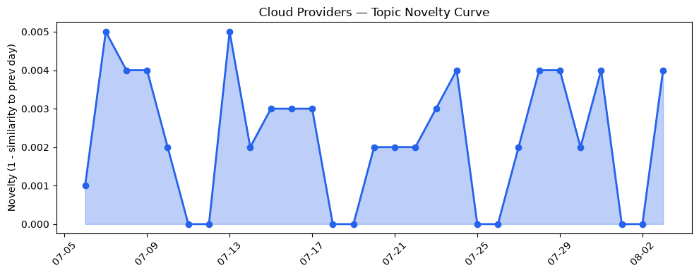
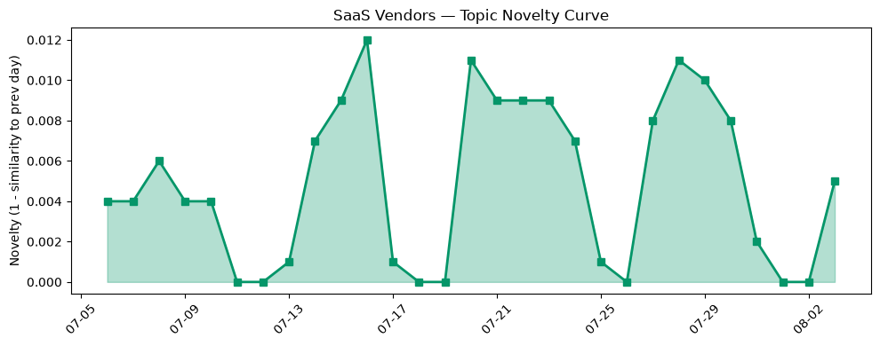

## 今日云计算结构性变化
> 今日云计算领域出现多项技术进展，包括 Azure 的 GPT-5.6 和 Claude 在 Microsoft Foundry 的推出，火山引擎的云产品发布，以及 Cloudflare 的 Workers 和容器支持 inbound TCP 连接等。
今天最值得注意的云计算/SaaS 结构性变化是技术层面的进展，特别是在 AI 和机器学习领域的应用日益广泛。这些进展表明云计算和 SaaS 厂商正在加速创新和竞争。同时，基础设施的变化，如定价和区域扩张，也是值得关注的信号。
- 📈 **持续趋势**：技术层话题已连续 30 天增强
- 🆕 **新兴方向**：GPT-5.6 和 Claude 在 Microsoft Foundry 的推出为 30 天内首次出现
- 🔺 **突然升温**：Cloudflare 的 Workers 和容器支持 inbound TCP 连接近 3 天突然集中出现
- 🔑 **新关键词**：Amazon, Chobani, Claude, GPT-5.6, Microsoft Foundry, VentureBeat, Workers, inbound TCP 连接, 企业上云, 容器
- 📉 **消退关键词**：Kubernetes, Serverless, 云原生, 数据中心

## 技术层信号
🔴 重大突破

云原生和容器技术的进展，如 Google Cloud 的 Cortex Framework v7 支持构建 agentic 工作流，Azure 的 GPT-5.6 和 Claude 在 Microsoft Foundry 的推出，Cloudflare 的 Workers 和容器支持 inbound TCP 连接等，表明云计算领域的技术创新正在加速。这些进展将推动云计算和 SaaS 的发展，并带来新的应用和商业机会。
同时，AI 和机器学习的应用日益广泛，如 Salesforce 推出新功能，如 Smarter Merchandising 和 Platform Extensibility，也是技术层面的重要信号。这些应用将推动企业上云和数字化转型的进程。
参考：
- [Cortex Framework v7 is GA: Build agentic workflows without disrupting SAP operations](https://cloud.google.com/blog/products/sap-google-cloud/cortex-framework-v7-power-ai-agents-with-sap-data-faster/)
- [Unifying public and private data: Scale knowledge graphs with Data Commons on Spanner](https://cloud.google.com/blog/products/databases/unify-public-and-private-data-with-data-commons-on-spanner-graph/)
- [GPT-5.6 now available in Microsoft Foundry](https://azure.microsoft.com/en-us/blog/gpt-5-6-now-available-in-microsoft-foundry/)
- [Cloudflare Workers and Containers now support inbound TCP connections and gRPC](https://blog.cloudflare.com/grpc-workers/)

## 产业资本信号
🔴 强信号

云计算和 SaaS 厂商的竞争加剧，基础设施的变化，如定价和区域扩张，也是值得关注的信号。同时，资本流向的变化，如 Strella 获得 1400 万美元的 A 轮融资，Design Arena 的创始人筹集了 790 万美元来将味觉带到 AI 模型中，也是产业资本信号的重要组成部分。
这些信号表明云计算和 SaaS 的发展将受到资本的推动，新的应用和商业机会将不断涌现。
参考：
- [Design Arena creators raise $7.9 million to bring taste to AI models](https://techcrunch.com/2026/08/03/designarena-creators-raise-7-9-million-to-bring-taste-to-ai-models/)
- [Sequoia’s Shaun Maguire leads $1B round for nuclear startup Valar Atomics](https://techcrunch.com/2026/08/03/sequoias-shaun-maguire-leads-1b-round-for-nuclear-startup-valar-atomics/)
- [Amazon and Chobani adopt Strella's AI interviews for customer research as fast-growing startup raises $14M](https://venturebeat.com/technology/amazon-and-chobani-adopt-strellas-ai-interviews-for-customer-research-as)

## 潜在拐点判断
今日信号 + 历史趋势表明，云计算和 SaaS 的发展将出现新的拐点。技术层面的进展，特别是在 AI 和机器学习领域的应用日益广泛，将推动云计算和 SaaS 的发展，并带来新的应用和商业机会。同时，基础设施的变化，如定价和区域扩张，也是值得关注的信号。

## 明日观察点
1. 云计算和 SaaS 厂商的竞争加剧，将带来新的应用和商业机会。
2. 基础设施的变化，如定价和区域扩张，将影响云计算和 SaaS 的发展。
3. 资本流向的变化，如新兴的 AI 和机器学习领域的投资，将推动云计算和 SaaS 的发展。

## 长期趋势坐标
今日信号放到月/季尺度，云计算和 SaaS 的发展将出现新的拐点。技术层面的进展，特别是在 AI 和机器学习领域的应用日益广泛，将推动云计算和 SaaS 的发展，并带来新的应用和商业机会。

## 数据洞察
### 云厂商话题演化
云厂商话题演化的 novelty_score 为 0.015，mean_similarity 为 0.985，trend 为延续，history_days 为 30，article_count 为 46。
### SaaS 厂商话题演化
SaaS 厂商话题演化的 novelty_score 为 0.057，mean_similarity 为 0.943，trend 为延续，history_days 为 30，article_count 为 20。
### 趋势图

## 参考来源
- [Cortex Framework v7 is GA: Build agentic workflows without disrupting SAP operations](https://cloud.google.com/blog/products/sap-google-cloud/cortex-framework-v7-power-ai-agents-with-sap-data-faster/) — Google Cloud Blog
- [Unifying public and private data: Scale knowledge graphs with Data Commons on Spanner](https://cloud.google.com/blog/products/databases/unify-public-and-private-data-with-data-commons-on-spanner-graph/) — Google Cloud Blog
- [GPT-5.6 now available in Microsoft Foundry](https://azure.microsoft.com/en-us/blog/gpt-5-6-now-available-in-microsoft-foundry/) — Microsoft Azure Blog
- [Cloudflare Workers and Containers now support inbound TCP connections and gRPC](https://blog.cloudflare.com/grpc-workers/) — Cloudflare Blog
- [Design Arena creators raise $7.9 million to bring taste to AI models](https://techcrunch.com/2026/08/03/designarena-creators-raise-7-9-million-to-bring-taste-to-ai-models/) — TechCrunch
- [Sequoia’s Shaun Maguire leads $1B round for nuclear startup Valar Atomics](https://techcrunch.com/2026/08/03/sequoias-shaun-maguire-leads-1b-round-for-nuclear-startup-valar-atomics/) — TechCrunch
- [Amazon and Chobani adopt Strella's AI interviews for customer research as fast-growing startup raises $14M](https://venturebeat.com/technology/amazon-and-chobani-adopt-strellas-ai-interviews-for-customer-research-as) — VentureBeat Enterprise