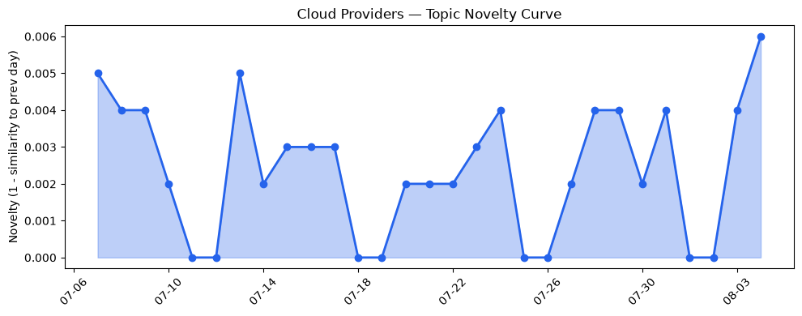
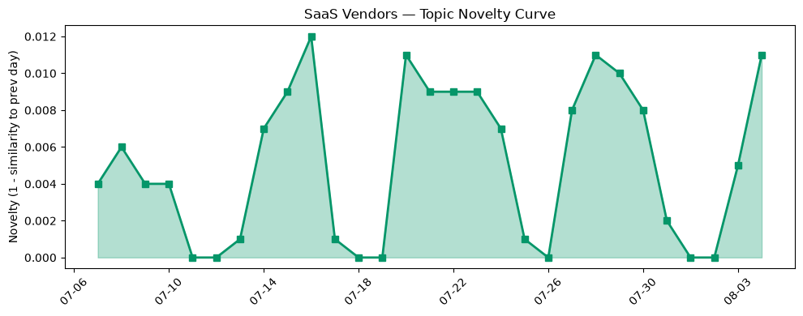

## 今日云计算结构性变化
> 今日云计算领域技术层面发生重大突破，尤其是在AI/ML与云的融合方面，多家云厂商推出新产品和服务。
今天最值得注意的云计算/SaaS结构性变化是技术层面和资本信号的持续升温，尤其是在AI/ML与云的融合方面。这种变化意味着云计算和SaaS领域正在经历重大变革，企业需要紧跟这些变化以保持竞争力。趋势报告中显示，技术层和资本信号的话题向量在最近8天内呈现持续增强趋势，表明这些方向正在持续升温。
- 📈 **持续趋势**：技术层和资本信号话题已连续8天增强
- 🆕 **新兴方向**：资本信号出现全新话题（与历史最大相似度仅0.22）
- 🔺 **突然升温**：AI/ML与云的融合方面近3天突然集中出现
- 🔑 **新关键词**：ML, Nvidia, Volta, Waymo
- 📉 **消退关键词**：Kubernetes, Serverless, 云原生, 数据中心

## 技术层信号
🔴 重大突破

云原生/容器/K8s/Serverless、数据库/存储/网络、AI与云融合领域有多项进展。AWS推出新功能和服务，包括GPT模型价格降低、CloudWatch管理的Prometheus指标收集、Database Migration Service和Spanner Graph的更新等。Google Cloud的基础设施更新包括Database Operations Agents和Cortex Framework v7。Cloudflare推出新功能，包括@cloudflare/computer和Cloudflare Workers和Containers现在支持入站TCP连接和gRPC。这些进展意味着云计算领域的技术层面正在经历重大变革，企业需要紧跟这些变化以保持竞争力。
例如，AWS的GPT模型价格降低和CloudWatch管理的Prometheus指标收集可以帮助企业更好地管理和优化其云资源。同时，Google Cloud的Database Operations Agents和Cortex Framework v7可以帮助企业更好地管理和优化其数据库和存储资源。
参考：
- [AWS Weekly Roundup: Price reduction of GPT models in Bedrock, CloudWatch managed collectors for Prometheus metrics, and more](https://aws.amazon.com/blogs/aws/aws-weekly-roundup-price-reduction-of-gpt-models-in-bedrock-cloudwatch-managed-collectors-for-prometheus-metrics-and-more-august-3-2026/)
- [Amazon EC2 C9g and C9gd instances powered by AWS Graviton5 processors are now available](https://aws.amazon.com/blogs/aws/amazon-ec2-c9g-and-c9gd-instances-powered-by-aws-graviton5-processors-are-now-available/)
- [Your agent needs a computer, not a container — introducing @cloudflare/computer](https://blog.cloudflare.com/cloudflare-computer/)

## 产业资本信号
🔴 强信号

云计算和SaaS领域的资本信号正在持续升温。Anthropic签署100亿美元协议与AI云初创公司Volta，SpaceX收入倍增，Anthropic和Google计算协议等。这些信号意味着云计算和SaaS领域的资本正在持续流入，企业需要紧跟这些变化以保持竞争力。
例如，Anthropic签署100亿美元协议与AI云初创公司Volta可以帮助企业更好地开发和部署AI应用。同时，SpaceX收入倍增可以帮助企业更好地开发和部署云计算和SaaS应用。
参考：
- [Anthropic signs $10B deal with AI cloud startup Volta](https://techcrunch.com/2026/08/04/anthropic-signs-10-billion-deal-with-ai-cloud-startup-volta/)
- [SpaceX doubles revenue on Anthropic and Google compute deals, Starlink growth](https://techcrunch.com/2026/08/04/spacex-doubles-revenues-on-anthropic-and-google-compute-deals-starlink-growth/)

## 潜在拐点判断
基于今日信号 + 历史趋势，判断是否存在潜在拐点。今日的信号表明，云计算和SaaS领域正在经历重大变革，尤其是在AI/ML与云的融合方面。这种变化可能会带来新的机遇和挑战，企业需要紧跟这些变化以保持竞争力。

## 明日观察点
1. 观察云计算和SaaS领域的技术层面和资本信号是否继续升温。
2. 观察Anthropic和AI云初创公司Volta的合作是否会带来新的机遇和挑战。
3. 观察SpaceX收入倍增是否会带来新的机遇和挑战。

## 长期趋势坐标
今日的信号表明，云计算和SaaS领域正在经历重大变革，尤其是在AI/ML与云的融合方面。这种变化可能会带来新的机遇和挑战，企业需要紧跟这些变化以保持竞争力。在月/季尺度上，云计算和SaaS领域的技术层面和资本信号可能会继续升温，企业需要紧跟这些变化以保持竞争力。

## 数据洞察
### 云厂商话题演化
云厂商话题向量在最近8天内呈现持续增强趋势，表明云厂商正在经历重大变革。
### SaaS厂商话题演化
SaaS厂商话题向量在最近8天内呈现持续增强趋势，表明SaaS厂商正在经历重大变革。
### 趋势图

## 参考来源
- [AWS Weekly Roundup: Price reduction of GPT models in Bedrock, CloudWatch managed collectors for Prometheus metrics, and more](https://aws.amazon.com/blogs/aws/aws-weekly-roundup-price-reduction-of-gpt-models-in-bedrock-cloudwatch-managed-collectors-for-prometheus-metrics-and-more-august-3-2026/)
- [Amazon EC2 C9g and C9gd instances powered by AWS Graviton5 processors are now available](https://aws.amazon.com/blogs/aws/amazon-ec2-c9g-and-c9gd-instances-powered-by-aws-graviton5-processors-are-now-available/)
- [Your agent needs a computer, not a container — introducing @cloudflare/computer](https://blog.cloudflare.com/cloudflare-computer/)
- [Anthropic signs $10B deal with AI cloud startup Volta](https://techcrunch.com/2026/08/04/anthropic-signs-10-billion-deal-with-ai-cloud-startup-volta/)
- [SpaceX doubles revenue on Anthropic and Google compute deals, Starlink growth](https://techcrunch.com/2026/08/04/spacex-doubles-revenues-on-anthropic-and-google-compute-deals-starlink-growth/)