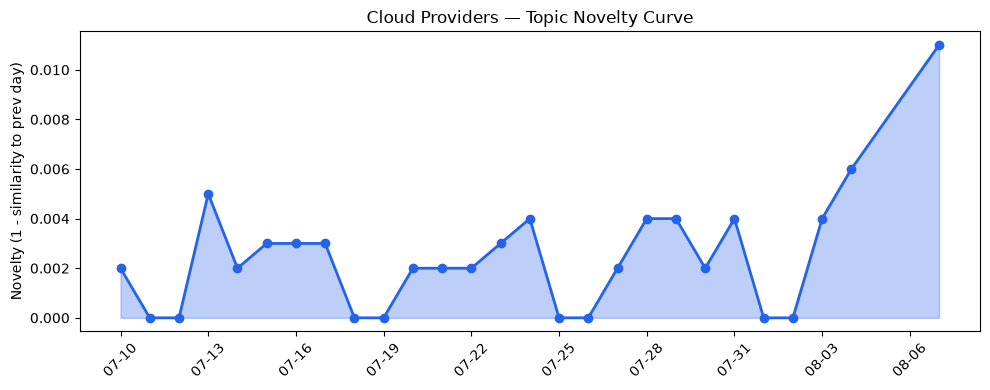
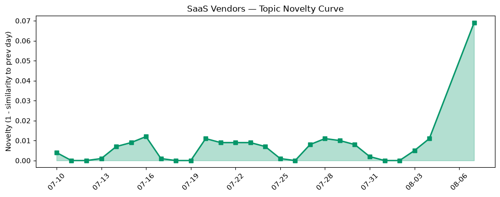

## 今日云计算结构性变化
> 今日云计算和SaaS产业结构性变化信号主要体现在技术层面的突破，特别是AI和云计算的融合，以及基础设施和应用层面的进展。
云计算和SaaS产业结构性变化信号主要体现在技术层面的突破，特别是AI和云计算的融合，以及基础设施和应用层面的进展。今日最值得注意的云计算/SaaS结构性变化是AWS、Google Cloud和Microsoft Azure推出的新的云原生平台和工具，如AWS的runtime instances和CloudFormation Express mode，Google Cloud的BigQuery和数据分析能力，Microsoft Azure的GPT-5.6和火山引擎的ByteHouse等数据产品。
- 📈 **持续趋势**：技术层话题已连续8天增强
- 🆕 **新兴方向**：云安全话题为30天内首次出现
- 🔺 **突然升温**：资本信号方向近3天突然集中出现
- 🔑 **新关键词**：云安全、HubSpot
- 📉 **消退关键词**：Kubernetes、Serverless、云原生、安全

## 技术层信号
🔴 重大突破

云原生/容器/K8s/Serverless、数据库/存储/网络、AI与云融合有显著进展。AWS、Google Cloud和Microsoft Azure推出了新的云原生平台和工具，如AWS的runtime instances和CloudFormation Express mode，Google Cloud的BigQuery和数据分析能力，Microsoft Azure的GPT-5.6和火山引擎的ByteHouse等数据产品。这些进展表明云计算和SaaS产业正在加速发展，特别是在技术层面。
例如，[Runtime instances: persistent compute for production AI agents on Amazon Bedrock AgentCore](https://aws.amazon.com/blogs/aws/runtime-instances-persistent-compute-for-production-ai-agents-on-amazon-bedrock-agentcore/) 和 [Amazon DynamoDB now supports real-time vector search at any scale](https://aws.amazon.com/blogs/aws/amazon-dynamodb-now-supports-real-time-vector-search-at-any-scale/) 等文章展示了AWS在云原生和数据库方面的进展。
同时，[Zero-code, low-cost data ingestion: New BigQuery DTS capabilities](https://cloud.google.com/blog/products/data-analytics/new-bigquery-data-transfer-service-capabilities/) 和 [Advancing brain tumor research with privacy-first AI](https://cloud.google.com/blog/products/identity-security/privacy-first-medical-ai-with-medperf-and-google-cloud/) 等文章展示了Google Cloud在数据分析和AI方面的进展。
此外，[Microsoft named a Leader in the 2026 Gartner Magic Quadrant for AI-Augmented Code Modernization Tools](https://azure.microsoft.com/en-us/blog/microsoft-named-a-leader-in-the-2026-gartner-magic-quadrant-for-ai-augmented-code-modernization-tools/) 和 [火山引擎正式推出四款数据产品](https://www.cnblogs.com/volcengine/p/15640481.html) 等文章展示了Microsoft Azure和火山引擎在AI和数据产品方面的进展。

## 产业资本信号
⚪ 无显著变化

今日无显著变化，资本信号的话题向量在最近8天内呈现持续增强趋势，但今日没有新的资本信号出现。

## 潜在拐点判断
今日观察到技术层面的重大突破和资本信号的持续增强趋势，可能表明云计算和SaaS产业正在经历一个潜在的拐点。这个拐点可能是由AI和云计算的融合驱动的，特别是在技术层面和基础设施层面。

## 明日观察点
1. 观察AWS、Google Cloud和Microsoft Azure在云原生和AI方面的进一步进展。
2. 关注火山引擎和Cloudflare在数据产品和云安全方面的发展。
3. 监测资本信号的话题向量是否继续呈现持续增强趋势。

## 长期趋势坐标
云计算和SaaS产业结构性变化信号主要体现在技术层面的突破，特别是AI和云计算的融合，以及基础设施和应用层面的进展。这个趋势可能会在未来持续发展，特别是在技术层面和基础设施层面。

## 数据洞察
### 云厂商话题演化
云厂商话题演化显示，AWS、Google Cloud和Microsoft Azure推出了新的云原生平台和工具，如AWS的runtime instances和CloudFormation Express mode，Google Cloud的BigQuery和数据分析能力，Microsoft Azure的GPT-5.6和火山引擎的ByteHouse等数据产品。
### SaaS 厂商话题演化
SaaS厂商话题演化显示，Salesforce和HubSpot等SaaS厂商在AI和数字化转型方面有所进展。
### 趋势图

## 参考来源
- [Runtime instances: persistent compute for production AI agents on Amazon Bedrock AgentCore](https://aws.amazon.com/blogs/aws/runtime-instances-persistent-compute-for-production-ai-agents-on-amazon-bedrock-agentcore/) — AWS Blog
- [Amazon DynamoDB now supports real-time vector search at any scale](https://aws.amazon.com/blogs/aws/amazon-dynamodb-now-supports-real-time-vector-search-at-any-scale/) — AWS Blog
- [Zero-code, low-cost data ingestion: New BigQuery DTS capabilities](https://cloud.google.com/blog/products/data-analytics/new-bigquery-data-transfer-service-capabilities/) — Google Cloud Blog
- [Advancing brain tumor research with privacy-first AI](https://cloud.google.com/blog/products/identity-security/privacy-first-medical-ai-with-medperf-and-google-cloud/) — Google Cloud Blog
- [Microsoft named a Leader in the 2026 Gartner Magic Quadrant for AI-Augmented Code Modernization Tools](https://azure.microsoft.com/en-us/blog/microsoft-named-a-leader-in-the-2026-gartner-magic-quadrant-for-ai-augmented-code-modernization-tools/) — Microsoft Azure Blog
- [火山引擎正式推出四款数据产品](https://www.cnblogs.com/volcengine/p/15640481.html) — 火山引擎博客
- [Building an open Agentic Internet: readable, discoverable, callable, and payable](https://blog.cloudflare.com/the-agentic-internet/) — Cloudflare Blog
- [Introducing Kitesurf: The agent-first browser that runs in V8 isolates on Cloudflare Workers](https://blog.cloudflare.com/kitesurf/) — Cloudflare Blog
- [Give any website a WebMCP interface](https://blog.cloudflare.com/webmcp/) — Cloudflare Blog
- [AT&T and Microsoft scale trillion-token workloads with Microsoft Foundry and AMD](https://azure.microsoft.com/en-us/blog/att-and-microsoft-scale-trillion-token-workloads-with-microsoft-foundry-and-amd/) — Microsoft Azure Blog
- [Meet Agentforce Coworker: your AI teammate everywhere. And it actually does the work.](https://www.salesforce.com/blog/agentforce-coworker-salesforce-ai-teammate/) — Salesforce Blog
- [What is enterprise marketing automation? Features, platforms, and best practices](https://blog.hubspot.com/marketing/enterprise-marketing-automation) — HubSpot Blog
- [CRM deployment: A step-by-step process for growing teams](https://blog.hubspot.com/marketing/crm-deployment) — HubSpot Blog
- [Azure Databricks delivers proven business value](https://azure.microsoft.com/en-us/blog/azure-databricks-delivers-proven-business-value/) — Microsoft Azure Blog
- [Computer maker Framework notifies ‘all customers’ of a data breach](https://techcrunch.com/2026/08/07/computer-maker-framework-notifies-all-customers-of-a-data-breach/) — TechCrunch
- [Chinese AI model Kimi escaped its cybersecurity testing environment, researchers say](https://techcrunch.com/2026/08/07/chinese-ai-model-kimi-escaped-its-cybersecurity-testing-environment-researchers-say/) — TechCrunch
- [Ransomware attacks spike as world distracted by AI](https://www.theregister.com/security/2026/08/07/ransomware-attacks-spike-as-world-distracted-by-ai/5284934) — The Register
- [Water system controllers don't belong on the internet, says ex-NSA chief after suspected Iran attacks](https://www.theregister.com/security/2026/08/07/water-system-controllers-dont-belong-on-the-internet-says-ex-nsa-chief-after-suspected-iran-attacks/5285070) — The Register
- [N-able God mode flaw: Vendor confirms attackers reached customer networks as second hotfix lands](https://www.theregister.com/networks/2026/08/07/n-able-god-mode-flaw-vendor-confirms-attackers-reached-customer-networks-as-second-hotfix-lands/5284730) — The Register