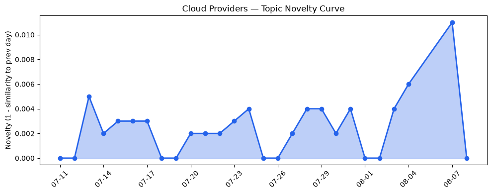
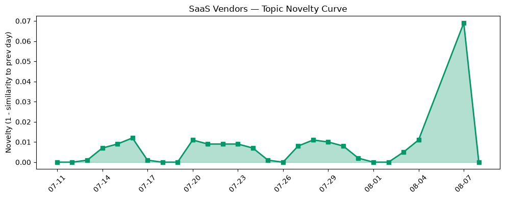

## 今日云计算结构性变化
> 今日云计算与SaaS产业结构变化主要体现在技术层面的突破，包括AI/ML与云的融合进展、云原生和Serverless技术的发展，以及基础设施的更新和扩张。
今天最值得注意的云计算/SaaS结构性变化是技术层面的重大突破，特别是在云原生和Serverless技术方面的进展。Cloudflare推出的Kitesurf浏览器和Google Cloud的BigQuery Search Innovations是这方面的重要例子。这些变化意味着云计算和SaaS产业正在经历快速的技术进步和基础设施升级，这将推动行业的发展和变革。
- 📈 **持续趋势**：技术层话题已连续8天增强
- 🆕 **新兴方向**：资本信号出现全新话题
- 🔺 **突然升温**：应用层近3天内容相似度显著高于更早期均值
- 🔑 **新关键词**：AI/ML, Cloudflare, HubSpot, 火山引擎
- 📉 **消退关键词**：Kubernetes, 安全, 安全性, 监管

## 技术层信号
🔴 重大突破

云原生和Serverless技术的发展是技术层信号中最重要的方面。Cloudflare推出的Kitesurf浏览器是一个运行在Cloudflare Workers上的agent-first浏览器，这意味着云计算基础设施的算力供应和扩展能力将得到显著提升。同时，Google Cloud的BigQuery Search Innovations实现了结构化和非结构化数据的统一，这将推动数据分析和处理能力的提升。
AWS的Amazon Bedrock AgentCore和Amazon DynamoDB的实时向量搜索能力也体现了技术层面的进展。这些变化表明云计算和SaaS产业正在经历快速的技术进步，这将推动行业的发展和变革。
[Cloudflare Blog: Introducing Kitesurf](https://blog.cloudflare.com/kitesurf/)
[Google Cloud Blog: Unifying Structured and Unstructured Data Insights with BQ Search Innovations](https://cloud.google.com/blog/products/data-analytics/bigquery-search-innovations-unify-structured-unstructured-data/)

## 产业资本信号
🔴 强信号

产业资本信号中，最值得注意的是OpenAI收购NextSlide和Cloudflare推出Kitesurf浏览器。这意味着资本正在流向云计算和SaaS产业，特别是在AI/ML和云原生技术方面。同时，企业估值和并购活动的增加也体现了资本对该产业的信心。
[The Register: ShinyHunters called cancer diagnostics biz and tricked staffers into giving them access](https://www.theregister.com/cyber-crime/2026/08/07/shinyhunters-called-cancer-diagnostics-biz-and-tricked-staffers-into-giving-them-access-now-theyve-dumped-109m-email-addresses/5284857)

## 潜在拐点判断
今日云计算和SaaS产业结构变化中，技术层面的突破和资本信号的强烈表明了潜在的拐点。这些变化可能推动行业的发展和变革，特别是在云原生和Serverless技术方面。同时，资本的流入和企业估值的增加也体现了对该产业的信心。

## 明日观察点
1. 云原生和Serverless技术的进一步发展
2. 资本信号的持续强烈
3. 产业结构变化的深化

## 长期趋势坐标
今日的信号和趋势表明，云计算和SaaS产业正在经历快速的技术进步和基础设施升级。这将推动行业的发展和变革，特别是在云原生和Serverless技术方面。

## 数据洞察
### 云厂商话题演化
云厂商话题演化中，今日的变化主要体现在技术层面的突破和资本信号的强烈。Cloudflare推出的Kitesurf浏览器和Google Cloud的BigQuery Search Innovations是这方面的重要例子。

### SaaS 厂商话题演化
SaaS厂商话题演化中，今日的变化主要体现在应用层面的发展和资本信号的强烈。Salesforce和HubSpot的发展是这方面的重要例子。

## 参考来源
- [Cloudflare Blog: Introducing Kitesurf](https://blog.cloudflare.com/kitesurf/)
- [Google Cloud Blog: Unifying Structured and Unstructured Data Insights with BQ Search Innovations](https://cloud.google.com/blog/products/data-analytics/bigquery-search-innovations-unify-structured-unstructured-data/)
- [The Register: ShinyHunters called cancer diagnostics biz and tricked staffers into giving them access](https://www.theregister.com/cyber-crime/2026/08/07/shinyhunters-called-cancer-diagnostics-biz-and-tricked-staffers-into-giving-them-access-now-theyve-dumped-109m-email-addresses/5284857)