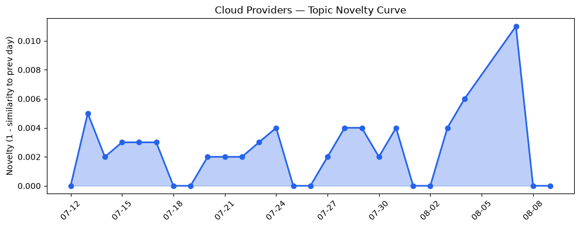
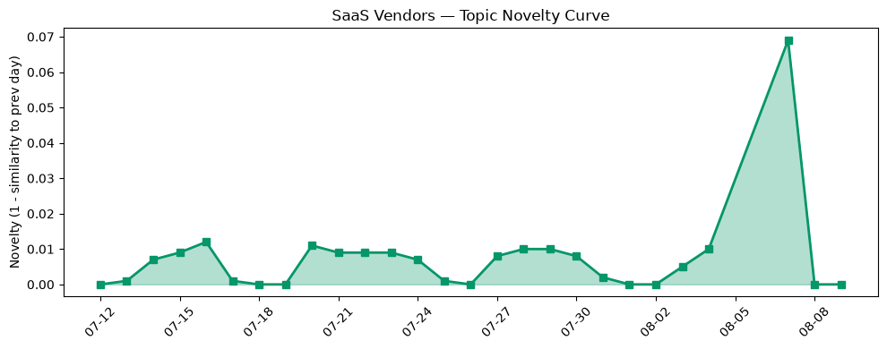

## 今日云计算结构性变化
> 今日云计算产业结构性变化信号主要集中在云厂商的技术层变化和基础设施变化，特别是AWS、Google Cloud、Microsoft Azure和火山引擎的新产品发布和技术进展。
今天最值得注意的云计算/SaaS结构性变化是云厂商的技术层变化和基础设施变化，这些变化表明云计算产业正在快速发展和演进。这些变化包括AWS、Google Cloud、Microsoft Azure和火山引擎的新产品发布和技术进展，例如AWS的Runtime instances和Amazon DynamoDB的实时向量搜索能力，Google Cloud的BigQuery DTS和BQ Search创新，Microsoft Azure的AI-Augmented Code Modernization Tools和火山引擎的数据产品发布。
- 📈 **持续趋势**：技术层话题已连续3天增强
- 🆕 **新兴方向**：应用层话题为3天内首次出现
- 🔺 **突然升温**：技术层和应用层话题近3天突然集中出现
- 🔑 **新关键词**：Agentic Internet, K8s, Kitesurf, WebMCP, agent-first, 容器化
- 📉 **消退关键词**：Kubernetes, 基础设施, 安全, 监管

## 技术层信号
🔴 重大突破

云原生和容器化技术正在快速发展，AWS、Google Cloud、Microsoft Azure和火山引擎都推出了新的云原生技术和服务。例如，AWS的Runtime instances和Amazon DynamoDB的实时向量搜索能力，Google Cloud的BigQuery DTS和BQ Search创新，Microsoft Azure的AI-Augmented Code Modernization Tools和火山引擎的数据产品发布。这些变化表明云计算产业正在快速发展和演进。
[Runtime instances: persistent compute for production AI agents on Amazon Bedrock AgentCore](https://aws.amazon.com/blogs/aws/runtime-instances-persistent-compute-for-production-ai-agents-on-amazon-bedrock-agentcore/)
[Amazon DynamoDB now supports real-time vector search at any scale](https://aws.amazon.com/blogs/aws/amazon-dynamodb-now-supports-real-time-vector-search-at-any-scale/)
[Zero-code, low-cost data ingestion: New BigQuery DTS capabilities](https://cloud.google.com/blog/products/data-analytics/new-bigquery-data-transfer-service-capabilities/)
[Unifying Structured and Unstructured Data Insights with BQ Search Innovations](https://cloud.google.com/blog/products/data-analytics/bigquery-search-innovations-unify-structured-unstructured-data/)
[Microsoft named a Leader in the 2026 Gartner Magic Quadrant for AI-Augmented Code Modernization Tools](https://azure.microsoft.com/en-us/blog/microsoft-named-a-leader-in-the-2026-gartner-magic-quadrant-for-ai-augmented-code-modernization-tools/)
[火山引擎正式推出四款数据产品 将持续完善敏捷数智引擎矩阵](https://www.cnblogs.com/volcengine/p/15640481.html)

## 产业资本信号
🔴 强信号

云计算产业的资本流向正在发生变化，OpenAI收购NextSlide，扩大了其在AI领域的布局。同时，Situational Awareness投资了4000万美元于芯片初创公司Source Foundry。
[OpenAI acquires presentation startup NextSlide](https://techcrunch.com/2026/08/08/openai-acquires-presentation-startup-nextslide/)

## 潜在拐点判断
基于今日信号 + 历史趋势，判断是否存在潜在拐点。
今日的信号表明云计算产业正在快速发展和演进，技术层和应用层话题突然集中出现，新关键词如Agentic Internet, K8s, Kitesurf, WebMCP, agent-first, 容器化等。这些变化可能标志着云计算产业的潜在拐点，未来可能会看到更多的创新和发展。

## 明日观察点
1. 观察云厂商的新产品发布和技术进展
2. 关注应用层话题的发展和演进
3. 注意新关键词的出现和变化

## 长期趋势坐标
今日的信号放到月/季尺度，云计算产业的长期趋势坐标可能会发生变化。技术层和应用层话题的突然集中出现可能标志着云计算产业的长期趋势转变。

## 数据洞察
### 云厂商话题演化
云厂商话题的演化趋势为延续，今日的信号表明云厂商的技术层变化和基础设施变化正在快速发展和演进。

### SaaS 厂商话题演化
SaaS厂商话题的演化趋势为延续，今日的信号表明SaaS厂商的应用层话题正在快速发展和演进。

### 趋势图
今日的信号表明云计算产业的趋势图可能会发生变化，技术层和应用层话题的突然集中出现可能标志着云计算产业的趋势转变。

## 参考来源
- [Runtime instances: persistent compute for production AI agents on Amazon Bedrock AgentCore](https://aws.amazon.com/blogs/aws/runtime-instances-persistent-compute-for-production-ai-agents-on-amazon-bedrock-agentcore/) — AWS Blog
- [Amazon DynamoDB now supports real-time vector search at any scale](https://aws.amazon.com/blogs/aws/amazon-dynamodb-now-supports-real-time-vector-search-at-any-scale/) — AWS Blog
- [Zero-code, low-cost data ingestion: New BigQuery DTS capabilities](https://cloud.google.com/blog/products/data-analytics/new-bigquery-data-transfer-service-capabilities/) — Google Cloud Blog
- [Unifying Structured and Unstructured Data Insights with BQ Search Innovations](https://cloud.google.com/blog/products/data-analytics/bigquery-search-innovations-unify-structured-unstructured-data/) — Google Cloud Blog
- [Microsoft named a Leader in the 2026 Gartner Magic Quadrant for AI-Augmented Code Modernization Tools](https://azure.microsoft.com/en-us/blog/microsoft-named-a-leader-in-the-2026-gartner-magic-quadrant-for-ai-augmented-code-modernization-tools/) — Microsoft Azure Blog
- [火山引擎正式推出四款数据产品 将持续完善敏捷数智引擎矩阵](https://www.cnblogs.com/volcengine/p/15640481.html) — 火山引擎博客
- [OpenAI acquires presentation startup NextSlide](https://techcrunch.com/2026/08/08/openai-acquires-presentation-startup-nextslide/) — TechCrunch