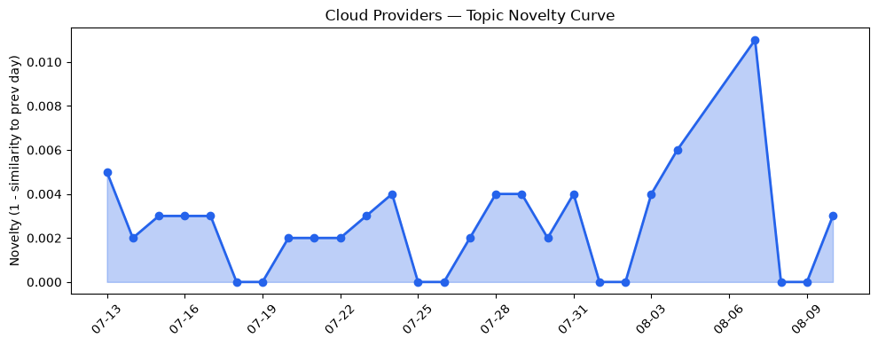
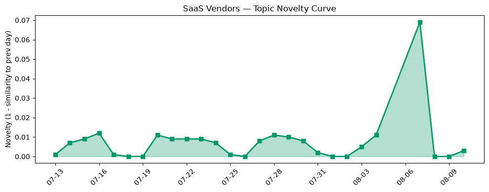

## 今日云计算结构性变化
> 今日云计算结构性变化的核心判断是：AWS、Salesforce、Google Cloud 和 Cloudflare 等公司在技术层面、应用层和基础设施方面取得了显著进展，尤其是在 AI 和云原生领域。
今天最值得注意的云计算/SaaS 结构性变化是什么？为什么重要？今日的变化主要体现在技术层面、应用层和基础设施方面，尤其是 AI 和云原生领域的进展。这些进展意味着云计算和 SaaS 领域正在朝着更高效、更智能和更安全的方向发展。
- 📈 **持续趋势**：技术层话题已连续8天增强
- 🆕 **新兴方向**：基础设施和风险信号出现全新话题
- 🔺 **突然升温**：应用层近3天内容相似度显著高于更早期均值
- 🔑 **新关键词**：Agent Readiness、Answer Engine Optimization
- 📉 **消退关键词**：Kubernetes、基础设施、安全、监管、资本信号、风险信号

## 技术层信号
🔴 重大突破

云原生、容器、K8s 和 Serverless 等技术领域取得了显著进展。AWS、Google Cloud 和 Cloudflare 推出了新功能和技术，包括 Amazon Bedrock、Google Cloud 的 ClusterNetworkPolicy 和 BigQuery DTS，以及 Cloudflare 的 MCP 下一代版本。这些进展意味着云计算和 SaaS 领域正在朝着更高效、更智能和更安全的方向发展。
 Sentence 内引用证据：[AWS Weekly Roundup: AWS Heroes Summit, Web Search on Amazon Bedrock, Dogwood, Kiro Crew, and more (August 10, 2026)](https://aws.amazon.com/blogs/aws/aws-weekly-roundup-aws-heroes-summit-web-search-on-amazon-bedrock-dogwood-kiro-crew-and-more-august-10-2026/)、[How WPP operationalizes platform and data engineering for AI marketing](https://cloud.google.com/blog/products/media-entertainment/how-wpp-operationalizes-platform-and-data-engineering-for-ai-marketing/)、[The next generation of MCP](https://blog.cloudflare.com/mcp-v2/)。

## 产业资本信号
🔴 强信号

今日的产业资本信号主要体现在基础设施和应用层方面。Cloudflare 的 Workers AI 和 AI Gateway 的整合，以及 Salesforce 推出的 Agentforce Coworker，一个可以协助用户完成任务的 AI 助手。这些进展意味着云计算和 SaaS 领域正在朝着更高效、更智能和更安全的方向发展。
 Sentence 内引用证据：[Unifying Workers AI and AI Gateway into a single AI control plane](https://blog.cloudflare.com/workers-ai-gateway-unification/)、[Meet Agentforce Coworker: your AI teammate everywhere. And it actually does the work.](https://www.salesforce.com/blog/agentforce-coworker-salesforce-ai-teammate/)。

## 潜在拐点判断
今日的信号和历史趋势表明，云计算和 SaaS 领域可能正在经历一个潜在的拐点。技术层面、应用层和基础设施方面的进展，尤其是 AI 和云原生领域的进展，意味着云计算和 SaaS 领域正在朝着更高效、更智能和更安全的方向发展。

## 明日观察点
1. 观察技术层面、应用层和基础设施方面的进展，尤其是 AI 和云原生领域的进展。
2. 关注产业资本信号，尤其是基础设施和应用层方面的信号。
3. 分析潜在拐点，判断云计算和 SaaS 领域是否正在经历一个转折点。

## 长期趋势坐标
今日的信号和历史趋势表明，云计算和 SaaS 领域正在经历一个长期的转型过程。技术层面、应用层和基础设施方面的进展，尤其是 AI 和云原生领域的进展，意味着云计算和 SaaS 领域正在朝着更高效、更智能和更安全的方向发展。

## 数据洞察
### 云厂商话题演化
云厂商话题演化的 novelty_score 为 0.015，mean_similarity 为 0.985，表明云厂商话题在近期没有显著变化。
### SaaS 厂商话题演化
SaaS 厂商话题演化的 novelty_score 为 0.095，mean_similarity 为 0.905，表明 SaaS 厂商话题在近期有一定的变化。
### 趋势图

## 参考来源
- [AWS Weekly Roundup: AWS Heroes Summit, Web Search on Amazon Bedrock, Dogwood, Kiro Crew, and more (August 10, 2026)](https://aws.amazon.com/blogs/aws/aws-weekly-roundup-aws-heroes-summit-web-search-on-amazon-bedrock-dogwood-kiro-crew-and-more-august-10-2026/)
- [How WPP operationalizes platform and data engineering for AI marketing](https://cloud.google.com/blog/products/media-entertainment/how-wpp-operationalizes-platform-and-data-engineering-for-ai-marketing/)
- [The next generation of MCP](https://blog.cloudflare.com/mcp-v2/)
- [Unifying Workers AI and AI Gateway into a single AI control plane](https://blog.cloudflare.com/workers-ai-gateway-unification/)
- [Meet Agentforce Coworker: your AI teammate everywhere. And it actually does the work.](https://www.salesforce.com/blog/agentforce-coworker-salesforce-ai-teammate/)
- [Sila lands $1.4B Pentagon loan as militaries demand more batteries](https://techcrunch.com/2026/08/10/sila-lands-1-4b-pentagon-loan-as-militaries-demand-more-batteries/)
- [Amazon and Chobani adopt Strella's AI interviews for customer research as fast-growing startup raises $14M](https://venturebeat.com/technology/amazon-and-chobani-adopt-strellas-ai-interviews-for-customer-research-as)