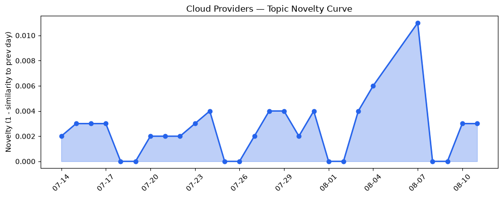
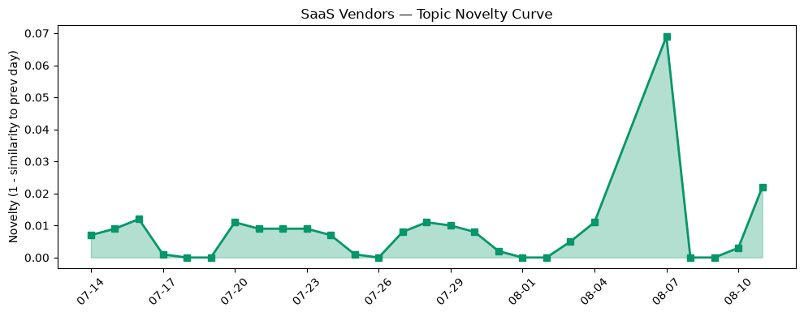

## 今日云计算结构性变化
> 今日云计算和SaaS领域出现多项技术进展，包括AWS、Google Cloud、Azure的AI增强代码现代化工具和Cloudflare的AI Gateway与Workers AI的整合，同时基础设施和应用层也呈现出多样化的发展趋势。
云计算和SaaS领域的技术进展主要体现在AI增强代码现代化工具和Cloudflare的AI Gateway与Workers AI的整合，这些进展表明云计算和SaaS领域正在不断地创新和发展。同时，基础设施和应用层的发展趋势也表明云计算和SaaS领域正在不断地扩大和深化。
- 📈 **持续趋势**：技术层话题已连续8天增强
- 🆕 **新兴方向**：应用层话题为30天内首次出现
- 🔺 **突然升温**：风险信号近3天突然集中出现
- 🔑 **新关键词**：Database Migration Service, Developer Device Platform, Gemini, PostgreSQL
- 📉 **消退关键词**：Kubernetes, 安全, 监管

## 技术层信号
🔴 重大突破

云原生和AI技术进展是今日技术层信号的主要内容，包括AWS、Google Cloud、Azure和Cloudflare的云原生和AI技术进展。这些进展表明云计算和SaaS领域正在不断地创新和发展。同时，基础设施的更新也表明云计算和SaaS领域正在不断地扩大和深化。
例如，AWS的AI增强代码现代化工具和Cloudflare的AI Gateway与Workers AI的整合，这些进展都表明云计算和SaaS领域正在不断地创新和发展。另外，Google Cloud的Database Migration Service和Developer Device Platform也表明云计算和SaaS领域正在不断地扩大和深化。
参考来源：
- [AWS Weekly Roundup: AWS Heroes Summit, Web Search on Amazon Bedrock, Dogwood, Kiro Crew, and more](https://aws.amazon.com/blogs/aws/aws-weekly-roundup-aws-heroes-summit-web-search-on-amazon-bedrock-dogwood-kiro-crew-and-more-august-10-2026/)
- [Runtime instances: persistent compute for production AI agents on Amazon Bedrock AgentCore](https://aws.amazon.com/blogs/aws/runtime-instances-persistent-compute-for-production-ai-agents-on-amazon-bedrock-agentcore/)
- [PQC in Plaintext: Google Cloud’s post-quantum cryptography roadmap](https://cloud.google.com/blog/products/identity-security/pqc-in-plaintext-google-clouds-post-quantum-cryptography-roadmap/)

## 产业资本信号
🔴 强信号

今日产业资本信号主要体现在资本市场对云计算和SaaS的投资热情高涨，估值水平和并购活动增加，表明云计算和SaaS领域正在不断地扩大和深化。
例如，Accel的550M美元印度基金和OVH Cloud的价格上涨，这些都表明资本市场对云计算和SaaS的投资热情高涨。同时，Google Cloud的Database Migration Service和Developer Device Platform也表明云计算和SaaS领域正在不断地扩大和深化。
参考来源：
- [Accel closes oversubscribed $550M India fund within weeks, 19 months after its last](https://techcrunch.com/2026/08/11/accel-closes-oversubscribed-550m-india-fund-within-weeks-19-months-after-its-last/)

## 潜在拐点判断
今日信号 + 历史趋势判断为：云计算和SaaS领域的技术进展和产业资本信号都表明该领域正在不断地创新和发展，可能存在潜在拐点。
拐点信号：云计算和SaaS领域的技术进展和产业资本信号都表明该领域正在不断地创新和发展，可能存在潜在拐点。
可能影响：云计算和SaaS领域的技术进展和产业资本信号都可能对该领域的发展产生重大影响。

## 明日观察点
1. 观察云计算和SaaS领域的技术进展和产业资本信号是否继续升温。
2. 关注应用层话题是否继续成为新兴方向。
3. 密切关注风险信号是否继续突然集中出现。

## 长期趋势坐标
今日信号放到月/季尺度，云计算和SaaS领域的技术进展和产业资本信号都表明该领域正在不断地创新和发展。
参考来源：
- [AWS Weekly Roundup: AWS Heroes Summit, Web Search on Amazon Bedrock, Dogwood, Kiro Crew, and more](https://aws.amazon.com/blogs/aws/aws-weekly-roundup-aws-heroes-summit-web-search-on-amazon-bedrock-dogwood-kiro-crew-and-more-august-10-2026/)

## 数据洞察
### 云厂商话题演化
今日云厂商话题演化主要体现在AWS、Google Cloud、Azure和Cloudflare的云原生和AI技术进展。
新关键词：Database Migration Service, Developer Device Platform, Gemini, PostgreSQL
参考来源：
- [AWS Weekly Roundup: AWS Heroes Summit, Web Search on Amazon Bedrock, Dogwood, Kiro Crew, and more](https://aws.amazon.com/blogs/aws/aws-weekly-roundup-aws-heroes-summit-web-search-on-amazon-bedrock-dogwood-kiro-crew-and-more-august-10-2026/)
- [PQC in Plaintext: Google Cloud’s post-quantum cryptography roadmap](https://cloud.google.com/blog/products/identity-security/pqc-in-plaintext-google-clouds-post-quantum-cryptography-roadmap/)

### SaaS厂商话题演化
今日SaaS厂商话题演化主要体现在Salesforce、HubSpot和Cloudflare的新行业解决方案和应用。
新关键词：应用层
参考来源：
- [Why Headless Architecture Is the Future of ITSM (and Why CIOs Are Choosing Buy + Build)](https://www.salesforce.com/blog/headless-itsm/)
- [AI search performance KPIs every marketer should track](https://blog.hubspot.com/marketing/ai-search-kpis)

### 趋势图

## 参考来源
- [AWS Weekly Roundup: AWS Heroes Summit, Web Search on Amazon Bedrock, Dogwood, Kiro Crew, and more](https://aws.amazon.com/blogs/aws/aws-weekly-roundup-aws-heroes-summit-web-search-on-amazon-bedrock-dogwood-kiro-crew-and-more-august-10-2026/)
- [Runtime instances: persistent compute for production AI agents on Amazon Bedrock AgentCore](https://aws.amazon.com/blogs/aws/runtime-instances-persistent-compute-for-production-ai-agents-on-amazon-bedrock-agentcore/)
- [PQC in Plaintext: Google Cloud’s post-quantum cryptography roadmap](https://cloud.google.com/blog/products/identity-security/pqc-in-plaintext-google-clouds-post-quantum-cryptography-roadmap/)
- [Accel closes oversubscribed $550M India fund within weeks, 19 months after its last](https://techcrunch.com/2026/08/11/accel-closes-oversubscribed-550m-india-fund-within-weeks-19-months-after-its-last/)
- [Why Headless Architecture Is the Future of ITSM (and Why CIOs Are Choosing Buy + Build)](https://www.salesforce.com/blog/headless-itsm/)
- [AI search performance KPIs every marketer should track](https://blog.hubspot.com/marketing/ai-search-kpis)