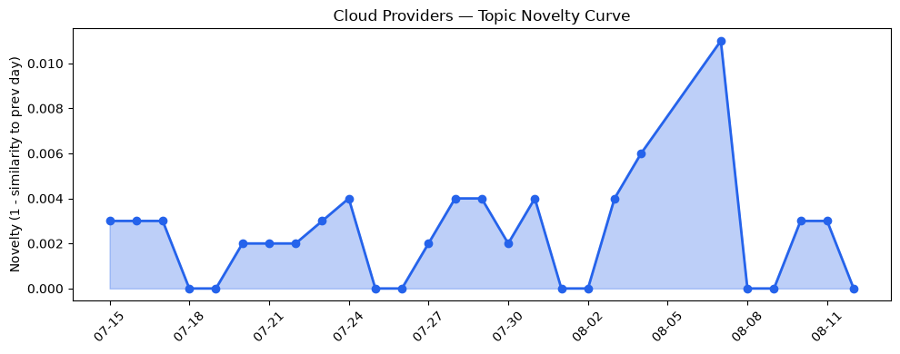
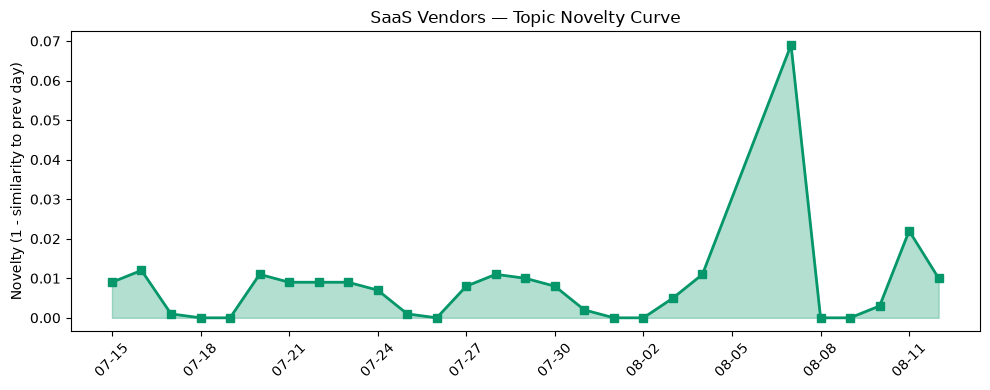

## 今日云计算结构性变化
> 今日云计算领域出现多项技术和基础设施更新，包括AI增强代码现代化工具、云原生理念和实践、数据迁移服务等，推动云计算和AI技术的融合。
今日最值得注意的云计算/SaaS结构性变化是技术层和基础设施层的重大突破，包括AWS、Google Cloud和Azure推出的多项云原生技术和服务，以及数据库和存储服务的更新。这些变化表明云计算和AI技术的融合正在加速，企业上云和数字化转型也取得了进展。
- 📈 **持续趋势**：技术层话题已连续8天增强
- 🆕 **新兴方向**：火山引擎的技术发展成为新兴话题
- 🔺 **突然升温**：技术层近3天话题突然增强
- 🔑 **新关键词**：Cloudflare, Serverless, 云原生, 火山引擎
- 📉 **消退关键词**：Anthropic, Kubernetes, 安全, 监管

## 技术层信号
🔴 重大突破

云原生技术和服务是今日技术层信号的主要内容，包括AWS、Google Cloud和Azure推出的多项云原生技术和服务，例如runtime instances、开发设备平台和AI增强代码现代化工具。这些技术和服务推动了云计算和AI技术的融合，帮助企业提高开发效率和降低成本。例如，[Runtime instances: persistent compute for production AI agents on Amazon Bedrock AgentCore](https://aws.amazon.com/blogs/aws/runtime-instances-persistent-compute-for-production-ai-agents-on-amazon-bedrock-agentcore/)展示了AWS在云原生技术方面的进展。
此外，数据迁移服务也是技术层信号的重要组成部分，包括AWS、Google Cloud和Azure推出的新型数据迁移服务。这些服务帮助企业更容易地将数据迁移到云端，提高了数据的利用率和价值。例如，[PQC in Plaintext: Google Cloud’s post-quantum cryptography roadmap](https://cloud.google.com/blog/products/identity-security/pqc-in-plaintext-google-clouds-post-quantum-cryptography-roadmap/)展示了Google Cloud在数据安全方面的进展。

## 产业资本信号
🔴 强信号

今日产业资本信号表明，AI和云计算领域的估值和并购活动增加，包括AI编码初创公司Cognition获得40亿美元估值，Thrive Holdings获得20亿美元投资。这些信号表明，资本市场对AI和云计算领域的发展前景充满信心，愿意投入更多的资金来推动这一领域的发展。例如，[AI coding startup Cognition reportedly already in talks to raise at $40B valuation](https://techcrunch.com/2026/08/12/ai-coding-startup-cognition-reportedly-already-in-talks-to-raise-at-40b-valuation/)展示了AI编码初创公司Cognition的融资进展。

## 潜在拐点判断
今日信号和历史趋势表明，云计算和AI技术的融合正在加速，企业上云和数字化转型也取得了进展。这些变化可能会导致云计算和AI技术的应用范围扩大，推动更多的企业和行业采用云计算和AI技术。因此，今日的信号和趋势可能是云计算和AI技术发展的潜在拐点。

## 明日观察点
1. 观察AWS、Google Cloud和Azure在云原生技术和服务方面的进一步进展。
2. 关注数据迁移服务的发展和应用。
3. 分析AI和云计算领域的估值和并购活动的变化。

## 长期趋势坐标
今日信号和历史趋势表明，云计算和AI技术的融合正在加速，企业上云和数字化转型也取得了进展。这些变化可能会导致云计算和AI技术的应用范围扩大，推动更多的企业和行业采用云计算和AI技术。在月/季尺度上，云计算和AI技术的发展可能会继续推动数字化转型和企业上云的进展。

## 数据洞察
### 云厂商话题演化
今日云厂商话题演化表明，AWS、Google Cloud和Azure推出的多项云原生技术和服务成为热点话题。这些话题的出现和发展可能会推动云计算和AI技术的融合，帮助企业提高开发效率和降低成本。
### SaaS 厂商话题演化
今日SaaS厂商话题演化表明，Salesforce和Google Cloud推出的多项新服务和功能成为热点话题。这些话题的出现和发展可能会推动SaaS领域的发展，帮助企业提高效率和降低成本。
### 趋势图

## 参考来源
- [Runtime instances: persistent compute for production AI agents on Amazon Bedrock AgentCore](https://aws.amazon.com/blogs/aws/runtime-instances-persistent-compute-for-production-ai-agents-on-amazon-bedrock-agentcore/) — AWS Blog
- [PQC in Plaintext: Google Cloud’s post-quantum cryptography roadmap](https://cloud.google.com/blog/products/identity-security/pqc-in-plaintext-google-clouds-post-quantum-cryptography-roadmap/) — Google Cloud Blog
- [Microsoft named a Leader in the 2026 Gartner Magic Quadrant for AI-Augmented Code Modernization Tools](https://azure.microsoft.com/en-us/blog/microsoft-named-a-leader-in-the-2026-gartner-magic-quadrant-for-ai-augmented-code-modernization-tools/) — Microsoft Azure Blog
- [布局云计算，火山引擎的技术发展之路](https://www.cnblogs.com/volcengine/p/15632953.html) — 火山引擎博客
- [Cloudflare AI Search: give your agents a search engine for your data](https://blog.cloudflare.com/ai-search-easier/) — Cloudflare Blog
- [AI coding startup Cognition reportedly already in talks to raise at $40B valuation](https://techcrunch.com/2026/08/12/ai-coding-startup-cognition-reportedly-already-in-talks-to-raise-at-40b-valuation/) — TechCrunch
- [OpenAI-backed Thrive Holdings raises $2B to bring AI to the enterprise](https://techcrunch.com/2026/08/12/openai-backed-thrive-holdings-raises-2b-to-bring-ai-to-the-enterprise/) — TechCrunch
- [Tokenization takes the lead in the fight for data security](https://venturebeat.com/technology/tokenization-takes-the-lead-in-the-fight-for-data-security) — VentureBeat Enterprise
- [Exposed: Woeful security at UK criminal records office that led to sensitive data leak](https://www.theregister.com/security/2026/08/12/exposed-woeful-security-at-uk-criminal-records-office-that-led-to-sensitive-data-leak/5286736) — The Register