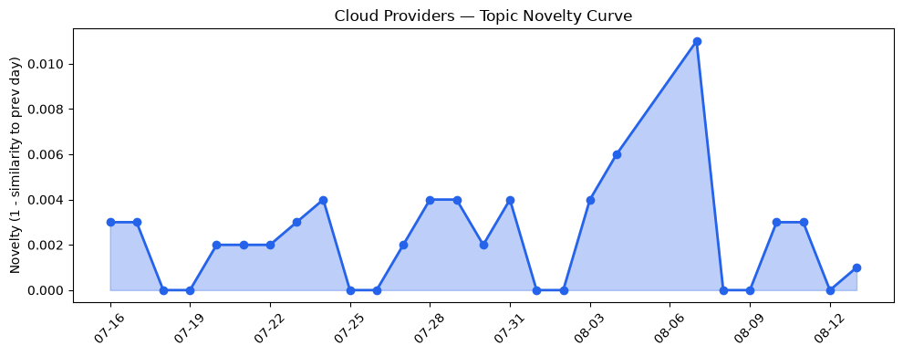
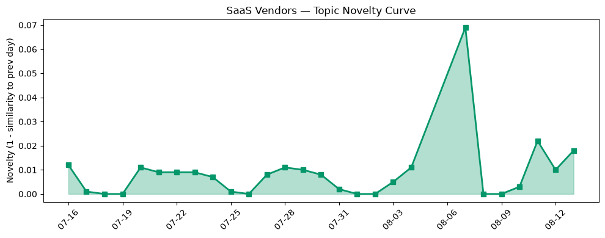

## 今日云计算结构性变化
> 云计算和 SaaS 领域继续推出新功能和服务，强调了 AI 和云原生的重要性，同时也面临着安全和监管的挑战。
今天最值得注意的云计算/SaaS 结构性变化是 AWS、Google Cloud 和 Cloudflare 等云厂商在云原生、AI 和安全领域的持续投入。这些变化表明云计算和 SaaS 领域正在迅速发展，企业需要跟上这些变化以保持竞争力。
- 📈 **持续趋势**：技术层话题已连续 3 天增强，基础设施话题近 3 天内容相似度显著高于更早期均值。
- 🆕 **新兴方向**：资本信号出现全新话题，这可能是一个新兴方向的早期信号。
- 🔺 **突然升温**：技术层和基础设施方向话题突然增强。

## 技术层信号
🔴 重大突破

云原生和 AI 是当前技术层的两个重要方向。AWS 推出 runtime instances，支持生产 AI 代理的持久计算，Google Cloud 的 BigQuery Graphs 和 post-quantum cryptography roadmap 体现了其在云原生和安全领域的持续投入。Cloudflare 推出了 Radar Researcher，一个 AI 工具用于探索互联网数据。
这些变化表明云计算和 SaaS 领域正在迅速发展，企业需要跟上这些变化以保持竞争力。[AWS Weekly Roundup: AWS Heroes Summit, Web Search on Amazon Bedrock, Dogwood, Kiro Crew, and more (August 10, 2026)](https://aws.amazon.com/blogs/aws/aws-weekly-roundup-aws-heroes-summit-web-search-on-amazon-bedrock-dogwood-kiro-crew-and-more-august-10-2026/)

## 产业资本信号
🔴 强信号

资本信号是当前产业的一个重要方面。Databricks 获得 5 亿美元投资，估值达到 1900 亿美元，Cloudflare 投资 100 万美元用于开源资金。这些变化表明投资者对云计算和 AI 企业的估值继续上升。
这些信号表明云计算和 SaaS 领域正在迅速发展，企业需要跟上这些变化以保持竞争力。[Databricks wanted to raise $1B, investors wanted $15B. It settled on $5B at a $190B valuation.](https://techcrunch.com/2026/08/13/databricks-wanted-to-raise-1b-investors-wanted-15b-it-settled-on-5b-at-a-190b-valuation/)

## 潜在拐点判断
基于今日信号 + 历史趋势，判断是否存在潜在拐点。技术层和基础设施方向话题突然增强，资本信号出现全新话题，这可能是一个新兴方向的早期信号。这些变化表明云计算和 SaaS 领域正在迅速发展，企业需要跟上这些变化以保持竞争力。

## 明日观察点
1. 观察 AWS 和 Google Cloud 在云原生和 AI 领域的进一步发展。
2. 关注 Cloudflare 在安全和 AI 领域的进一步投入。
3. 观察 Databricks 和 Cloudflare 的进一步发展。

## 长期趋势坐标
云计算和 SaaS 领域正在迅速发展，企业需要跟上这些变化以保持竞争力。技术层和基础设施方向话题突然增强，资本信号出现全新话题，这可能是一个新兴方向的早期信号。

## 数据洞察
### 云厂商话题演化
云厂商话题演化显示，AWS 和 Google Cloud 在云原生和 AI 领域的持续投入。Cloudflare 推出了 Radar Researcher，一个 AI 工具用于探索互联网数据。
### SaaS 厂商话题演化
SaaS 厂商话题演化显示，Salesforce 和 ServiceNow 在 AI 和安全领域的进一步发展。
### 趋势图

## 参考来源
- [AWS Weekly Roundup: AWS Heroes Summit, Web Search on Amazon Bedrock, Dogwood, Kiro Crew, and more (August 10, 2026)](https://aws.amazon.com/blogs/aws/aws-weekly-roundup-aws-heroes-summit-web-search-on-amazon-bedrock-dogwood-kiro-crew-and-more-august-10-2026/)
- [Databricks wanted to raise $1B, investors wanted $15B. It settled on $5B at a $190B valuation.](https://techcrunch.com/2026/08/13/databricks-wanted-to-raise-1b-investors-wanted-15b-it-settled-on-5b-at-a-190b-valuation/)
- [Using BigQuery Graphs with measures for trusted agentic workloads](https://cloud.google.com/blog/products/data-analytics/bigquery-graphs-with-measures-for-trusted-agentic-workloads/)
- [PQC in Plaintext: Google Cloud’s post-quantum cryptography roadmap](https://cloud.google.com/blog/products/identity-security/pqc-in-plaintext-google-clouds-post-quantum-cryptography-roadmap/)
- [Unifying Workers AI and AI Gateway into a single AI control plane](https://blog.cloudflare.com/workers-ai-gateway-unification/)
- [Cloudflare AI Search: give your agents a search engine for your data](https://blog.cloudflare.com/ai-search-easier/)
- [Microsoft named a Leader in the 2026 Gartner Magic Quadrant for AI-Augmented Code Modernization Tools](https://azure.microsoft.com/en-us/blog/microsoft-named-a-leader-in-the-2026-gartner-magic-quadrant-for-ai-augmented-code-modernization-tools/)
- [火山引擎正式推出四款数据产品](https://www.cnblogs.com/volcengine/p/15640481.html)