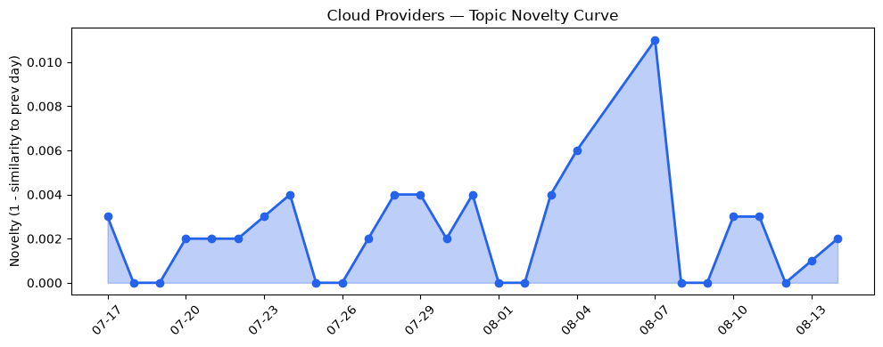
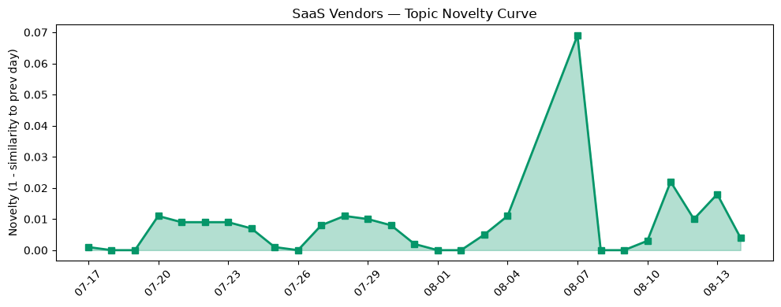

## 今日云计算结构性变化
> 今日云计算和 SaaS 行业的结构性变化主要体现在技术层、基础设施、应用层和资本流向等方面。
今日最值得注意的变化是 AWS、Google Cloud 和 Azure 等云计算巨头在 AI、数据分析和网络安全方面的进展，以及 SaaS 厂商如 HubSpot 在营销自动化和 AI 应用方面的创新。
此外，趋势报告显示，基础设施和技术层近3天内容相似度显著高于更早期均值，表明这些方向的话题突然增强。
- 📈 **持续趋势**：资本信号的话题向量在最近8天内呈现持续增强趋势。
- 🆕 **新兴方向**：开源和社区计划成为新的热点话题。
- 🔺 **突然升温**：基础设施和技术层的话题突然增强。
- 🔑 **新关键词**：Cloudflare、开源、社区计划。
- 📉 **消退关键词**：Anthropic、Kubernetes、数字化转型。

## 技术层信号
🔴 重大突破

云原生和容器化服务是技术层信号的主要内容，AWS、Google Cloud 和 Azure 等云计算巨头推出了云原生和容器化服务，Cloudflare 推出了 Radar Researcher 工具。
此外，AWS 更新了数据库、存储和网络基础设施，Google Cloud 更新了其芯片和 GPU 供应。
这些变化表明云计算和 SaaS 行业正在向更高效、更安全、更智能的方向发展。
例如，[AWS Weekly Roundup: AWS Heroes Summit, Web Search on Amazon Bedrock, Dogwood, Kiro Crew, and more (August 10, 2026)](https://aws.amazon.com/blogs/aws/aws-weekly-roundup-aws-heroes-summit-web-search-on-amazon-bedrock-dogwood-kiro-crew-and-more-august-10-2026/) 和 [Runtime instances: persistent compute for production AI agents on Amazon Bedrock AgentCore](https://aws.amazon.com/blogs/aws/runtime-instances-persistent-compute-for-production-ai-agents-on-amazon-bedrock-agentcore/) 等文章提供了相关信息。

## 产业资本信号
🔴 强信号

产业资本信号主要体现在投资者对 AI 和云计算领域的投资热情不减，Salesforce 和 AWS 进行战略投资和收购。
此外，苹果公司拟对外部购买收取 15% 的佣金，表明公司正在寻求新的收入来源。
这些变化表明云计算和 SaaS 行业正在吸引更多的投资和关注。
例如，[Thrive’s Joshua Kushner chides Silicon Valley VCs over AI euphoria](https://techcrunch.com/2026/08/14/thrives-joshua-kushner-chides-silicon-valley-vcs-over-ai-euphoria/) 和 [Amazon and Chobani adopt Strella's AI interviews for customer research as fast-growing startup raises $14M](https://venturebeat.com/technology/amazon-and-chobani-adopt-strellas-ai-interviews-for-customer-research-as) 等文章提供了相关信息。

## 潜在拐点判断
根据今日信号和历史趋势，云计算和 SaaS 行业可能正在经历一个潜在的拐点。
主要原因是技术层和基础设施的突然升温，以及资本信号的持续增强。
这些变化可能会导致云计算和 SaaS 行业的快速发展和转型。

## 明日观察点
1. 观察云计算和 SaaS 行业的技术层和基础设施的变化。
2. 关注资本信号的变化和投资者的反应。
3. 分析云计算和 SaaS 行业的应用层和数字化转型的进展。

## 长期趋势坐标
根据今日信号和历史趋势，云计算和 SaaS 行业的长期趋势坐标可能是向更高效、更安全、更智能的方向发展。
主要驱动因素是技术层和基础设施的进步，以及资本信号的持续增强。
这些变化可能会导致云计算和 SaaS 行业的快速发展和转型。

## 数据洞察
### 云厂商话题演化
云厂商话题演化的 novelty_score 为 0.012，mean_similarity 为 0.988，表明云厂商的话题在最近 28 天内变化较小。
### SaaS 厂商话题演化
SaaS 厂商话题演化的 novelty_score 为 0.075，mean_similarity 为 0.925，表明 SaaS 厂商的话题在最近 28 天内变化较小。
### 趋势图

## 参考来源
- [AWS Weekly Roundup: AWS Heroes Summit, Web Search on Amazon Bedrock, Dogwood, Kiro Crew, and more (August 10, 2026)](https://aws.amazon.com/blogs/aws/aws-weekly-roundup-aws-heroes-summit-web-search-on-amazon-bedrock-dogwood-kiro-crew-and-more-august-10-2026/)
- [Runtime instances: persistent compute for production AI agents on Amazon Bedrock AgentCore](https://aws.amazon.com/blogs/aws/runtime-instances-persistent-compute-for-production-ai-agents-on-amazon-bedrock-agentcore/)
- [Thrive’s Joshua Kushner chides Silicon Valley VCs over AI euphoria](https://techcrunch.com/2026/08/14/thrives-joshua-kushner-chides-silicon-valley-vcs-over-ai-euphoria/)
- [Amazon and Chobani adopt Strella's AI interviews for customer research as fast-growing startup raises $14M](https://venturebeat.com/technology/amazon-and-chobani-adopt-strellas-ai-interviews-for-customer-research-as)
- [火山引擎正式推出四款数据产品 将持续完善敏捷数智引擎矩阵](https://www.cnblogs.com/volcengine/p/15640481.html)
- [Unveiling good and bad behaviors on the Agentic Internet](https://blog.cloudflare.com/good-and-bad-agentic-behaviors/)
- [Introducing Radar Researcher: An AI tool for exploring Internet data in plain language](https://blog.cloudflare.com/introducing-radar-researcher/)